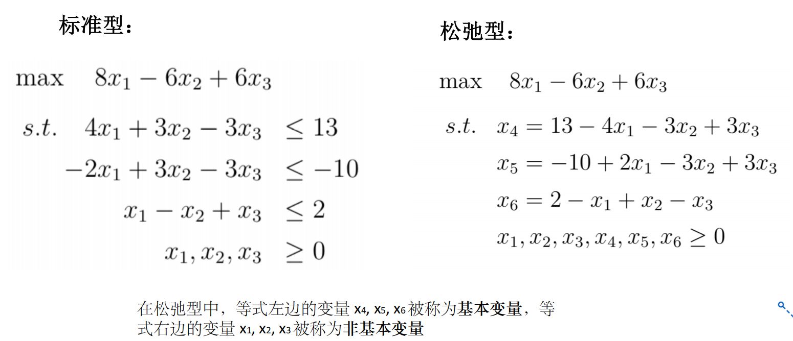
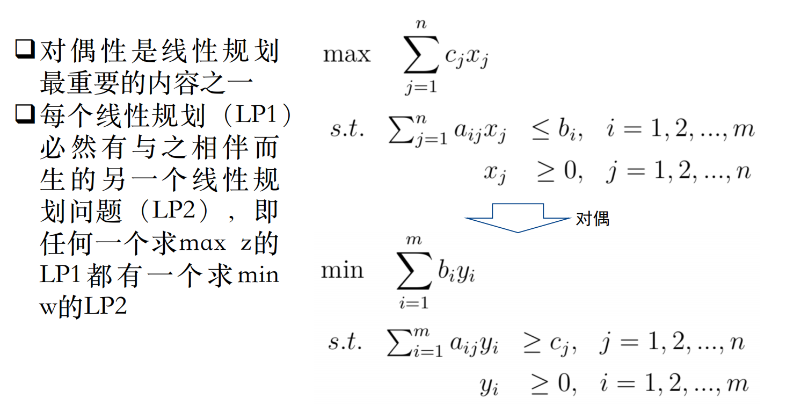
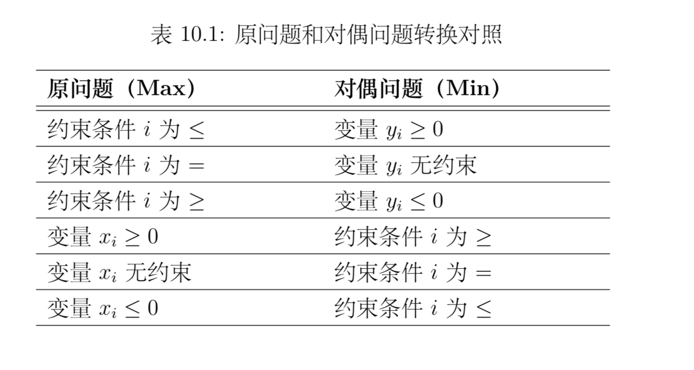
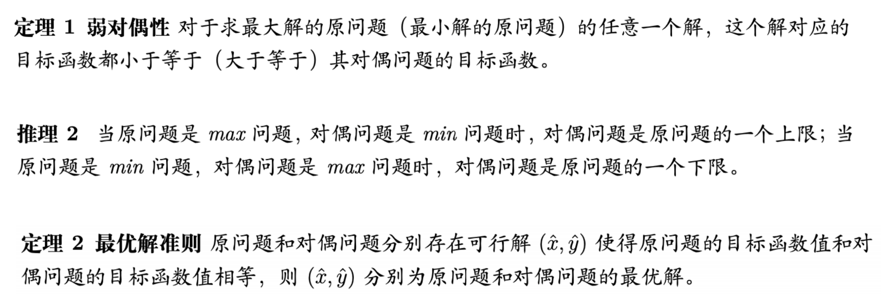
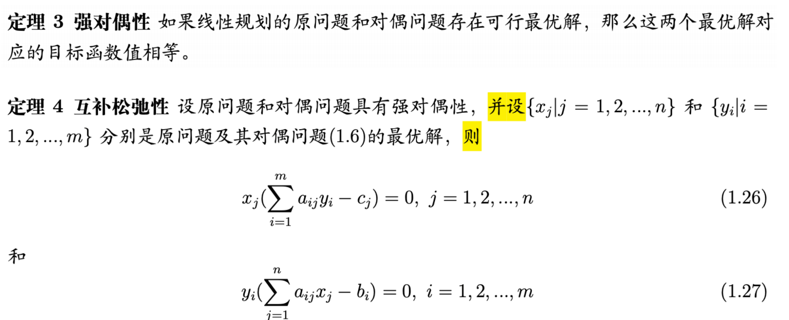
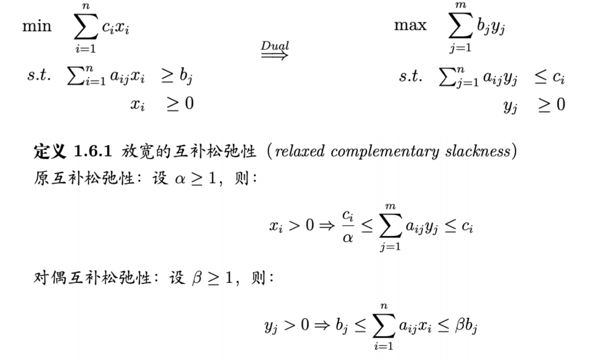
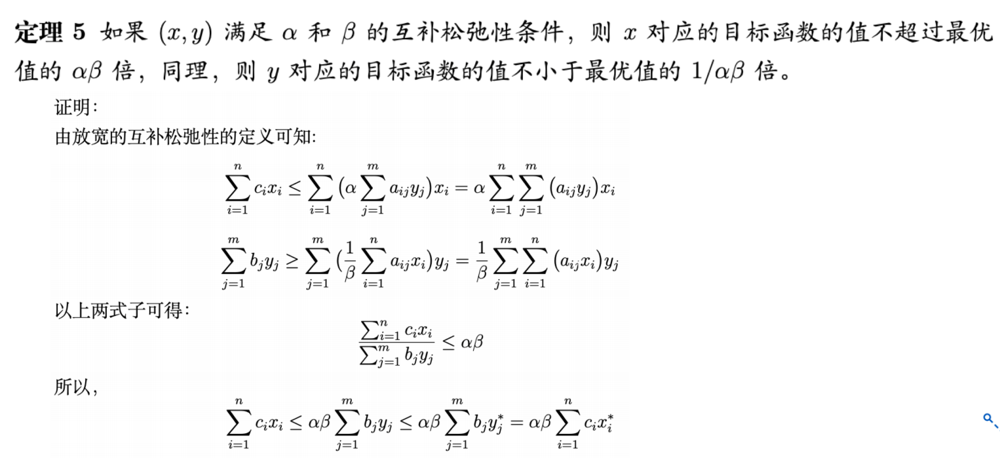
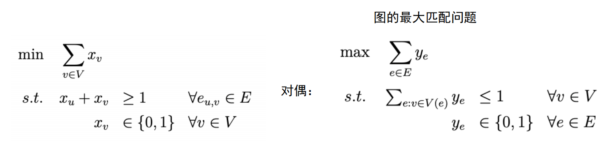
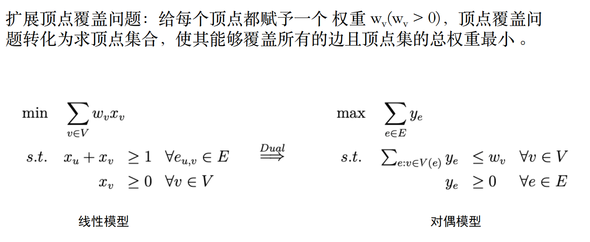

# 线性规划(LP)定义
对满足有限多个线性等式或不等式约束条件的决策变量的一个线性目标函数求最大或者最小值优化问题
1. 可行解
2. 可行域
3. 最优解
4. 最优值

# 标准型和松弛型

# 图解法
# 单纯型法
先化为标准型，然后再变为松弛型，使用单纯型表求解

# 对偶

# 对偶性质

# 整数规划
先不考虑整数约束条件，然后使用分支限界法确定整数解

# 0-1 整数规划
隐枚举法

# 原始对偶算法
通过对偶问题来求解原问题
## 放宽的互补松弛性

## 顶点覆盖问题 <-> 图的最大匹配问题

## 带权重的顶点覆盖问题

