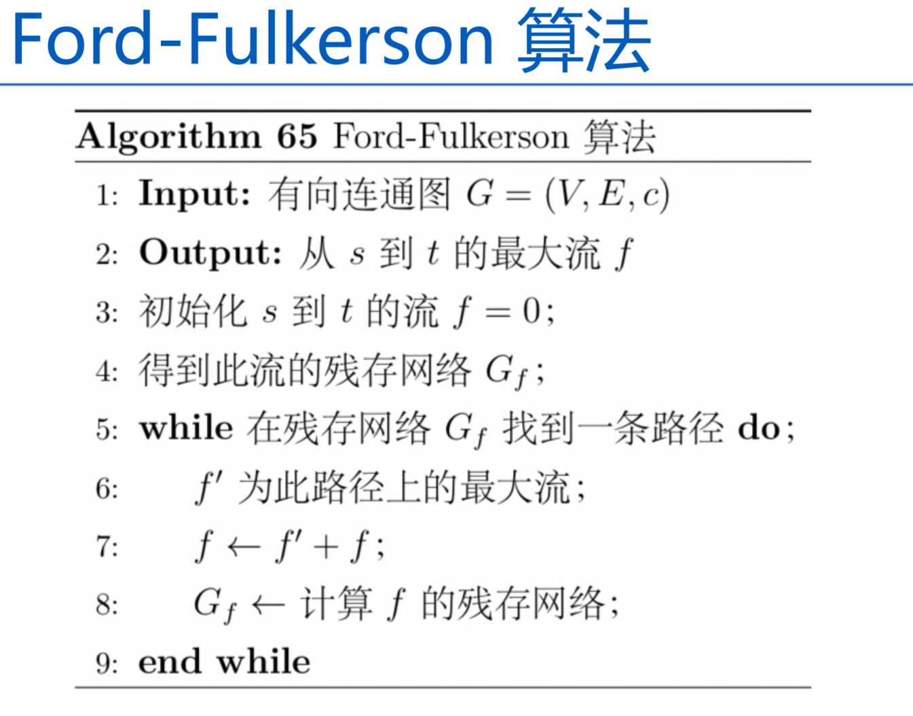
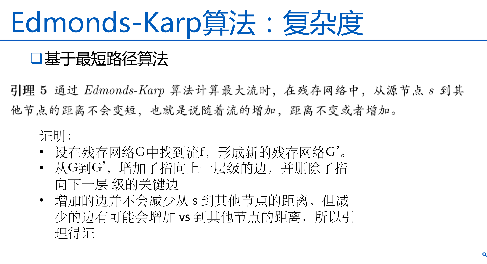
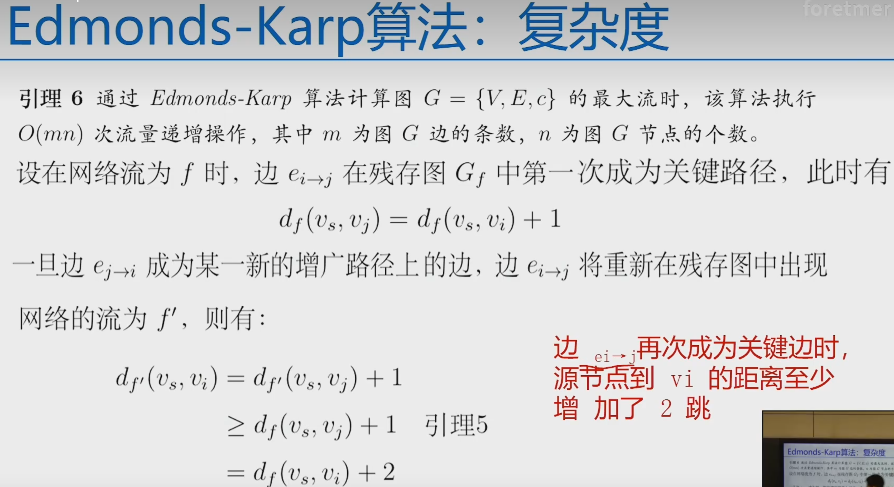
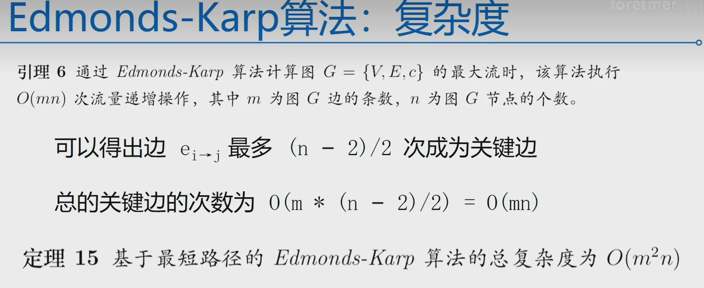
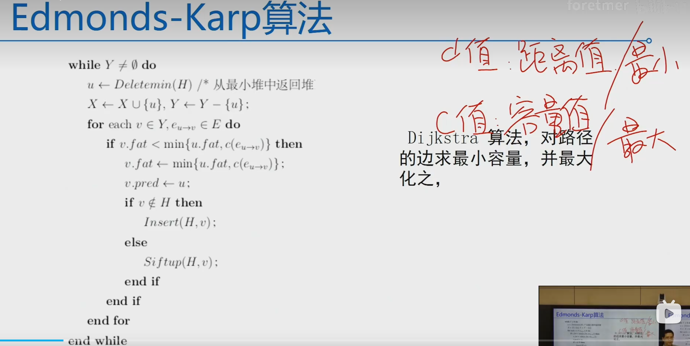
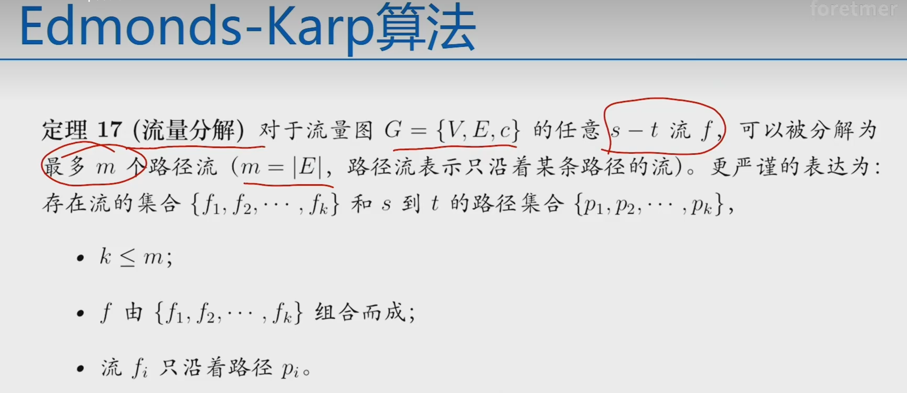
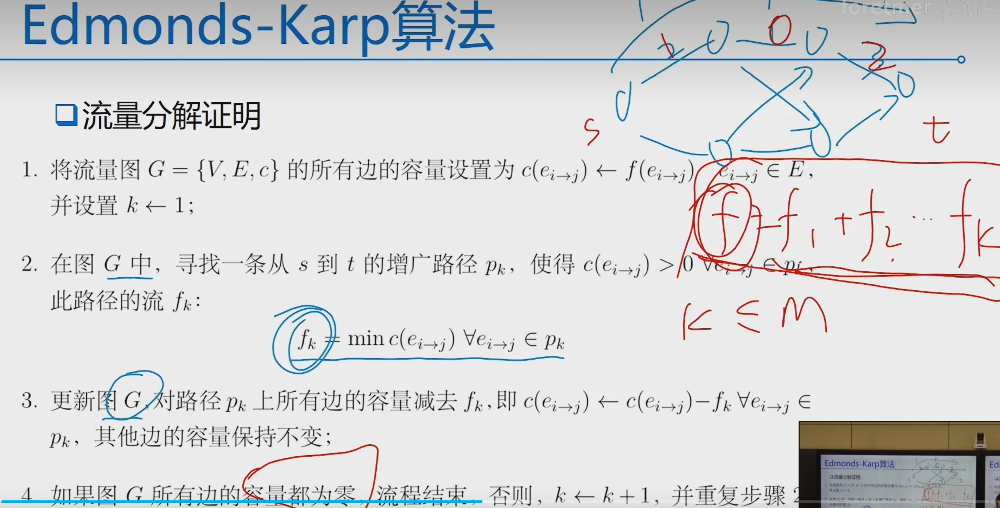
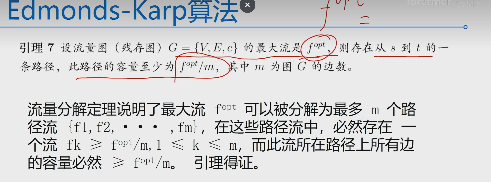

# 最大流和最小割
## 最大流问题定义
找到一个从s出发，到t的流量最大的流
 
## 网络的流需要满足的条件
- 容量限制
- 流量守恒

## 如何找最大流
1.从流量为0开始，逐步增加流量 
2.从s出发，找到一条道t的可行路径，并将流增加到这个路径能够支持的最大路径 
3.在残存网络再找一条可行路径，增加相应的流 
4.重复以上步骤 

## 割的定义
将所有点划分为两个集合，这两个集合连接的边的集合称为割或者切

## 最小割定义
图是带权重的，划分的所有集合中，权重和最小的割

## s-t最小割定义
划分的两个点的集合，必须是一个包含s，一个包含t

## 最大流和最小割定义
下面三个是等价的: 
1.f是G的最大流 
2.残存网络$G_f$找不到任何从s到t的新路径 
3.s-t最小割和最大流是相等的 

## 如何从残存网络找到一条从s到t的路径
### 基于最短路径的Edmonds-Karp算法

### 基于最大容量路径的Edmonds-Karp算法
Dijkstra的改造

### 流量分解定理

# 图的中心性算法

# 社群发现算法