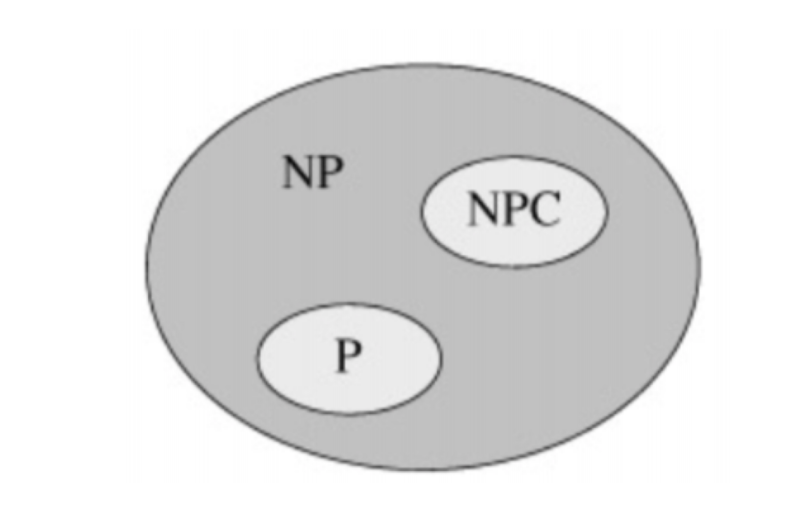
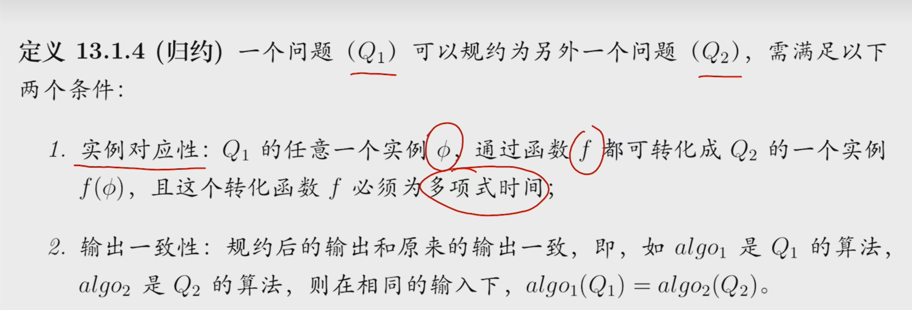
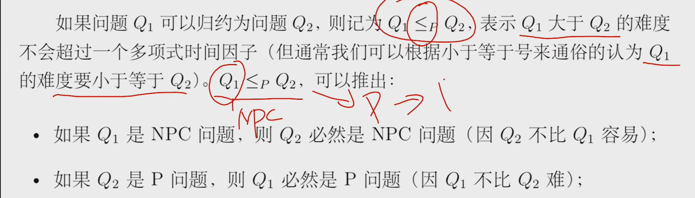

# 算法效率
1.多项式时间复杂度（O(n)、O(nlogn)、O($n^2$)、O($n^{10}$)） 
2.非多项式时间复杂度（O($n^{logn}$)、O($2^n$)、O($n!$)）

# P问题定义
多项式时间内可以解决的问题

# NP问题定义
就是对于一个给定的解，能够在多项式时间内验证其是否正确的问题
> 所有的P问题都是NP问题

# NPC问题(NP完全问题)定义
需满足两个条件 
1.是一个NP问题 
2.所有NP问题都可以在多项式时间归约成此问题 

# 规约

# P问题的证明

# NPC问题的证明

