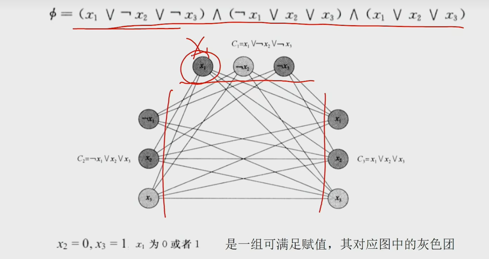
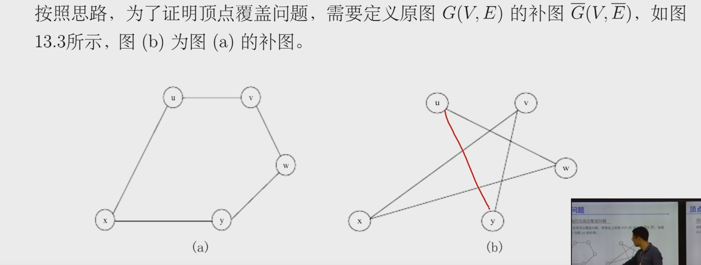
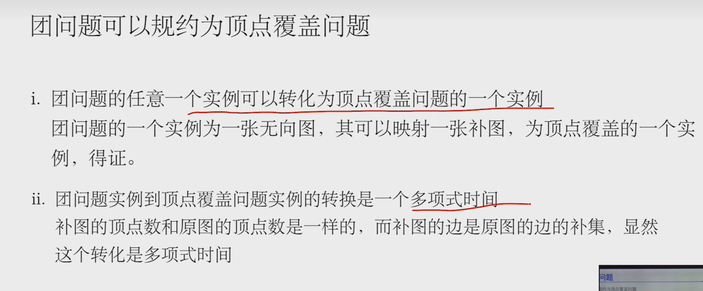
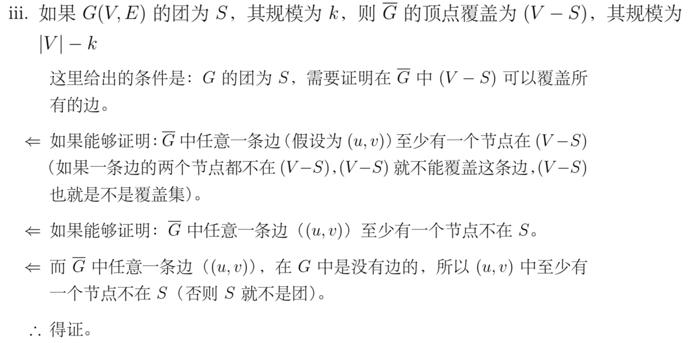
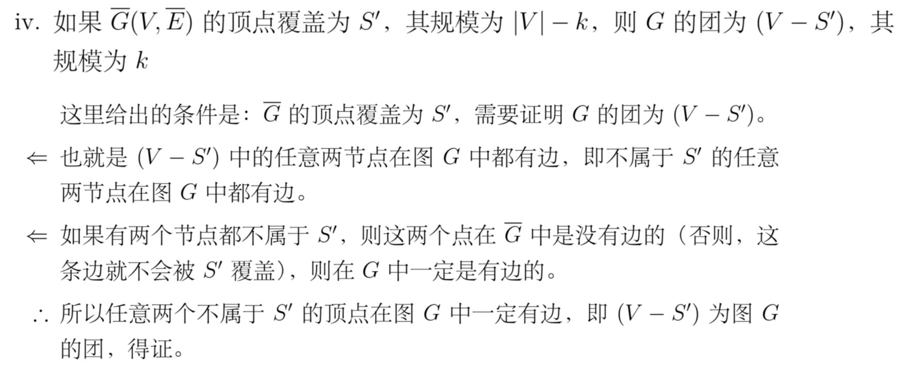
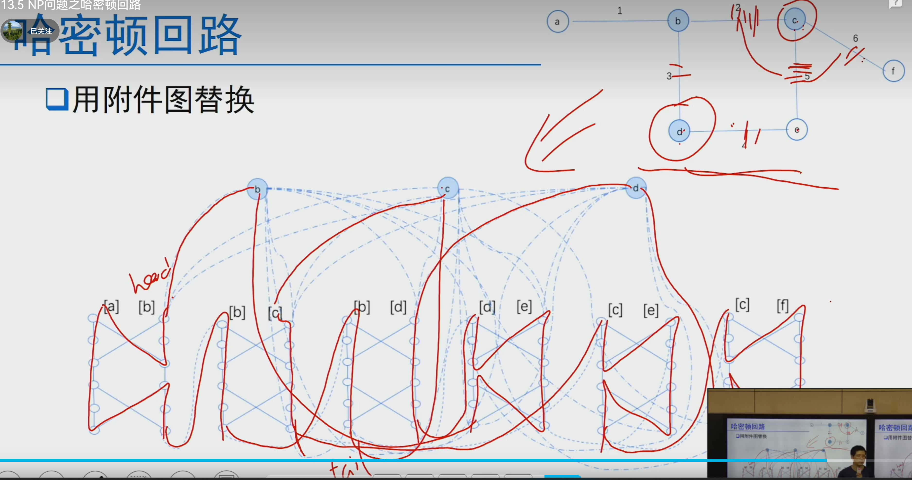
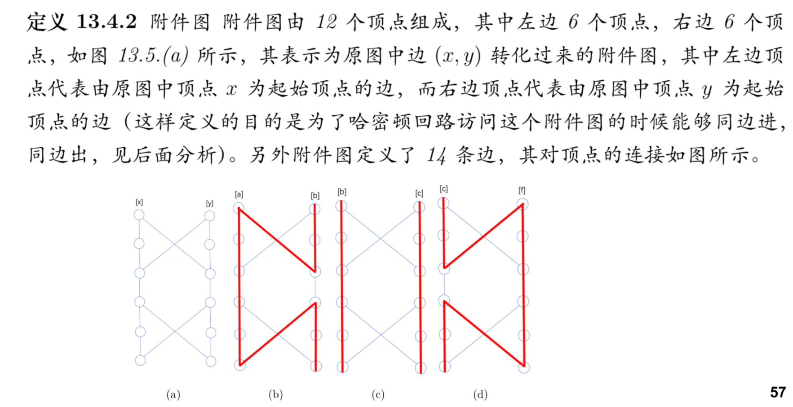

# 算法效率
1.多项式时间复杂度（O(n)、O(nlogn)、O($n^2$)、O($n^{10}$)） 
2.非多项式时间复杂度（O($n^{logn}$)、O($2^n$)、O($n!$)）

# P问题定义
多项式时间内可以解决的问题

# NP问题定义
就是对于一个给定的解，能够在多项式时间内验证其是否正确的问题
> 所有的P问题都是NP问题

# NPC问题(NP完全问题)定义
需满足两个条件 
1.是一个NP问题 
2.所有NP问题都可以归约成此问题 

# 规约

# P问题的证明
## 2CNF-SAT（2合取范式的可满足问题）
是否存在一个赋值使得2CNF为真

# NPC问题的证明
## 电路可满足问题（第一个NPC问题）
给定一个逻辑电路，是否存在一种输入使得输出为True

## 公式可满足性问题
1.它是一个NP问题，可以在多项式时间判断解是否正确 
2.电路可满足问题可以 **规约** 到公式可满足问题

## 3CNF-SAT问题(3合取范式的可满足问题)
1.它是一个NP问题，可以在多项式时间判断解是否正确 
2.公式可满足问题可以 **规约** 到3CNF-SAT问题

## 团问题
团问题是关于寻找图中规模最大的团的最优化问题 
我们仅仅要考虑的是：在图中是否存在一个给定规模为k的团 

1.它是一个NP问题，可以在多项式时间判断解是否正确 
>给定义一个图G的顶点集，可以在多项式时间判断它是否是团

2.3CNF-SAT问题可以 **规约** 到团问题

输出一致性： 
> 若3CNF-SAT有真，则必然所有子句都为真，则子句内有真，真值之间都是互联的，所以有团 

## 顶点覆盖问题
找出最小数目的顶点集合S，使得G中的每条边都至少被集合S中的一个顶点覆盖 

1.它是一个NP问题，可以在多项式时间判断解是否正确 
2.团问题可以 **规约** 为顶点覆盖问题 

原图和补图

## 哈密顿回路问题
在一个图（通常指无向图图）中，从某个顶点出发，经过其它顶点一次且仅一次的回路称作哈密顿回路。将这个问题转为一个判断性问题“给定一个图，判断它是否包含哈密顿回路”

1.它是一个NP问题，可以在多项式时间判断解是否正确 
2.顶点覆盖问题可以 **规约** 为哈密顿回路问题 

转化后的图中有顶点数：12m + k 
转化后的图中有边数：14m + 2m - n + 2kn

