# 概述
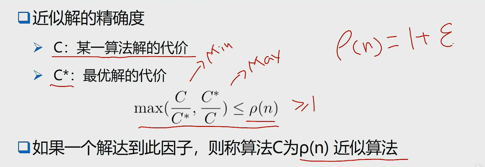
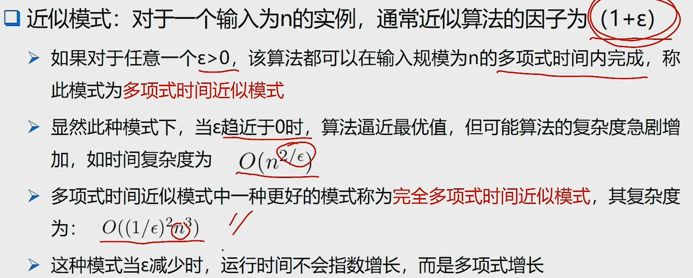

# 旅行商(TSP)问题
在一个带权图中，寻找一条经过所有顶点且每个顶点仅经过一次的回路，使得回路的总权值最小
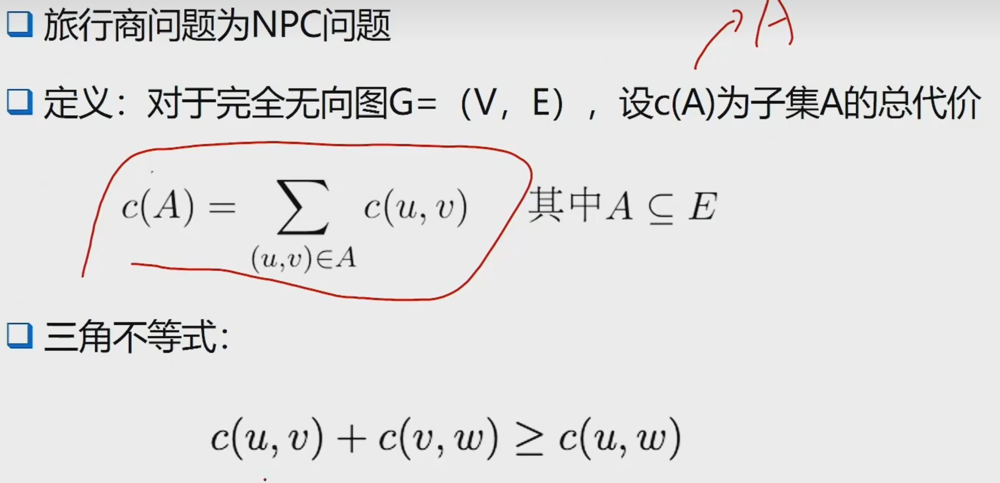
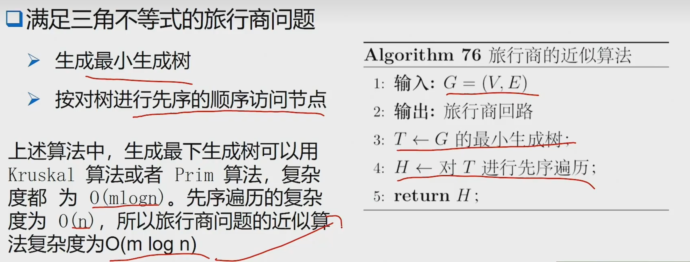
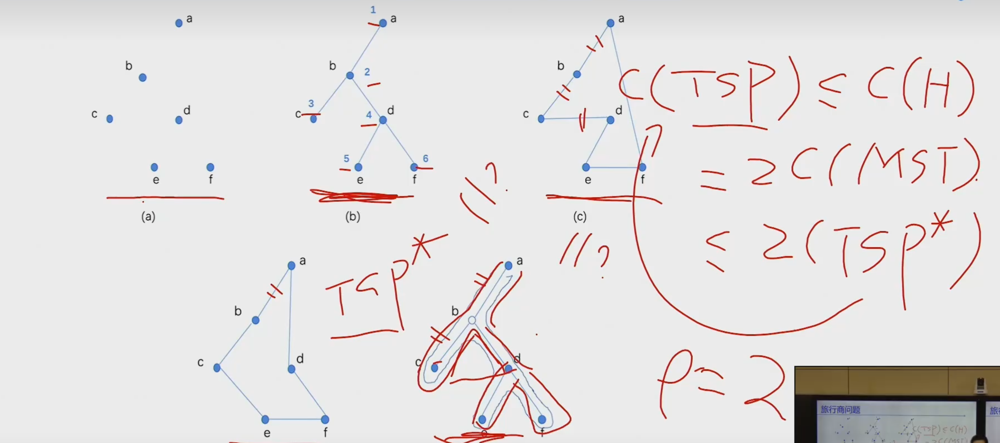
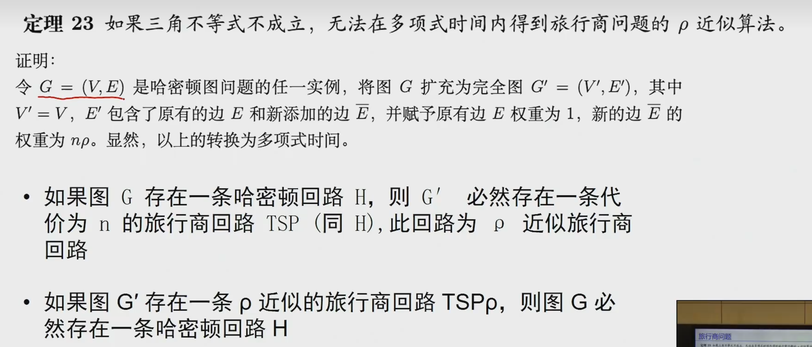

# 子集和问题
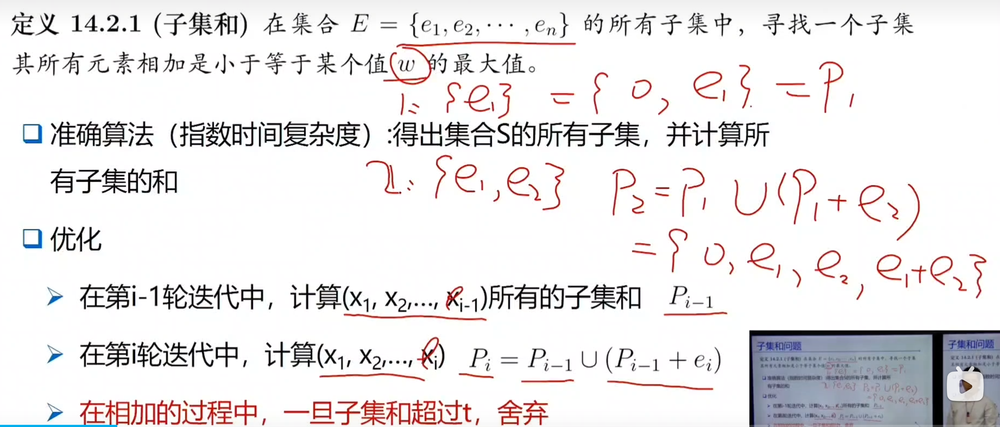
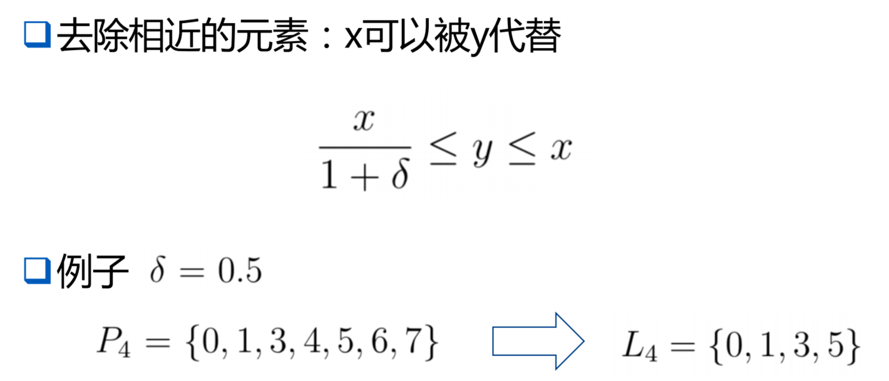
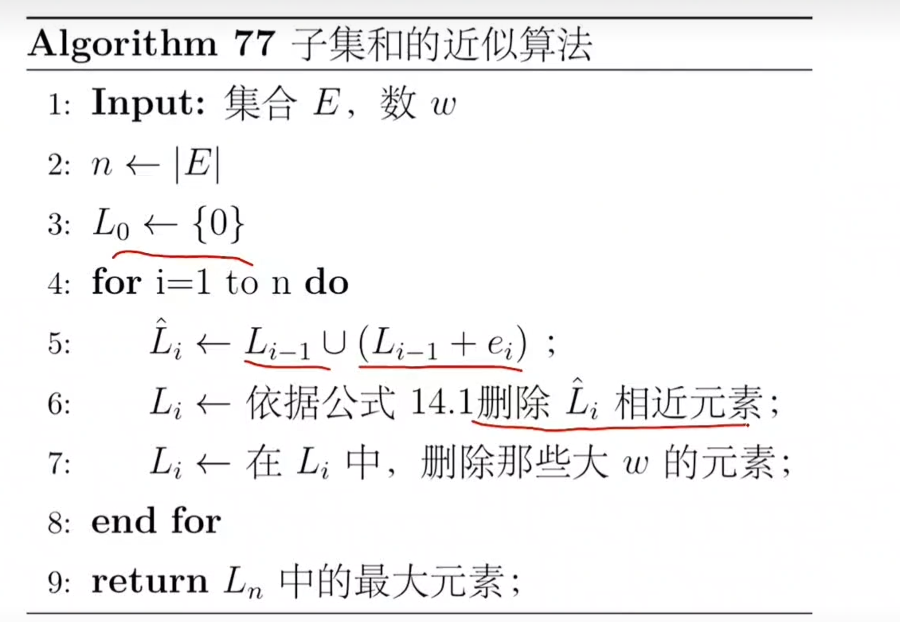
证明内容待学习......

# 集合覆盖问题
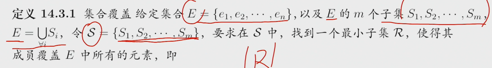
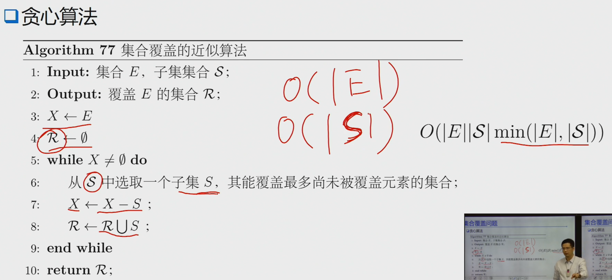
证明过程见PPT

# 带权重的集合覆盖问题——整数规划
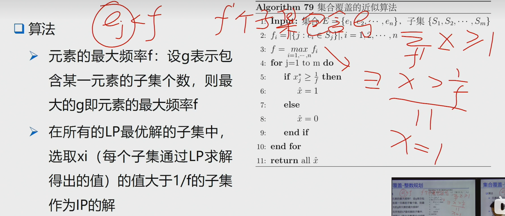
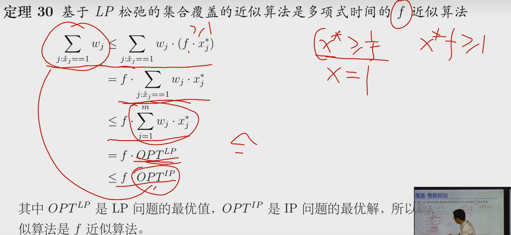

# 带权重的集合覆盖问题——原始对偶算法
对偶问题中约束条件的含义为
>在每个子集$S_i$中，对每个元素赋值$y_i$，所有元素的权值和小于等于$W_i$
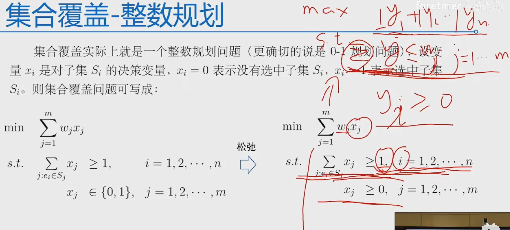
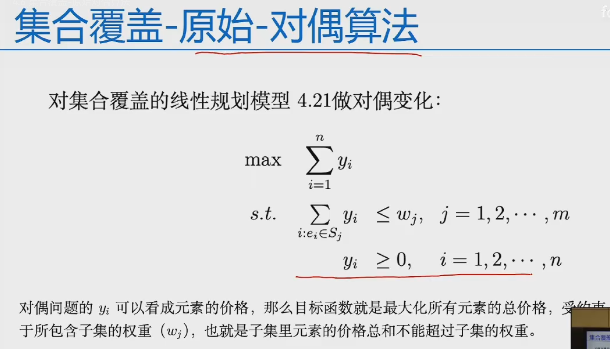
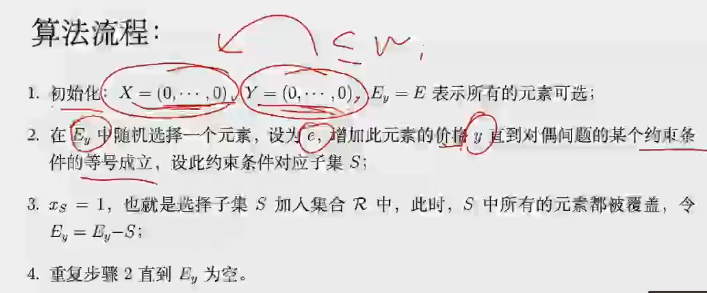
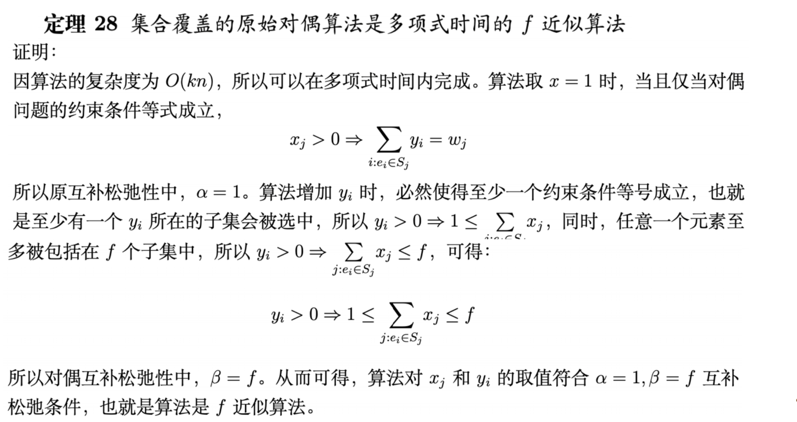

# 斯坦纳最小树
