# 概述
前面所讲述的算法都是确定性算
1. 算法总能得出确定的结果
2. 算法总能在确定的时间内完成

当算法引入一些随机因素后，算法将不再具有上述性质

## 分类1
### 拉斯维加斯算法(Las Vegas)
在限定时间内，算法不一定能找到解；如果找到解，一定是正确解

### 蒙特卡洛算法(Monte Carlo)
执行时间是确定的，但是解不一定是正确解

## 分类2
### 避免落入最坏情形
这类随机算法也称为舍伍德算法(Sherwood)

### 降低时间复杂度
1. 求解概率
2. 近似因子

# 随机快速排序
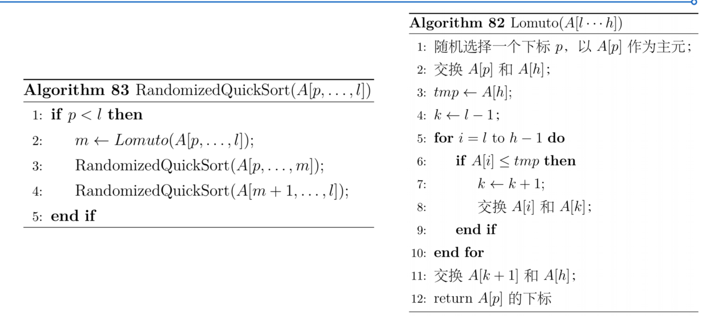

# 最小圆覆盖问题
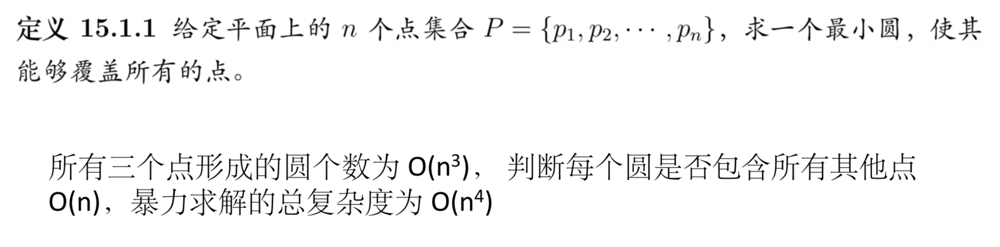
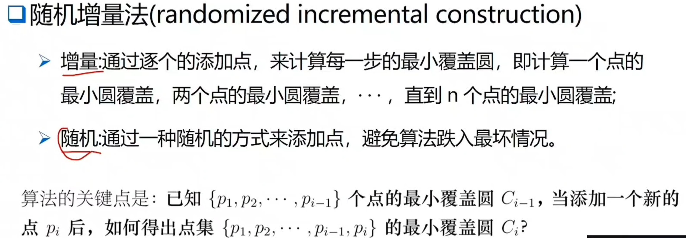
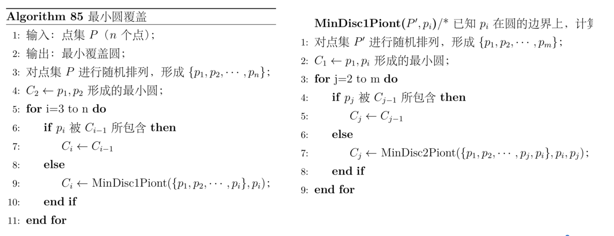
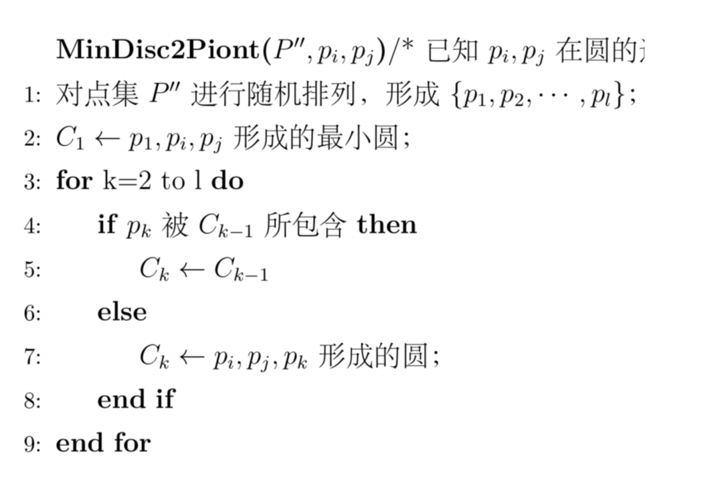
基于随机增量法的最小圆覆盖的最差时间复杂度为$O(n^3)$,期望时间复杂度为$O(n)$

# 弗里瓦德算法(Frievald's Algorithm)
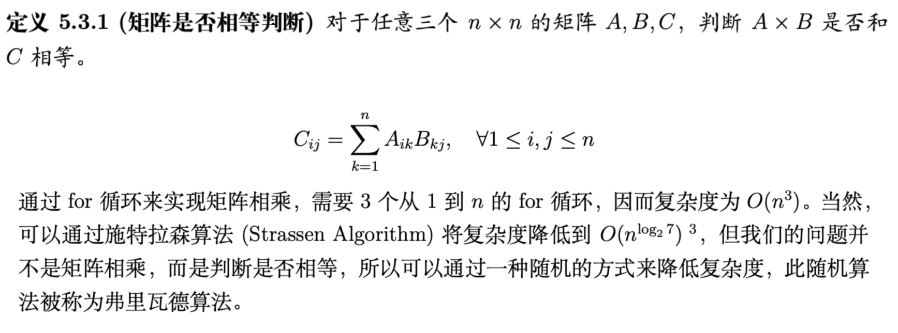
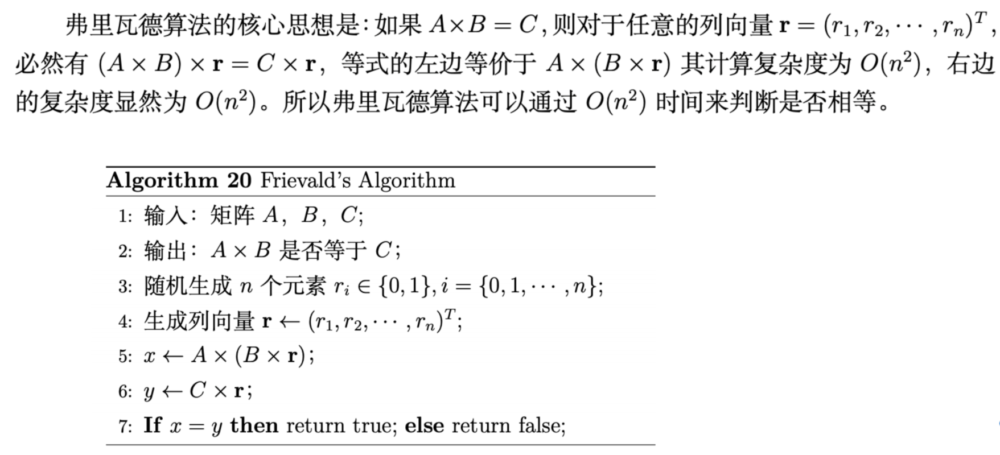
弗里瓦德算法得到错误解的概率小于等于$1/2$

# 集合覆盖的随机算法
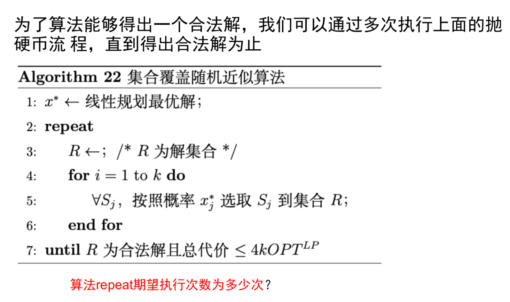

# 最小割
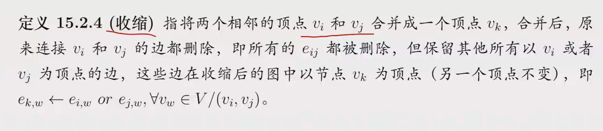
随机算法通过收缩的方式来找最小割
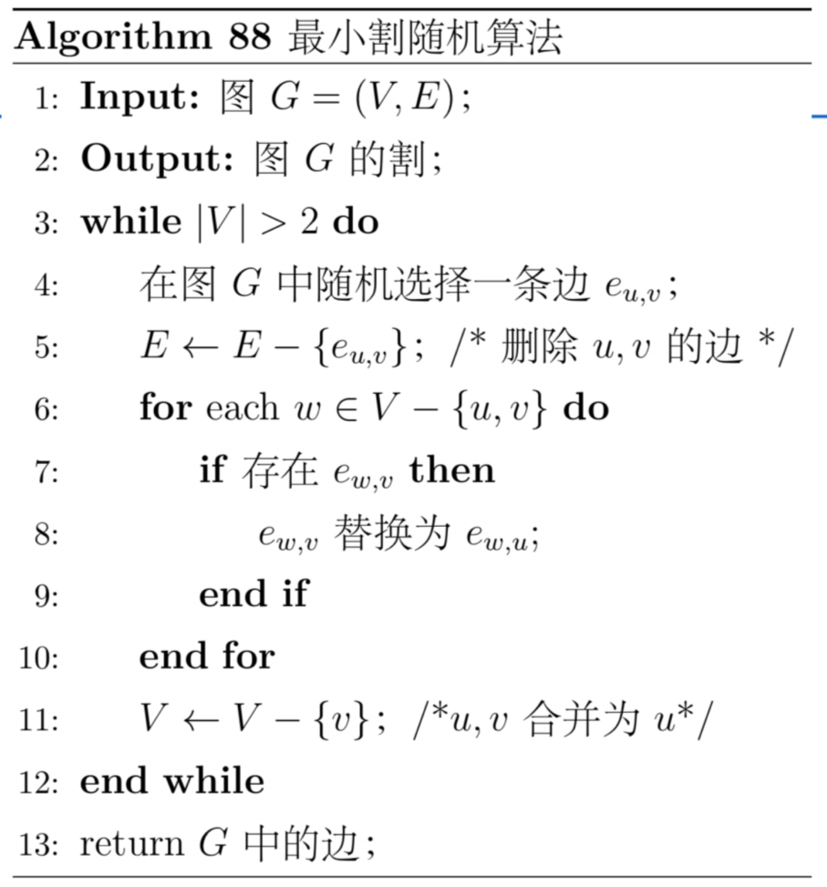
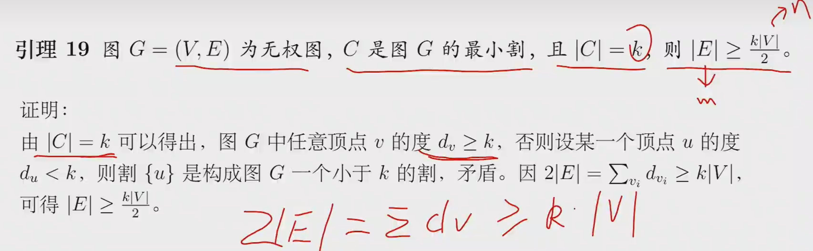
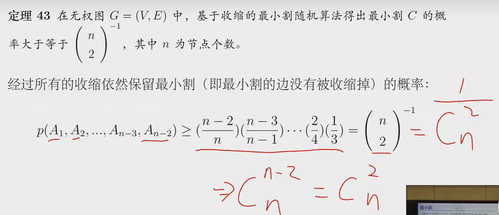
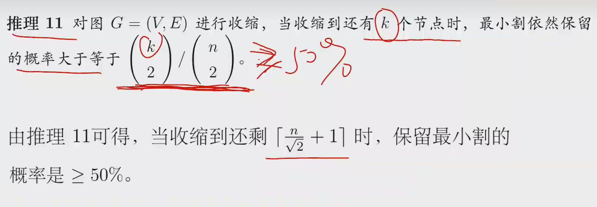
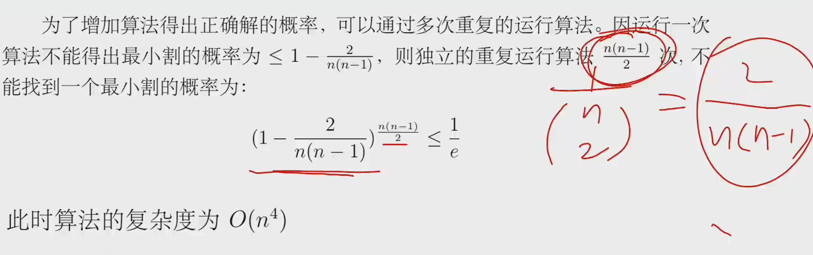
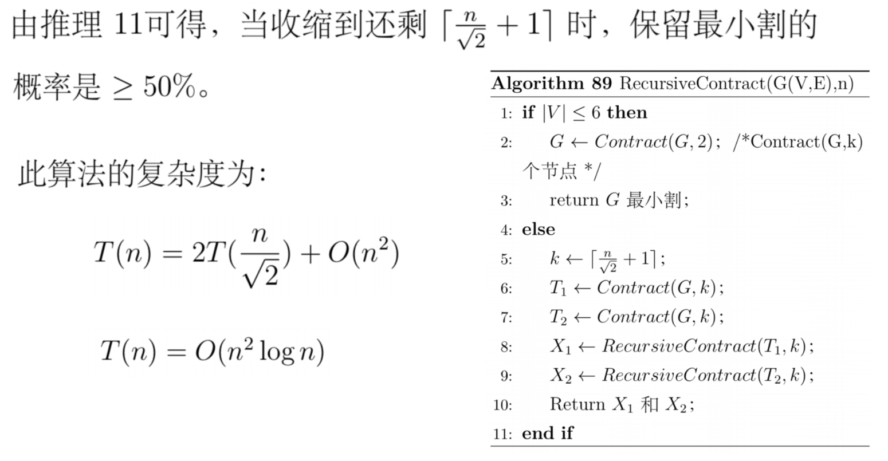
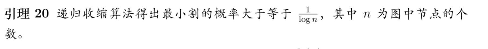