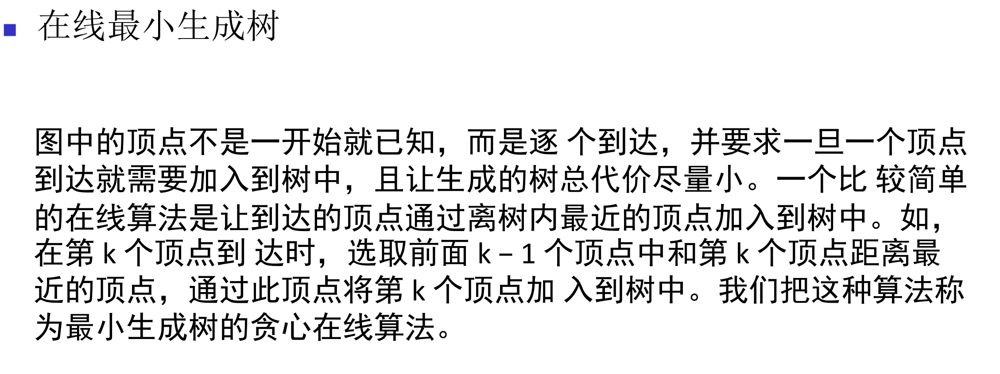
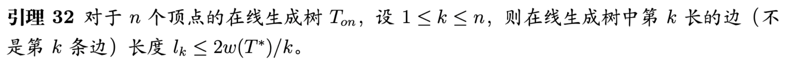
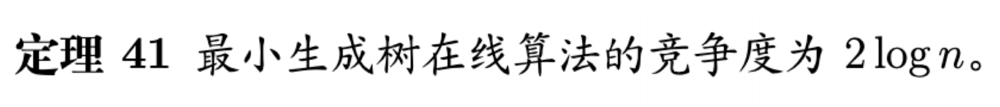
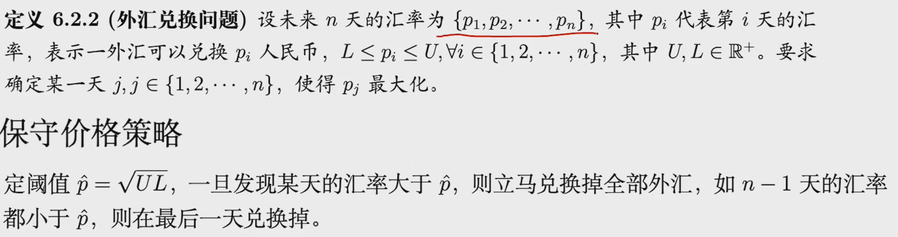
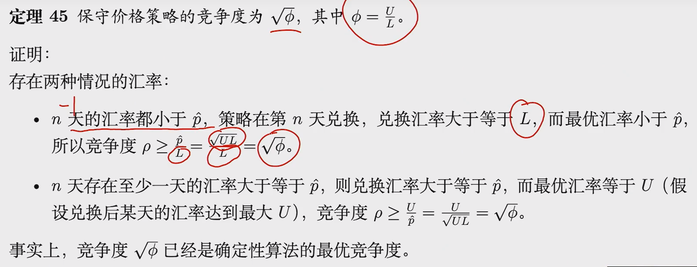
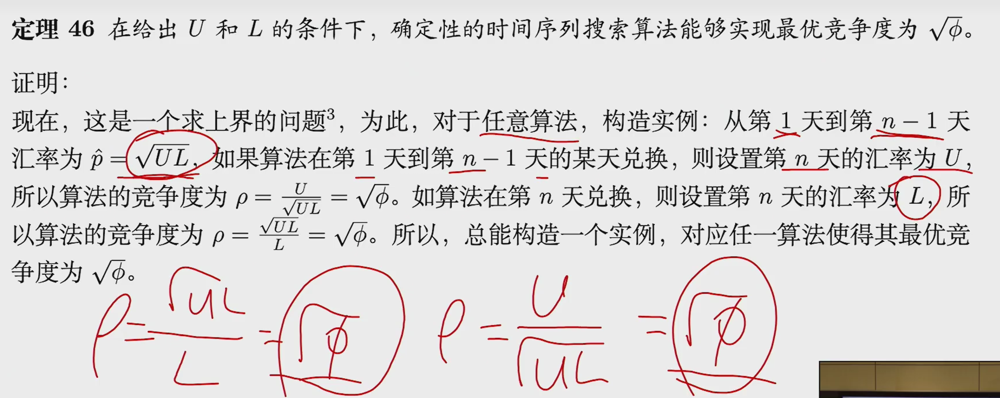
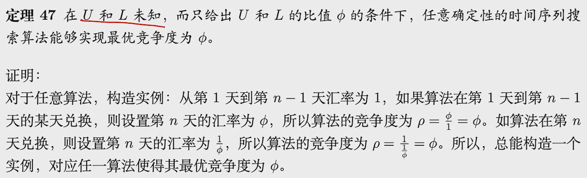
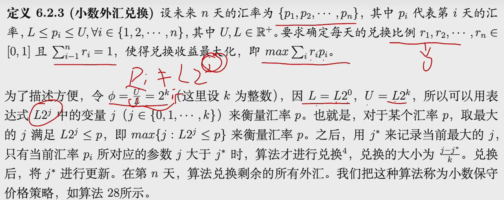
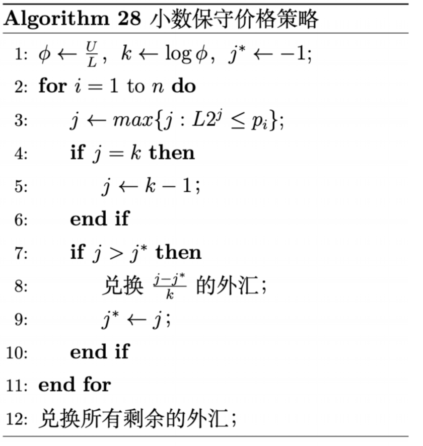

# 概述
## 离线算法
在前面讨论的算法中，问题实例的所有数据在计算时都是已知的
## 在线算法
1.问题实例的数据是逐渐来到的 
2.在线算法是近似算法
## 人工智能算法和在线算法的区别
人工智能算法
> 试图从以往的数据中寻找规律，根据目前分配状态，来分配目前到达的任务

在线算法
> 数据完全未知，并且存在最坏数据的情况

## 竞争度
和近似算法的近似因子十分相似

# 确定性在线算法
## 在线最小生成树

## 时间序列问题
### 整数外汇兑换

### 小数外汇兑换

# 随机在线算法
策略的做出是随机性的，形成随机算法，随机在线算法的好处是，假设对手无法猜测算法的策略
### 租买问题
