ALEX：An Updatable Adaptive Learned Index

## 应用场景：
在DBMS中代替传统的索引结构，类似于B树、B+树之类的变种

## 问题描述：
ALEX索引需要实现点查找、范围查询、插入、删除和批量载入
ALEX的目标是
1.比B+树写数据更快
2.比B+树和learned index读数据要更快
3.索引大小要比B+树和learned Index要小

## 难点与分析过程：
- 写数据时：B+树插入到数据节点时需要进行大量的移位操作，对于一个dense Array 它的插入时间复杂度为O(n)
- 写数据时：B+树插入到数据节点时，根据节点是否已满的条件来将数据节点分裂，分裂到根节点会导致树高的增加
- 读数据时：B+树遍历到数据节点后，使用二分查找确定带查找的key的position，它的时间复杂度为O（log2n)
- 读数据时：最初的Learned Index是先将数据排序好之后，再在该数据上创建模型，这样用最后的数据节点来预测key的位置时会有较大出错的概率，并且还需要存储Error Bound

## 方法：
- **写数据时**：ALEX使用一个gap array（间隙数组），这样在插入过程中需要更少的移位操作，它的时间复杂度近似于O（log2n）
- **写数据时**：插入已满数据节点时，使用一个intra-node cost model模型来决定将数据节点扩展（如果没有）或者是分裂
Intra-node cost model根据每个数据节点存储的两个信息（1.**平均每次操作指数搜索的迭代次数** 2.**平均每次插入时的移位操作次数**）计算经验成本，再和数据节点的预期成本（节点创建时预期的成本）比较
如果经验成本与预期成本没有较大的偏离（超过50%）则执行节点扩展（不会超过节点最大大小限制），否则执行节点分裂
- **读数据时**：ALEX使用指数查找，先用数据节点的线性模型预测一个position，再判断该position上的key是否大于或者小于待查找的key，以此判断指数查找的方向

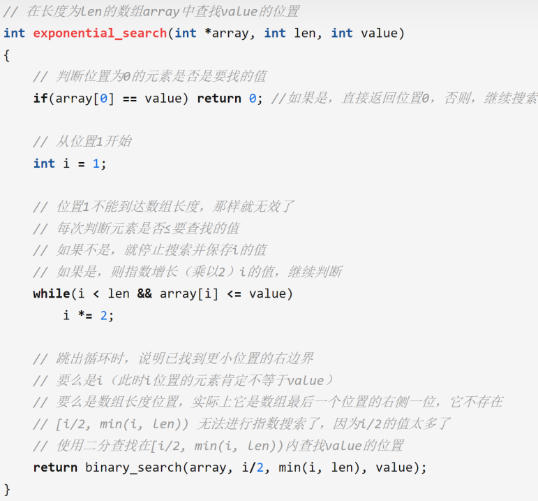
指数查找的时间复杂度分析如下
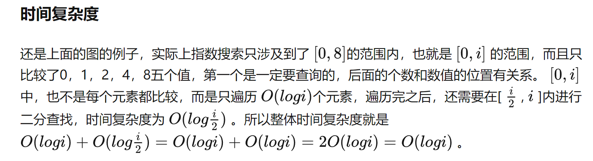
并且使用指数查找算法后，也不需要在数据节点模型中存储error bound。

- **读数据时**：ALEX在创建数据节点时使用基于模型的插入，先训练好模型之后，再将模型尽量插入预测的位置，这样可以大大减少预测错误的概率

**ALEX的节点：**
**Internal node：**
线性模型（slope intercept）、point array
**Leaf node：**
线性模型（slope intercept）、gap array 、bitmap

**查找：**
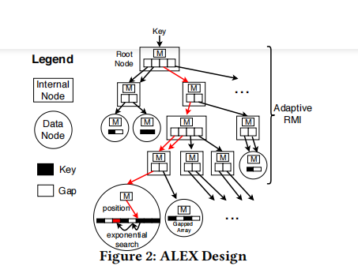

**插入：**
**未满节点:** 按照查找逻辑找到应该插入的数据节点，有必要的情况下用指数查找来找到正确的位置。
**已满节点：** 已满节点的定义（有一个上下限密度dl du）
节点扩展机制：
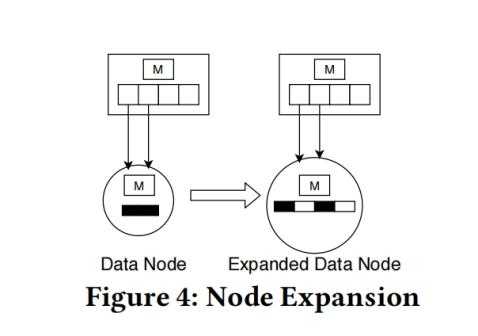
节点分裂机制：
a.有冗余指针指向数据节点，可以用它分别指向另外两个数据节点
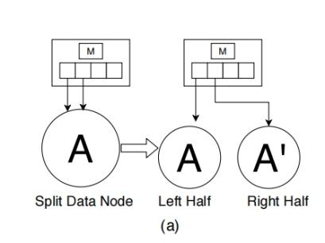

b.如果父节点满了，像B+树那样进行拆分，分类一直可以传播到根节点
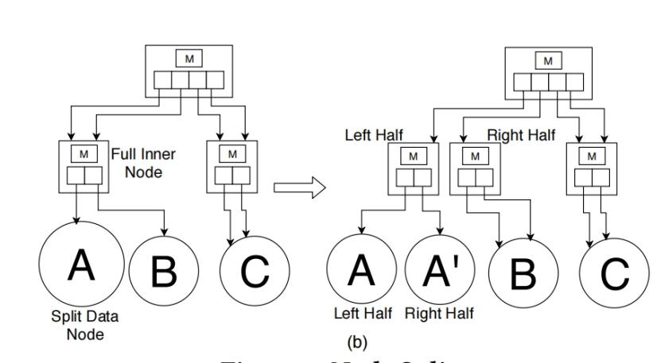

**删除：**
简单删除key和payload，如果Data Node由于删除而达到密度下限dl，那么我们将收缩Data Node避免低空间利用率（思考：是否可以引入合并操作）

**更新：**
Delete和Insert操作结合

**界外插入：**
首先，当ALEX检测到现有key空间之外的插入时，将扩展root节点；如果此扩展将导致根节点超过最大节点大小，ALEX则会创建一个新的root节点，并为新root节点的每个其他指针槽创建一个新的数据节点。
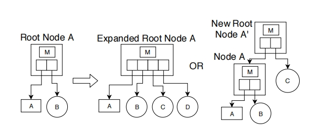
其次，ALEX最右边的数据节点通过记录节点中的最大键的值和插入超过该最大值的计数器来检测插入行为。如果多次插入都超过该最大值，这意味着这是一个只追加行为，因此数据节点向右扩展，扩展的空间用来更多类似于追加的插入

**批量加载**
RMI成本是通过TraverseToLeaf和intra-node cost model来计算的
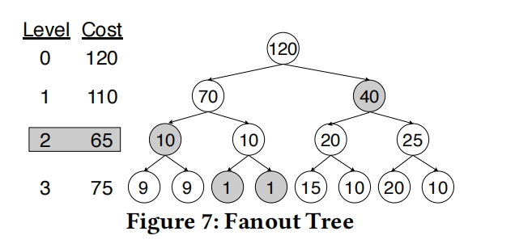 
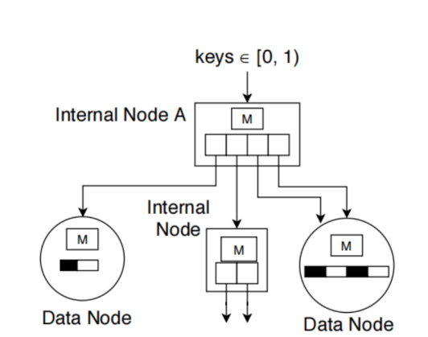
每个node为internal node或者leaf node由fanout tree决定，
决定每一个node的类型时都独自创建一棵fanout tree

## 结果
数据集选取：
使用某个数据集的8字节的key运行所有的实验，并随机生成固定大小的payload。
我们在4个数据集上评估了ALEX，其特征和CDF如下所示
经度数据集由Open Street Maps中世界各地的经度组成
Longlat数据集由复合键组成（k=180*floor(longitude)+latitude, 经纬度也是来自Open Street Maps)
Lognormal数据集的值是根据对数正态分布N（0，4）生成的，并乘上10^9，再四舍五入到最接近的整数。
YCSB数据集表示根据YCSB基准生成的用户ID的值，这些值均匀分布在整个64位域中，并使用80字节的有效载荷
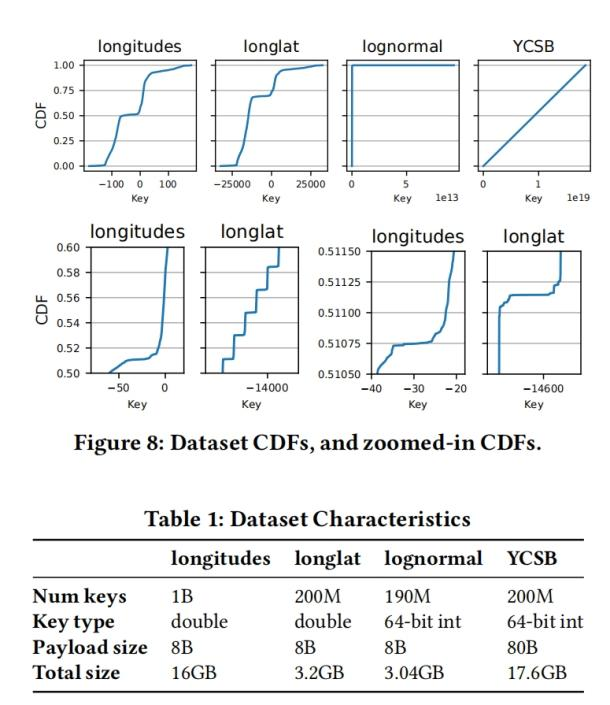
工作负载：我们评估ALEX的主要指标是平均吞吐量（指定时间内完成的插入或读取量），评估了5个工作负载的吞吐量
（1）只读工作负载 （2）具有95%的读取和5%插入的读取繁重的工作负载（3）具有50%的读取和50%的插入的写繁重的工作负载（4）具有95%读取和5%插入的读取的短范围查询的工作负载（5）只写工作负载
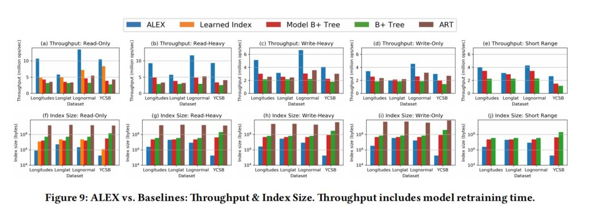
ALEX和learned Index；B+ Tree；模型增强B+ Tree；ART对比
- 在只读工作负载上，ALEX比B+树、learned index、模型增强B+树和ART在吞吐量上高4.1x、2.2x、2.9x、3.0x和在索引大小上小800x、15x、160x、8000x
- 在读写工作负载上，ALEX比B+树、模型增强B+树和ART在吞吐量上高4.0x、2.7x、2.7x，
在索引大小上小2000x、475x、36000x
