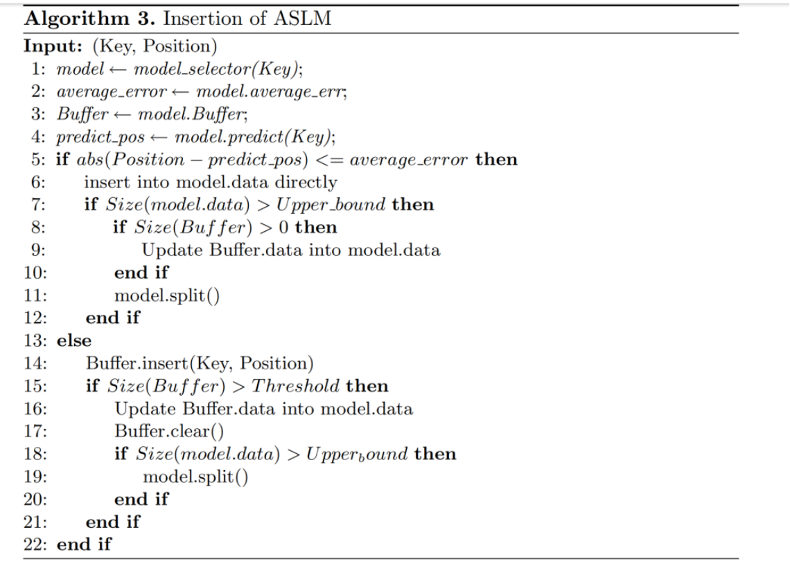

### 应用场景：
读写场景

### 问题描述：
Learned Index 
(1)RMI 采用的分区策略没有考虑数据之间的相似性 
(2)RMI 不支持更新

### 方法：
#### 分区算法
##### Method1:

SLM:这是一个简单的模型，只有一层，这一层包含K个子模型

##### Method2：

数据点之间三角形面积可替换为欧式距离，用来表示两个数据点之间的相似度

#### 数据插入：

### 结果：

