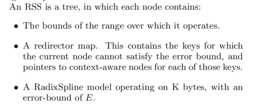
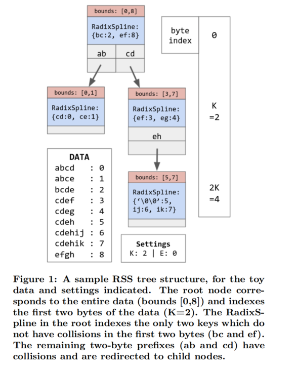

## INTRODUCTION
ReadOnly
对字符串的学习索引最重要的问题是 last-mile-search,并且这种搜索在字符串场景中特别昂贵。

两个原因
> 1. 由于难以建模真实世界的数据（许多真实世界的数据集具有很长的共同前缀以及每个字节相对较低的鉴别内容，CDF似乎是循序渐近的，这样传统的学习模型很难准确捕获和预测），这些场景的平均模型误差往往很高
> 2. 最后一英里的搜索是很慢的，每次比较是昂贵的，字符串的大尺寸减少了适合在缓存中的键的数量

这项研究的基础： Bounded Error（这样就可以使用二分查找代替指数搜索）

## SPLING STRINGS
问题描述：对于字符串而言，需要满足两种操作
1. 确定性查找，找到完全匹配的字符
2. 模糊匹配，找到第一个满足匹配条件的元素（下届）

### RADIX STRING SPLINE
RSS是一棵树，每个节点包含三个部分：

- bounds: 可操作的数据下标范围
- 重定向map(指针):包含并指向了一些key，这些key因为不满足当前节点的error bound，因而被分配到了其他节点
- 一个使用K个byte作为前缀，错误范围为E的RadixSpline模型

#### 如何构建？
1. 首先，对数据集中所有字符串构建一个RadixSpline(使用前k个字节)。然后，遍历所有唯一的k字节前缀，并检查估计的位置是否在前缀的第一次出现和最后一次出现时都在规定的误差范围内。
2. 对于每个测试失败的前缀，我们将其添加到重定向表中，并在有问题前缀的所有字符串中构建一个新的RSS，从字节k开始而不是0
3. 这个过程递归地继续进行，直到每个key都得到满足为止。

#### 如何查询

首先提取字符串的前k个字节，然后对重定向器进行二分查找，如果找到重定向新的RSS节点，就重新开始对下一个k字节进行操作；如果没有找到，那么就在当前节点使用适当的字符串前缀查找并返回结果。

## HASH CORRECTOR
待更新