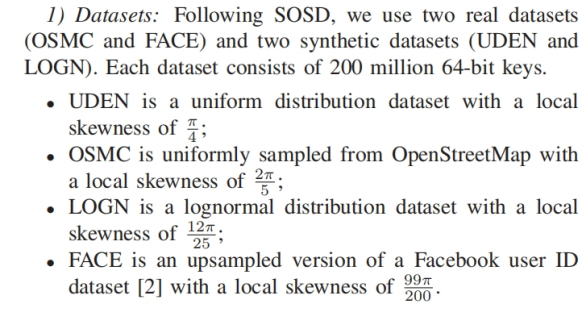
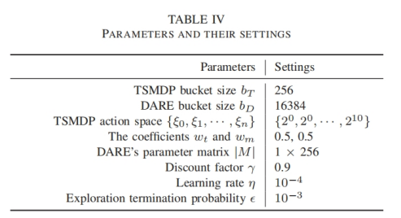

> 关键词：learned index，locally skewed data，multi-agent reinfocement learning

## Introduction
### 问题描述

（1）学习索引利用机器学习模型去拟合局部区域内的数据分布具有挑战性
现存的工作（比如ALEX，PGM, FITing-tree采用贪心构建策略来拟合整体数据分布）无法很好地适应局部数据的偏斜分布

（2）频繁插入数据而进行的重新构建或者重训练对查询延迟有显著影响

### 解决方案
（1）提出了一个名为Chameleon的一维学习型索引，分为non-leaf node（使用linear model）和leaf node（使用EBH（Error Bounded Hashing） model）
（2）提出了一个测量local skewness的指标，提出MARL（Multi Agent Reinforcement Learning）方法用来构建索引结构和定位局部倾斜的区域
（3）提出一个轻量级锁（名为interval lock）和一个基于此的无锁重训练机制，

（1）、（2）解决了问题1，（3）解决了问题2

## Related work

## OVERVIEW OF CHAMELEON

### Inner node

### Leaf node
因为输入的微小变化可以导致相应的哈希值的显著变化，使得哈希函数能够分散密集数据，从而有效降低索引树的高度

### 难点
解决局部倾斜问题的关键在于如何测量和识别这种偏斜，以及在数据更新时可能导致局部偏斜区域的变化

### 提出了一个测量local skewness的指标

### 提出MARL（Multi Agent Reinforcement Learning）方法
提出MARL（Multi Agent Reinforcement Learning）方法用来构建索引结构和定位局部倾斜的区域

- 首先提取数据集的分布信息（即D的PDF，|D|和D的lsn），输入DARE，输出为一个矩阵，用于确定前h-1层的分支因子，用来构建前h层的索引，最后提取第h层每个节点的数据分布信息将其输入TSMDP，输入每个节点的分支因子（可能为1）
- 当数据更新导致局部数据分布发生变化时，重训练线程会定位局部倾斜的区域并调用TSMDP来调整局部结构，而不会阻塞查询（使用interval lock）

## CHAMELEON INDEX CONSTRUCTION
### Resolving local skewness
为了有效解决局部偏斜问题，我们根据定理1自适应地调整每个叶子节点 $ N_{ij}.c $ 的容量，以确保每个节点满足所需的 $ \tau $ 值。

### Locating the Locally Skewed Regions
在索引构建过程中，每个内部节点都会影响其所有子节点。现有的基于马尔可夫决策过程（MDP）的强化学习算法侧重于顺序决策问题，无法直接应用于我们的基于树的决策过程。为了解决这一问题，我们提出了一个树结构马尔可夫决策过程（TSMDP），基于深度 Q 网络（DQN）的思想。以与节点 $ N_{ij} $ 对应的数据集特征作为输入，TSMDP 输出节点 $ N_{ij} $ 的扇出 $ N_{ij}.f $。接下来，我们定义 TSMDP 过程，并介绍训练过程。

#### TSMDP公式定义
State：状态s是节点划分之前的信息，包括PDF，key的数量，lsn（其中PDF由大小为bt的桶表示）

Action：动作a是指分配给当前状态对应节点的fanout，动作空间是一个离散值的预定义值

Transition：给定s和a，如果a = 1，则TSMDP到达一个终止状态，并构建一个叶子节点。由于基于树的索引结构的特点，当前状态s可能会导致多个下一个状态{s1，s2}

Reward function：评估在给定s和a下构建的索引的查询成本和内存成本
 $ r = -w_t \cdot R_t - w_m \cdot R_m $。其中，$ w_t $ 和 $ w_m $ 表示查询时间奖励和内存奖励的权重系数。我们用 $ R_t $ 表示遍历树和在叶节点内进行二次搜索的成本，用 $ R_m $ 表示执行动作后节点的内存使用量。根据应用需求，还可以将查询分布等其他因素加入到奖励函数中

#### TSMDP训练过程
学习算法：带经验回放（experience replay）的DQN
智能体的经验，包括状态、动作、奖励和下一状态 $(s_t, a_t, r_t, s_{t+1})$ ，在每个时间步 $ t $ 进行存储。在每一步中，使用***Boltzmann*** 探索策略来选择动作。我们实现了两个网络：一个为参数为 $ \theta $ 的策略网络 $ Q_T $ ，另一个为参数为 $ \theta^{-} $ 的目标网络 $ \hat{Q}_T $ ，这种设置使 TSMDP 比使用单一网络更稳定。

给定一批转换 $(s, a, r, s')$ 后，通过最小化**平均绝对误差**（Mean Absolute Error，MAE）损失来使用梯度下降更新策略网络的参数 $ \theta $ 。具体而言，损失函数为：

其中，$ \gamma \in (0, 1) $ 表示折扣因子，决定了未来奖励的重要性，$ a'_z $ 表示由 $ s'_z $ 所采取的最优动作。$ w_z $ 是 $ s'_z $ 的权重，即 $ s'_z $ 中键数量与 $ s $ 中键数量的比值。
请注意，目标网络的参数 $ \theta^- $ 仅在每隔 $ K $ 个步骤（系统参数）时与策略网络的参数 $ \theta $ 同步，而在其他时间保持不变。

#### 只使用TSMDP的缺点
1.索引构建时间很长，因为需要递归调用TSMDP模型为每个节点做出决策

2.高训练开销。在训练过程中，每个经验都包含了每个节点及其所有子节点的概率密度函数 (PDF)。逐一使用 $ Qˆ_T $ 计算子节点的 $ Qˆ_T(s', a') $ 的过程非常耗时。同时，离散动作空间的使用限制了我们在更大动作空间中的探索能力。

3.当应用需求发生变化时（例如，奖励函数优先考虑查询时间而非索引大小，或反之），TSMDP需要重新训练

### Enhancing TSMDP with DARE

> 为了解决限制 (1)，Chameleon 只需调用 DARE 一次来构建索引的上层 $ h $ 层，仅对下层进行局部 TSMDP 调用以进行微调。

> 为了解决限制（2），DARE 使用单步决策的强化学习模型，该模型具有较低的训练开销，使我们可以在一个大且连续的动作空间中探索，以找到最佳动作。

> 为了解决限制 (3)，我们提出了一个动态奖励函数，使其能够适应系统动态约束，而无需重新训练强化学习代理。

具体来说，给定一个数据集 $ D $，其最大和最小键分别为 $ M_k $ 和 $ m_k $，DARE 首先提取全局数据分布特征。基于这些特征，它输出一个固定大小的参数矩阵 $ M(h - 2, L) $ 和根节点的分支因子 $ p_0 $（根节点的分支因子作为一个单独的输出参数，因为它在索引中具有唯一性）。这里，$ h $ 表示层数，矩阵 $ M $ 的每一行代表第 $ i $ 层中各个非根内节点的参数 $ p_{i,0}, p_{i,1}, ..., p_{i,L-1} $

在获得 $ M $ 和 $ p_0 $ 后，我们首先计算节点 $ N_{ij} $ 在 $ M $ 中的位置 $ x $ 的映射，其中 $ x = \frac{\frac{(N_{ij}.lk + N_{ij}.uk)}{2} - m_k}{M_k - m_k}{(L-1)} $。接下来，计算矩阵 $ M $ 中包含 $ x $ 的区间 $[p_{i,l}, p_{i,l+1}]$，其中 $ l = \lfloor x \rfloor $。然后，我们采用分段线性插值函数将离散参数转换为连续值，公式为：

在构建了上层 $ h $ 级索引后，基于 DARE 构建的索引，TSMDP 精细化下层，决定是否继续分裂。在这里，索引构建完成。

如图 6 所示，假设 $ h = 3 $，$ L = 4 $，最小键 $ m_k = 0 $ 和最大键 $ M_k = 3 $。在步骤 (1) 中，提取数据集特征并作为 DARE 的状态。在步骤 (2) 中，DARE 输出根节点的分支因子 $ p_0 $ 和一个 $ 1 \times 4 $ 的参数矩阵 $ M $。由于 $ p_0 = 3 $，根节点有三个子节点，其中 $ N_{10}.lk = 0 $ 和 $ N_{10}.uk = 1 $。因此，计算 $ x = \frac{\frac{(0+1)}{2} - 0}{3-0}\cdot 3 = 0.5 $，并得到 $ l = \lfloor x \rfloor = 0 $。最后，得到 $ N_{10}.f = (0.5 - 0) \cdot 1.3 + (1 - 0.5) \cdot 5.1 = 3.2 \approx 3 $。

#### DARE公式定义
Experience: 由于DARE处理的是单步强化学习问题,经验仅包含state，action，reward

State: 我们还使用概率密度函数（PDF，表示为大小为 bD 的向量）、|D| 和局部偏斜度（lsn）来表示状态 sD。因此，状态空间的大小为 bD + 2。

Reward：为了适应不断变化的应用需求，我们提出了一种动态奖励函数（Dynamic Reward Function，DRF），表示为 $ r_D $ = $\sum_{i=1}^{n} w_i \cdot \text{cost}_i $。

假设一个深度Q网络（DQN）已经训练好，可以将高维状态空间和动作空间映射到低维成本空间。给定系数权重 $ w_i $（根据一些特定要求，使得 $ \sum_{i=1}^{n} w_i = 1 $）和不同应用特定指标的成本 $ \text{cost}_1, \text{cost}_2, \ldots, \text{cost}_n $，DRF 可以预测奖励 $ r_D $。当这些权重发生变化时，Q函数仍然有效。

action： 动作$ a_D $ 代表一组参数，用于确定上层 $ h - 1 $ 级节点的扇出（fanout）。根节点的更大扇出有助于提高学习索引的查询性能。大多数现有的一维学习索引的根节点扇出设置在 20 到 220 之间，例如 ALEX。因此，根节点的扇出在范围 [20, 220] 内进行搜索。对于内节点，根据现有的研究，扇出范围设置为 [20, 210]，。对于 DARE 的 $ (h - 2) \cdot L $ 参数矩阵，每行向量的大小 $ L $ 设置为 256。
 为了提供稳定的动作选择策略，DARE 利用遗传算法（Genetic Algorithm，GA）作为行为者，并使用深度Q网络（DQN）作为评论者。在这种方法中，GA 将动作视为基因，将 $ Q_D(s_D, a_D) $ 作为给定状态的适应度函数。通过数值变异和交叉的方式迭代提高适应度，GA 逐渐识别出最接近最大值的动作，从而确定最优策略。算法 1 概述了使用 GA 输出最优参数的过程。

- 种群。由于矩阵 $ M $ 中的值是有限的浮点值，我们可以直观地将每个值视为一个染色体。每个个体有 $ 1 + (h - 2) \cdot L $ 个染色体。
- 变异（第 3-4 行）可以分为两种类型。第一种类型是添加一组随机的扇出，以生成种群中全新的基因型。第二种类型允许 GA 更好地利用现有的高质量基因，随机选择某些染色体将其传递给后代。后者涉及在同一染色体内进行数值交叉。
- 交叉（第 5 行）也可以分为两种类型。前者是多点交叉，其中一个配置包含 $ 1 + (h - 2) \cdot L $ 个染色体，而 DARE随机选择某些染色体将其传递给后代。后者涉及在同一染色体内执行数值交叉。
- 适应度（第 6 行）。GA 算法提供根节点参数 $ p_0 $ 和其他内节点的参数矩阵 $ M $。基于这些参数，通过 Q 网络预测索引的查询成本和内存成本。随后，基于动态奖励函数（DRF）计算的预测值被用作适应度值。
- 选择（第 7-8 行）过程涉及保留一部分适应度最高的基因

### Training Chameleon
算法 2 总结了整个 Chameleon 的训练过程。
首先，我们初始化 

TSMDP 策略网络 $ Q_T $、 
目标网络 $ \hat{Q}_T $、 

DARE 策略网络 $ Q_D $、 
探索概率 $ e_r $ 和探索终止概率（第 1-2 行）。

$ e_r $ 决定在选择 $ a_D $ 时探索与利用之间的倾向。我们使用大量真实和合成数据集作为训练集。随后，在每个回合中，我们从训练集中随机选择一个数据集 $ D $ 并提取其特征作为 $ s_D $（第 3-6 行）。我们随机生成 DRF 的权重 $ w $（第 7 行），并根据算法 1 获取 $ s_D $ 和 $ w $ 的最佳参数 $ a_{\text{best}} $（第 8 行）。参数 $ a_{\text{random}} $ 是随机生成的（第 9 行）。为了在探索和利用之间取得平衡，DARE 根据 $ e_r $ 选择一组参数 $ a_D $（第 10 行），其中 $ e_r $ 在训练过程中逐渐从 1 降至 0。通过 $ a_D $ 和 $ Q_T $ 实例化 Chameleon-Index（第 11-12 行）。然后，我们训练 TSMDP $ Q_T $ 和 DARE $ Q_D $（第 13-14 行）。最后，我们减少 $ e_r $ 并重复上述过程，直到达到 $ \epsilon $（第 15 行）。损失函数为：

其中 $ \theta_D $ 代表 $ Q_D $ 的参数。

## ONLINE RETRAINING FOR UPDATE
使用后台线程重训练索引，不阻塞查询过程

时间复杂度分析

## EXPERIMENTS
### 实验设置
#### 数据集

#### 工作负载

#### 参数设置

#### 基线选取

### 只读工作负载下的实验结果

### 混合工作负载下的实验结果

