## 应用场景
需要有一批数据用于批量加载构建初始数据，不支持从0开始构建（一个key一个key插入），支持读写操作。

## 问题描述
在一棵树中查找一个key，包含两部分；找到包含key的leaf node，leaf node的local search
查找性能取决于leaf node的深度和线性回归模型的accuracy

## 方法和结果
提出一种two-phase bulk loading算法，先构建一棵BU（bottom-up）-Tree，它的node布局由greedy merging 算法（考虑了leaf node的深度和线性回归模型的accuracy）决定，接着根据BU-Tree的node布局构建DILI.
BU-Tree中internal node的range并不是被它的child平分
DILI与LIPP相比，每个leaf node的keys分布更接近线性，发生冲突的概率更低
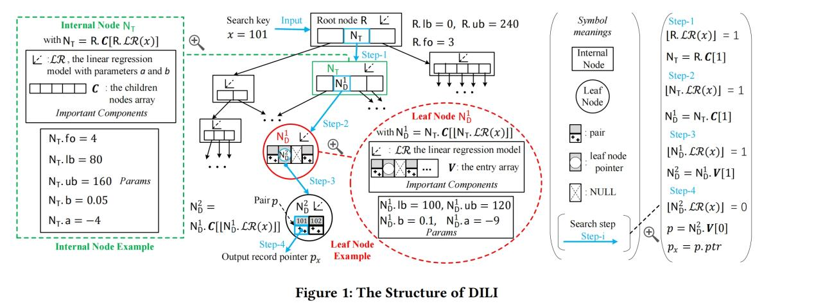

Search without Optimization
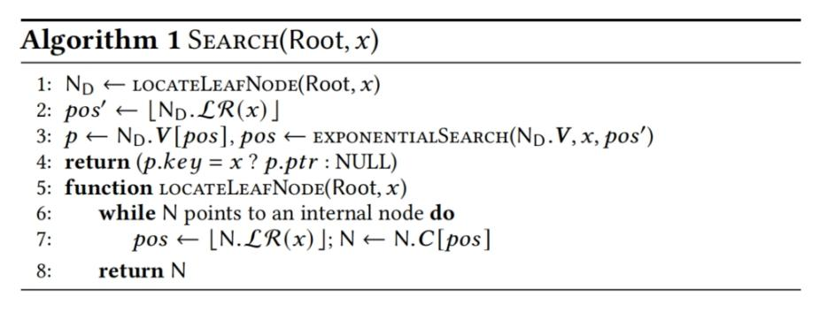

Building BU-Tree
难点：确定nh的大小和nh - 1个breakpoints
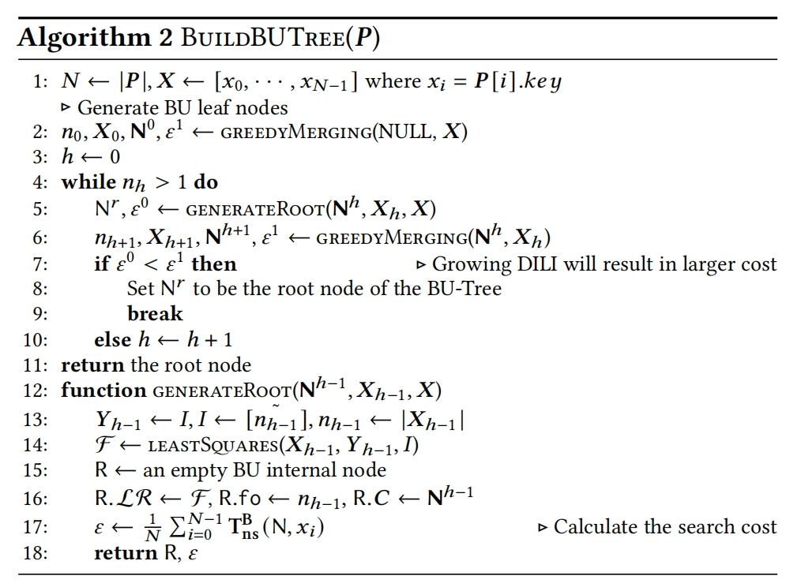
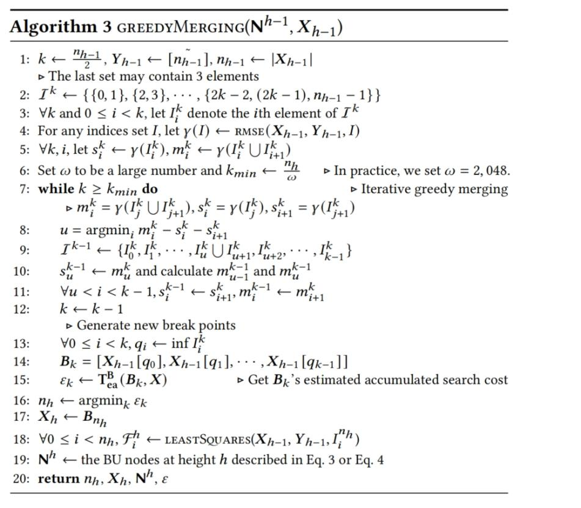
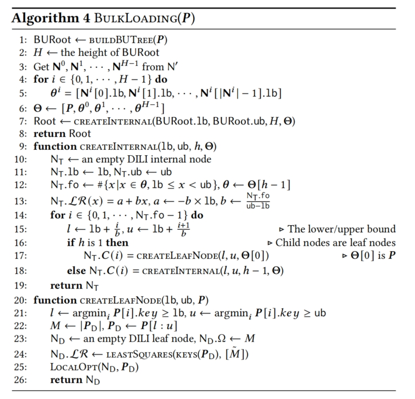
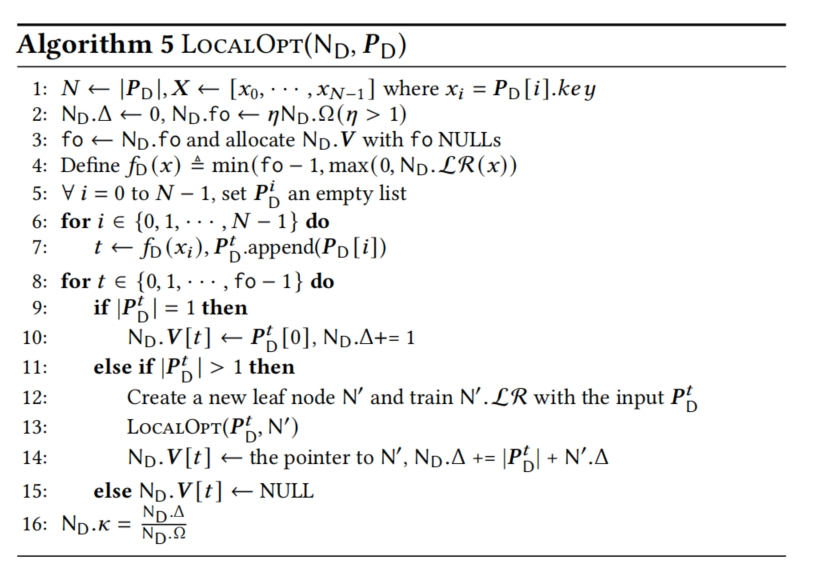
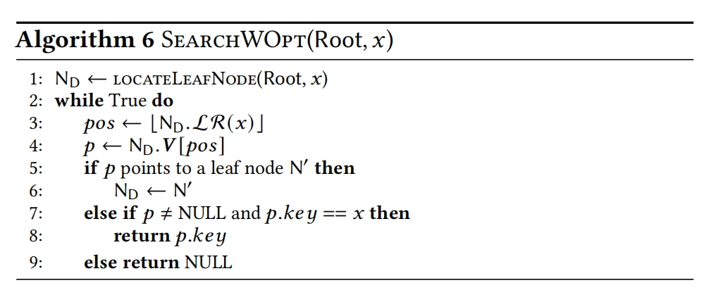
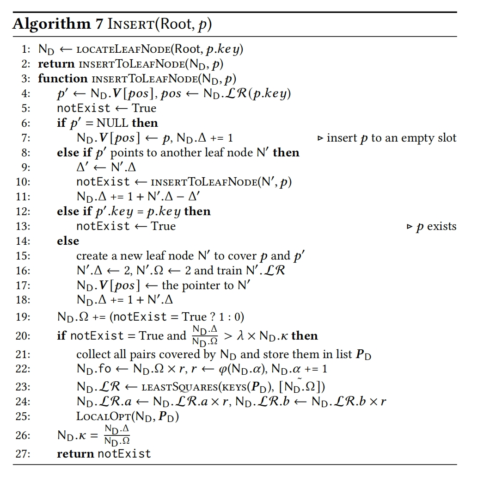
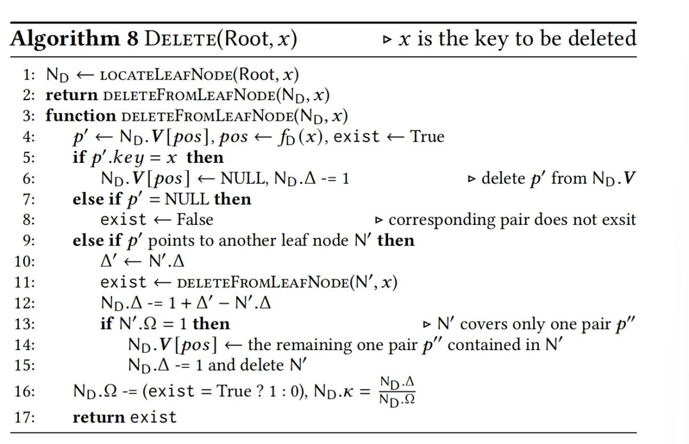
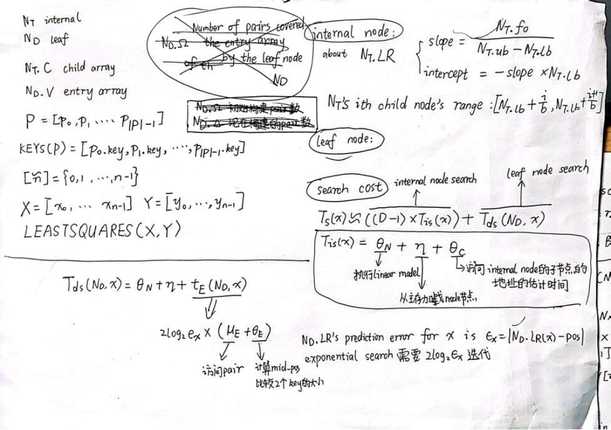
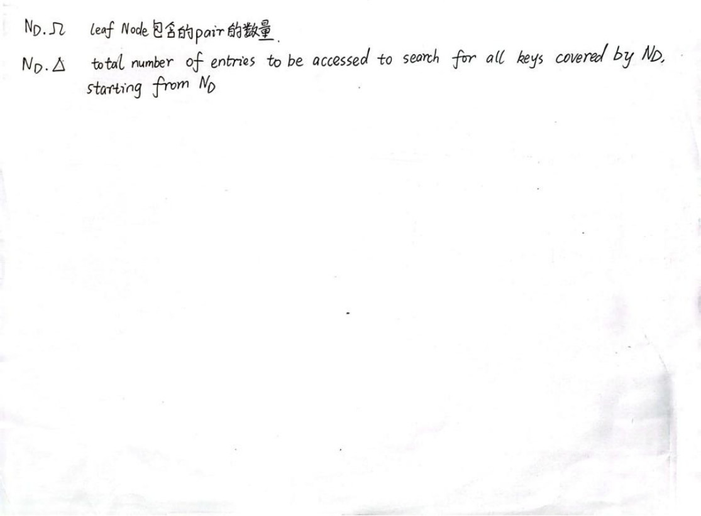
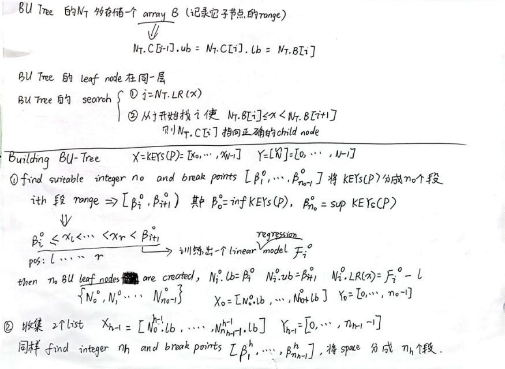
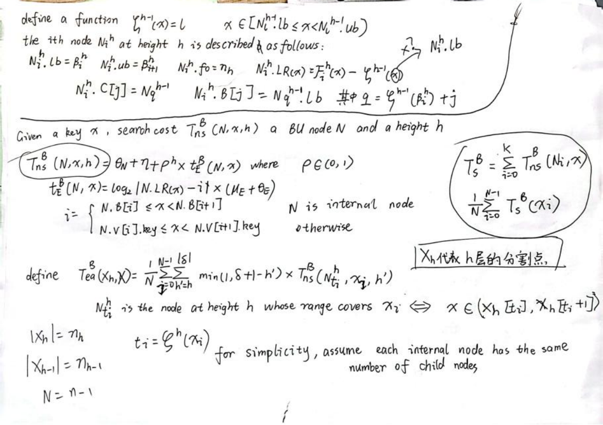