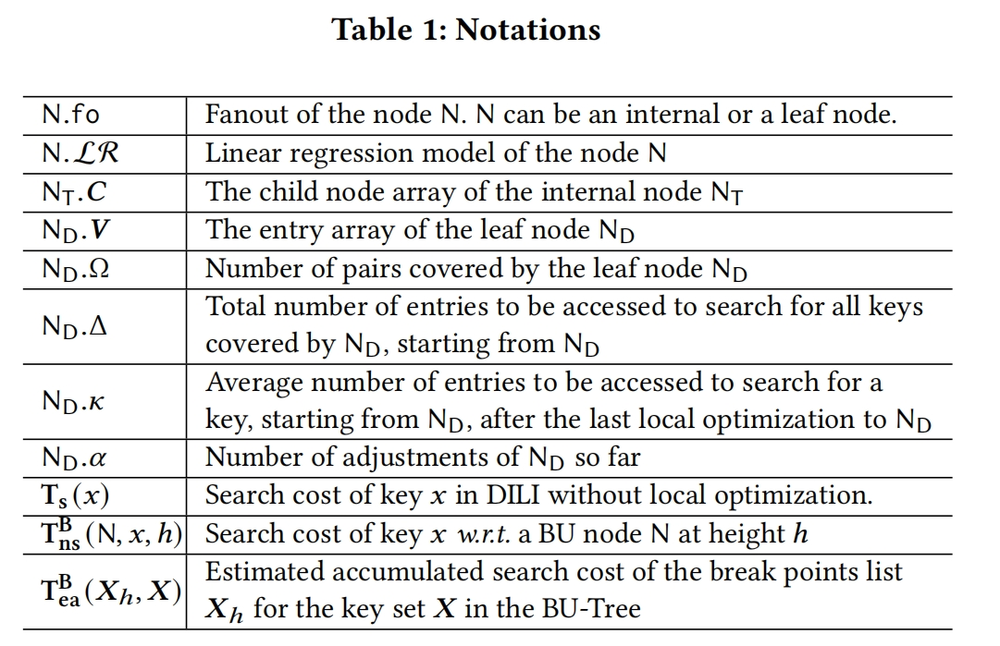
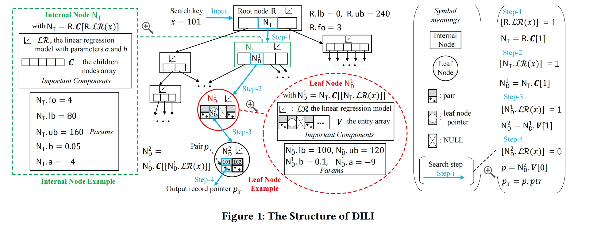
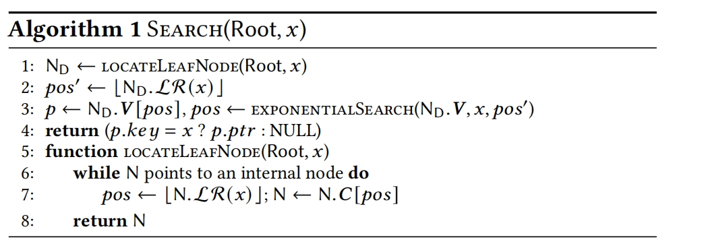
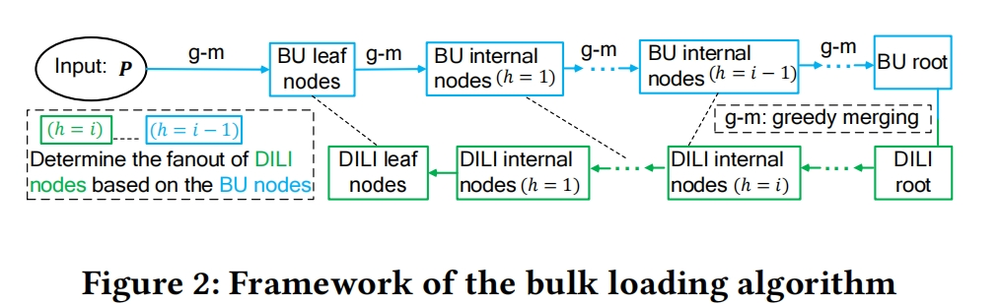
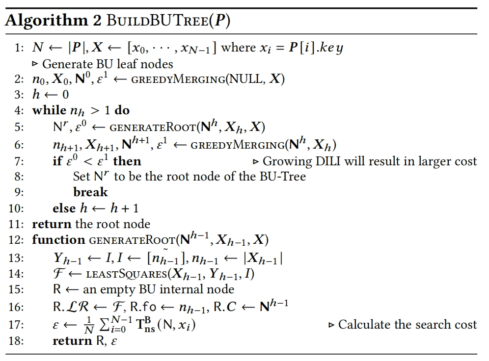
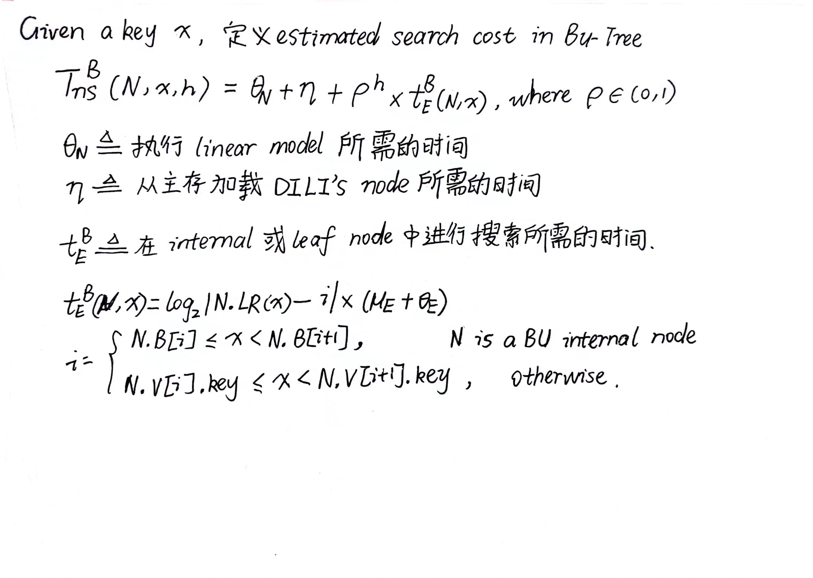
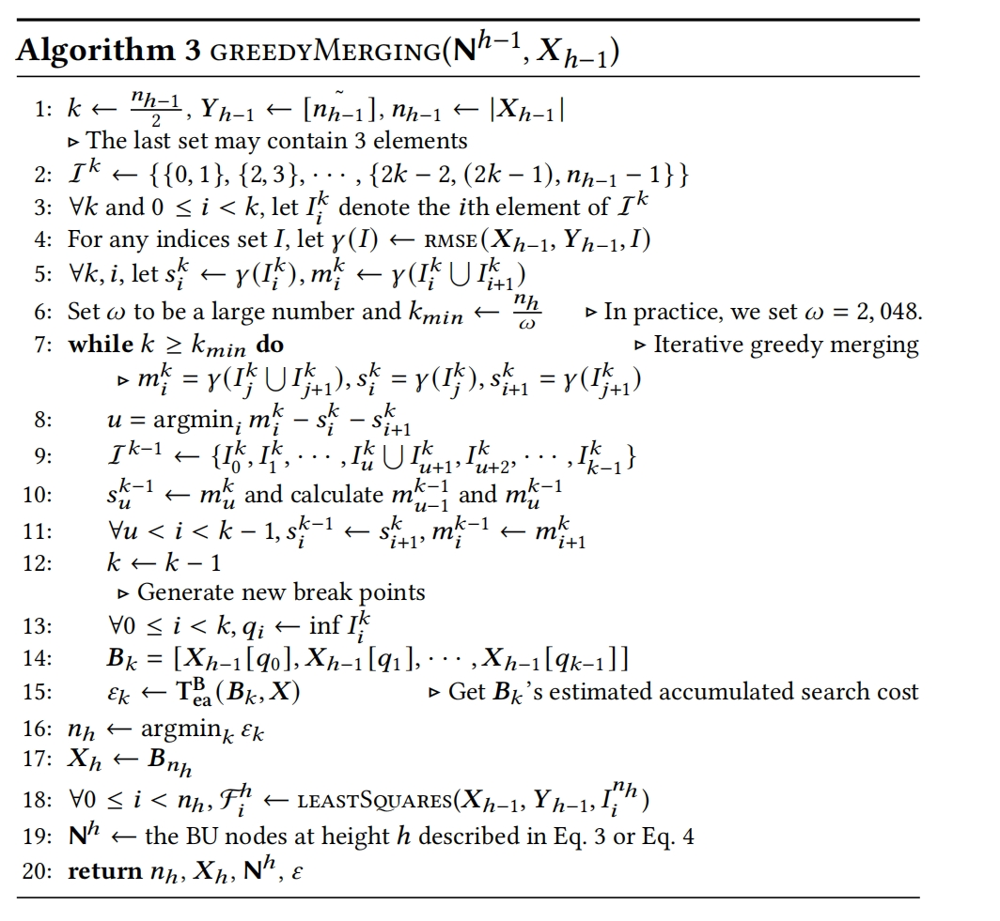
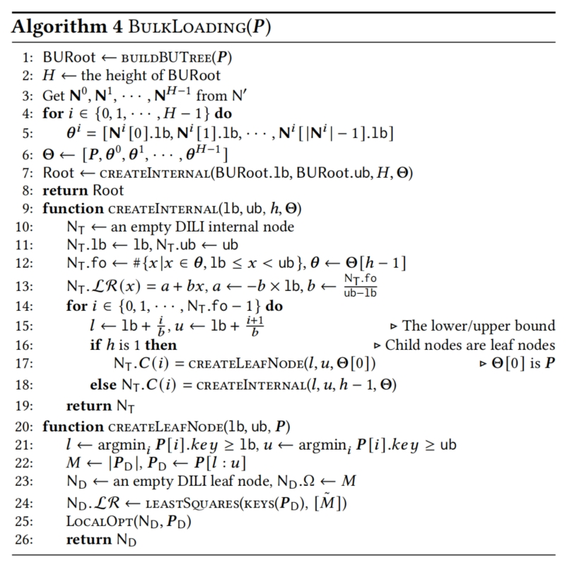

## DILI：A Distribution-driven Learned Index
摘要： 
DILI的每个节点（internal node 和 leaf node）都有一个Linear model，并且internal node的key’s range被它的child node均分，当进行key查找时，可以准确地找到对应的leaf node。在leaf node中的linear model是可以准确预测key的位置的。

为了构建DILI，首先构建一颗bottom-up tree,然后使用这个bottom-up tree，自顶向下构建一个DILI树。DILI在the number of leaf nodes和tree height之间有一个很好的平衡（the number of leaf nodes 和 tree height是影响key搜索时间的关键因素）。设计了灵活的插入和删除算法，并在必要时调整树形结构。

实验结果表明DILI比其它baseline在不同的workloads上要表现的更好。

### 1.INTRODUCTION 
RMI：仅支持查找 
ALEX：扩展RMI，在leaf node中使用 gapped array，使用 cost model初始化RMI结构和动态更新RMI结构。存在last-mile问题 
LIPP：解决last-mile问题，但是没有利用data distribution 
DILI-LO：未解决last-mile问题，利用data distribution 
DILI：解决last-mile问题，利用data distribution 

构建DILI的目的是实现最好的搜索性能 ---> 搜索的开销取决于(1)leaf node的深度(2)leaf  node中的linear model预测的accuracy ---> 这两个factors都应该在DILI的构建中被考虑

因此，提出了一个two-phase bulk loading 方法 
**Phase1** -> 使用greedy merging algorithm（考虑到了上面的两个factors） 构建一棵BU-tree（BU-tree的internal node’srange并不是被它的child nodes均分的，因此在BU-tree进行key搜索时，确定child node需要额外的开销）

**Phase2** ->  借鉴BU-tree的结构构建DILI

#### Contribution
- 提出DILI，algorithms 和它的cost analysis
- 构建DILI的two-phase bulk loading 方法
- 对DILI的leaf node的local optimization，解决last-mile问题
- 对于DILI的insertion和deletion操作提出相应的algorithm来维持查找性能
- 在synthetic data和real data上证实DILI的性能

### 2.OVERVIEW OF DILI

DILI的结构如Figure 1所示

DILI在没有使用local Optimization的时候SEARCH算法如下，查找key时，锁定了leaf node后需要再进行指数查找来确定position。

#### Local Optimization strategy
在leaf node中，先用线性模型预测key的position，之后直接将key放到预测的position上，如果发生冲突，就创建一个新的node，对应的entry设置为指向新node的指针

#### Updates
当对DILI插入数据时，如果发生conflict，会创建新的Node，当创建的新Node过多并且退化了查找性能时，需要进行调整策略（在section6会详细描述）

### 3.SEARCH COST ANALYSIS
Cost Analysis: 
未使用local optimization strategy
Algorithm1由两步组成(1)找到包含search key的leaf node (2)leaf node中的local search

### 4.CONSTRUCTION OF DILI
#### 4.1Motivation and Overall Idea of BU-Tree
DILI的internal node的线性模型有着完美的准确性，因为internal node被它的child nodes均分。----> 现在有一个问题，如何确定DILI的fanout

大致思路：

#### 4.2 Building BU-Tree

##### 4.2.1 Bottom-up Node and Model Creation
构建第0层的leaf node

已知h - 1层的internal node,构建第h层的internal node

##### 4.2.2 Determining Node Layout at A Height

但是BU-Tree是从下往上创建的，即使创建了第h层的node，我们也不知道BU-Tree的高度

#### 4.3 BU-Tree based Bulk loading for DILI

#### 4.4 Remarks
