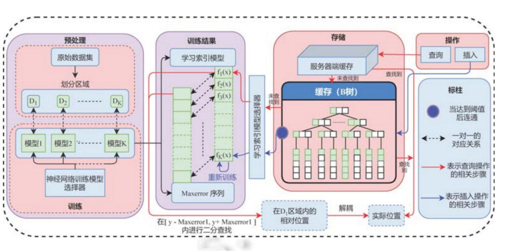

### 应用场景：
读写场景

### 解决方案：
提出Dabble模型

（1）用K-Means算法把数据集进行聚类，从而划分为K个数据区域，使得每个区域内的数据分布尽可能的一致 
（2）在模型训练阶段，我们对K个数据区域采用前馈神经网络进行学习，并在模型的损失函数中加入数据的访问热度，从而使模型对访问频率高的数据预测率该更加精准 
（3）针对数据插入问题，借鉴LSM树中的延迟更新机制，在内存中开辟一块缓存用来存放新插入的数据，当缓存溢出时一次性将数据进行插入 
（4）针对索引更新问题，提出了一种基于中间层的机制，通过模型解耦的方式缓解了索引带来的消耗

### 结果：
（1）在 Lognormal 人工数据集上,Dabble 模型的查询性能比 B+树提升了 69%,比学习索引提升了 13%,比 ALEX提升了 8%;内存占用比 B+树减少了 92%,神经网络模型的内存占用比学习索引减少了 99%, 
比 ALEX 减少了 98%.同时,Dabble 模型的插入性能比 B+树提升了 250%,比 ALEX 提升了 123%;  
（2）在真实数据集 Weblogs 上,Dabble 的查询性能比 B+树提升了 49%,比学习索引提升了 33%,比 ALEX 提升了 9%;内存占用比 B+树减少了 92%,神经网络模型的内存占用比学习索引减少了 99%,比 ALEX 减少了 98%.同时,Dabble 的插入性能比 B+树提升了 400%,比 ALEX 提升了 88%. 
