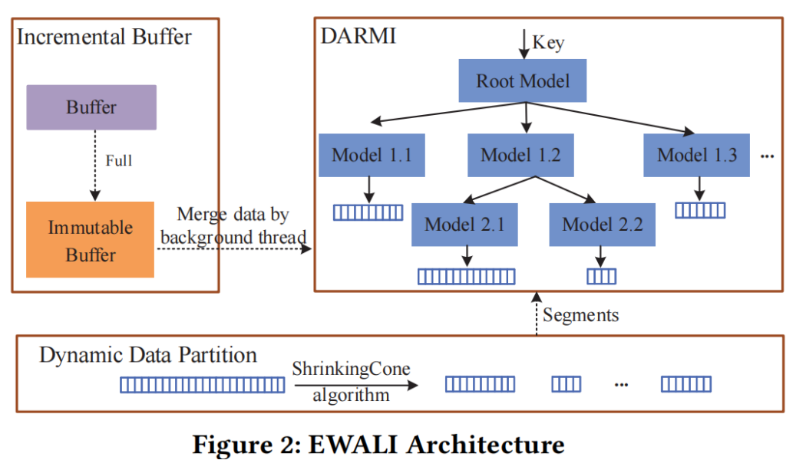

### 应用场景：
(1)支持读写工作负载,在重写工作负载中性能表现很好 
(2)使用轻量的light-weight data-aware data partition algorithm构建模型 
(3)当data distribution发生变化，EWALI会自动分裂相关叶子节点，重训练模型 
(4)并采用duel buffer（双缓冲）来处理新数据，并采用延迟更新机制合并数据，提高写入性能 

问题描述：
（1）RMI不支持写操作，插入新数据导致data distribution变化，需要重训练所有模型
（2）RMI构建时采用统一的数据划分策略，没有考虑划分到同一模型中数据的相似性，导致预测不准确

### 难点和分析过程：
（1）现在支持写操作的方法包括就地插入（gap array，需要移动数据或产生不必要的空间开销）缓冲区插入（发生写入阻塞） 
（2）现存的data-partition-algorithm 
K-means算法（Dabble模型） 
贪心算法（ASLM） 
Piece-wise linear function（PGM-iNDEX  FITing-Tree）

以上不同的算法有不同的计算开销和误差

### 解决方案：

#### Data-partition-algorithm
考虑lower model error 和 time cost 以及 memory usage选择ShrinkingCone 

#### DARMI Design

##### Model Training: 
(1)non-leaf node
(2)leaf node

##### Model Retraining:
当incremental buffer与segments合并后，改变了数据分布，后台线程被唤醒进行retraining操作

##### Node Split:
当一个Node管辖的data数量超过一定数量时，会产生以下影响
1.过多的数据会导致重训练的时候要扫描更多的key，增加训练耗时，降低写性能
2.过多的数据也会让线性模型更难去拟合，精准度会下降

(1)horizontal split
Disadvantages: result in lower prediction accuracy of parent model

(2)Vertical split
Disadvantages: increase the height of DARMI, result in high lookup time

DARMI会动态地选择两种split方式

##### Retrain DARMI
当DARMI的高度达到一个阈值，查找性能退化地过于严重了，需要对root Node进行重训练，
将所有的old leaf node的first key用来训练root node的线性模型，DARMI又变成two-layer

#### Incremental Buffer Design

#### DARMI的核心操作

### 结果：
数据集： 
真实数据集（NYCT、OSM） 合成数据集（Lognormal） 
工作负载： 
（1）read-only （2）write-only （3）write-read-balance (50% read 50%write) 
（4）write-heavy(95% write 5% read) （5）read-heavy(95% read 5%write) 
（6）short-ranges(95% range queries 5% write) 

