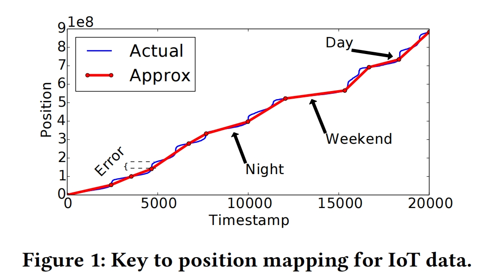
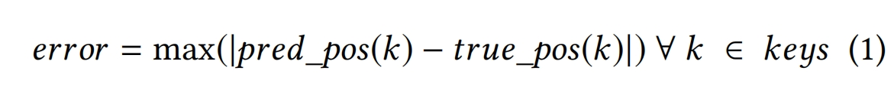
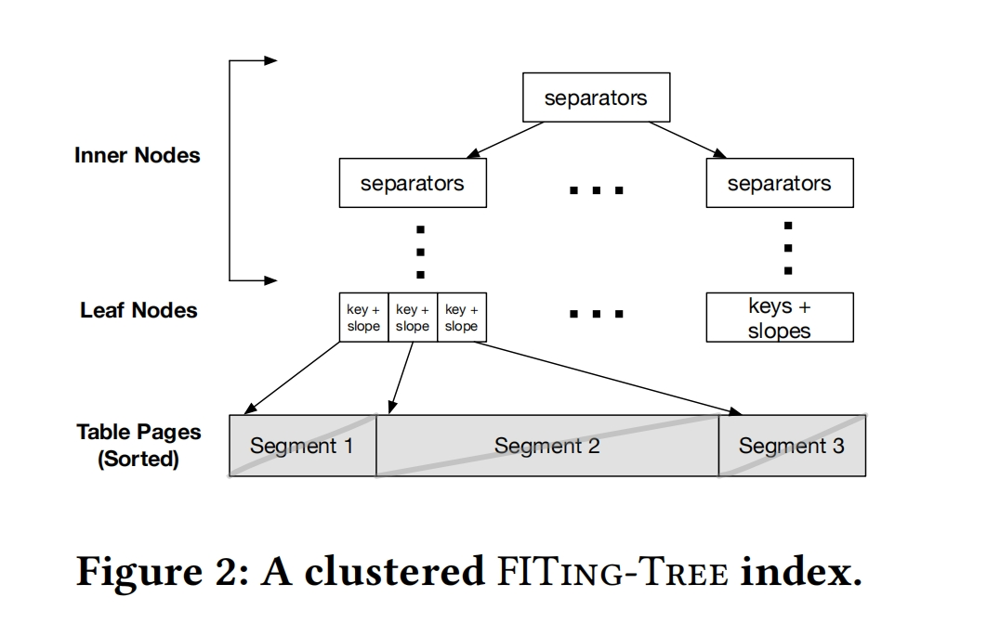
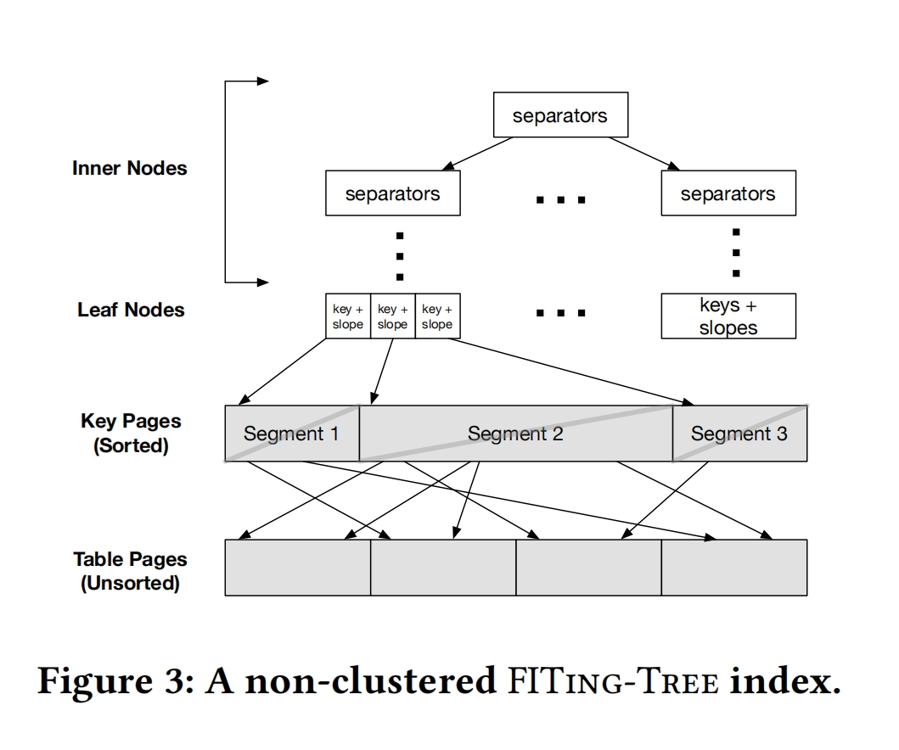
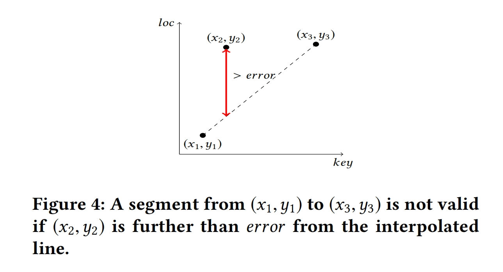
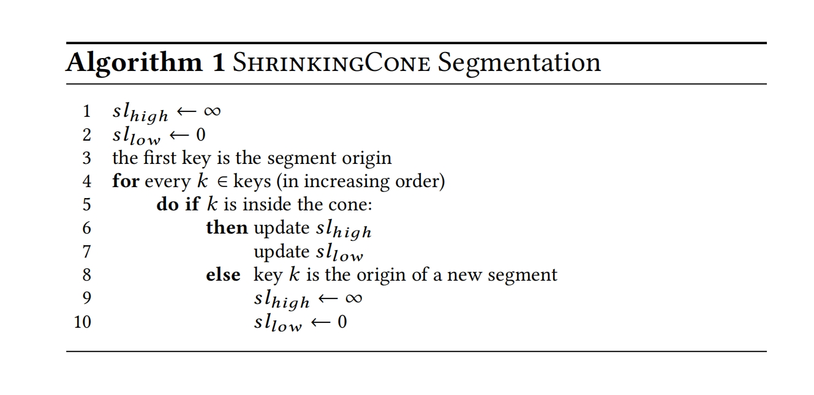
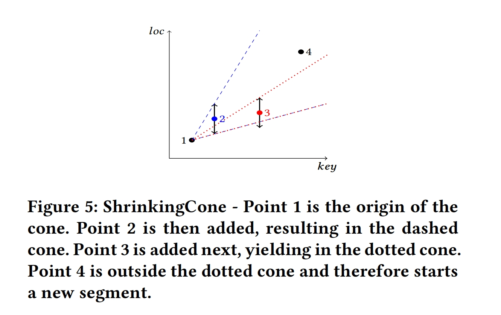
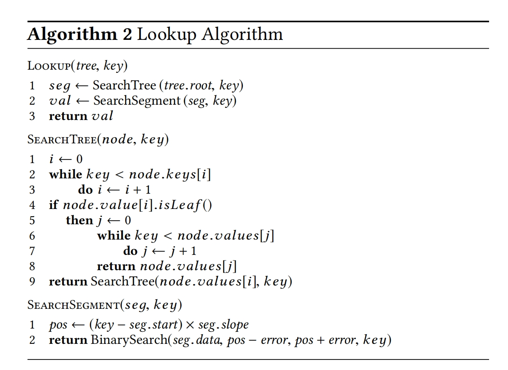
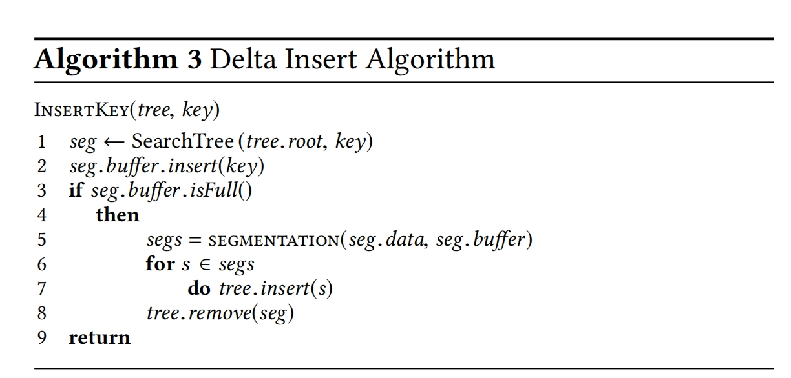

## Introduction
1. 一种新的索引结构，它使用分段线性函数紧凑地捕捉数据中的趋势，并通过此减少索引的内存大小
2. 这个索引结构的核心是一个参数error(查找key的预测position和实际position之间的最大距离)
3. 为了实现查找性能和空间之间的trade-off，我们提出了一种cost model在给定查找延迟需求(eg 500ns)和存储预算(eg 100MB)的情况下帮助DBA选择合适的error参数

与最初的提出的技术相比，有以下优点：
(1)绑定最坏的查找性能 
(2)有效地支持插入
(3)启动分页(所有数据不必驻留在一个连续的内存区域)

另一个有趣的点：
由于FITing-Tree的内部节点是树形结构，仍然可以应用前缀和后缀截断的技术来进一步减少索引的大小

## OverView
### Function Representation
使用分段线性函数拟合数据相比于更复杂的函数的优点
(分段线性函数近似的计算成本要低得多)
(1) 初始索引构建成本低
(2) 插入新的key延迟低

分段线性函数仍然存在误差error

通过以上公式，我们可以定义一个segment(一组排序好的数据)
分割过程结束后，FITing-Tree将每个segment的边界和斜率存储在叶子节点中，减少了索引的总体内存占用

### FITing-Tree Design
#### Clusted Indexes

#### Non-clusted Indexes

## SEGMENTATION
### Design Choices
下图是我们分段算法需要实现的目标，使得分段后满足最大的error

为了高效地构建索引和支持插入，需要一个高效地one-pass linear algorithm

### Segment Definition
当一个segment添加一个key时，违反了这个max-error，则定义这个segment已经达到最大了
> 定理:最大segment所覆盖的最小位置数为max-error + 1

### Segmentation Algorithm (思考: 可以不以用一个新的分段算法,或者在这个分段算法之上对这个进行改进)

如图5所示，说明了圆锥体的更新方式:点1时圆锥体的原点。点2更新了高斜坡和低斜坡。点3在原锥内，但是它只更新圆锥的上界（点3的小于下界之上的误差）。点4在更新锥的外部，因此将是新段的第一个点

### Algorithm Analysis
虽然以上收缩锥体算法的运行时间复杂度为O(n),但是它不是最优的。

## INDEX LOOKUPS
### Point Queries

### Range Queries

## INDEX INSERTS
### In-place Insert Strategy
类似于页面的填充因子，我们将指定的误差分成两个部分：分割误差e和插入预算x 
通过为每个segment保留插入预算x，可以确保插入新元素不会违反页面的错误

更具体地说，给定一个段，页面的总大小为|s| + 2*x(|s|为该段中的位置数,数据被放置在新页面的中间)，在页面的开始和结束处产生x个空位置。在插入过程中如果所有的空白都被填满，那么就需要重新执行分割算法

### Delta Insert Algorithm
- 就地插入策略的成本可能很高
- 为了减小插入时页面内数据移动的开销，每个segment包含一个额外的固定大小的缓冲区，此缓冲区保持排序，以实现有效的搜索和合并操作，一旦缓冲区达到预定的大小(buff)，它与段中的数据进行合并，再次执行分割算法
- 另外，由于为每个段添加缓冲区可能违反FITing-Tree的max-error，我们透明地将缓冲区地大小合并到分割过程地错误阐述中，即分割过程中地错误阈值为(error -buff)

