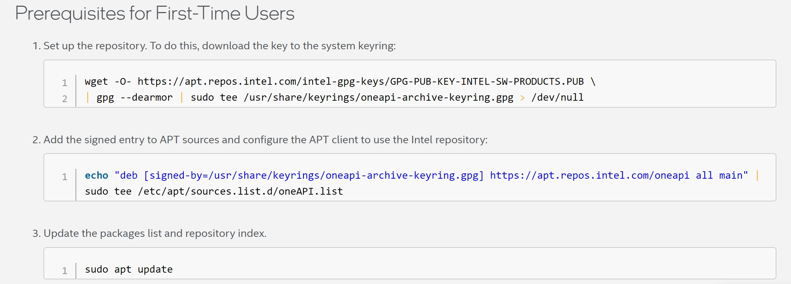
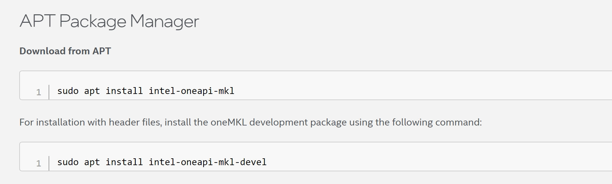
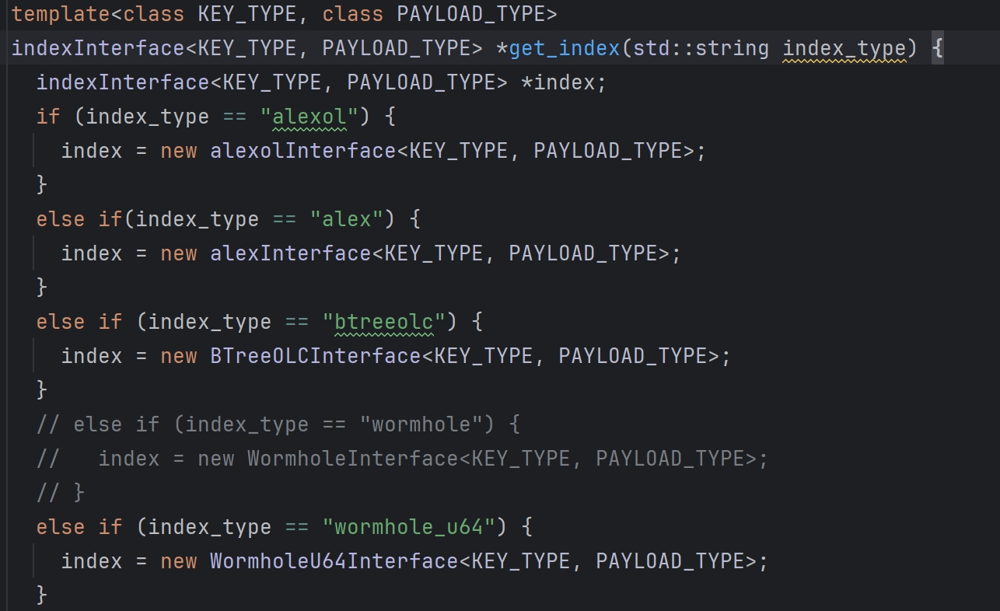

## 下载官网地址:<br>
[https://github.com/jingtao8a/GRE](https://github.com/jingtao8a/GRE)


## 软件环境
Ubuntu 20.04.6 LTS<br>
gcc 9.4.0<br>
cmake 3.16.3


## Dependencies
### intel-mkl 2018.4.274<br>
这里安装2024的版本也可以<br>
进入官网 [https://www.intel.com/content/www/us/en/developer/tools/oneapi/onemkl-download.html](https://www.intel.com/content/www/us/en/developer/tools/oneapi/onemkl-download.html)<br>

选择Linux 和 APT Package Manager

依次输入命令



默认安装路径如下：


使用mkl库需要配置环境变量：<br>
```shell
对所有用户生效，需要重启系统
vim /etc/profile
```


### intel-tbb 2020.3<br>
tbb库的版本必须使用2020.3<br>
下载地址[https://github.com/oneapi-src/oneTBB/releases/tag/2020_U3](https://github.com/oneapi-src/oneTBB/releases/tag/2020_U3)

#### 编译
```shell
# 解压
tar -zxvf oneTBB-2020_U3.tar.gz

# 因为要使用 gcc-9 进行编译，所以需要编辑成 gcc-9 形式
cp build/linux.gcc.inc build/linux.gcc-9.inc 

# 编辑 linux.gcc-9.inc 文件：
# 第15、16行原来是
CPLUS ?= g++
CONLY ?= gcc

# 修改为
CPLUS ?= g++-9
CONLY ?= gcc-9

# 然后在文件夹 oneTBB-2020_U3/ 中编译
cd oneTBB-2020_U3
make compiler=gcc-9 stdver=c++17 tbb_build_prefix=my_tbb_build
# 编译完成后，在 builld/ 文件夹下会看到编译生成的文件夹 my_tbb_build_release/
```

#### 安装
```shell
sudo mkdir /usr/local/tbb-2020_U3

sudo cp -r oneTBB-2020_U3/include /usr/local/tbb-2020_U3/include
# 建立新安装tbb版本的符号链接
sudo ln -s /usr/local/tbb-2020_U3/include/tbb /usr/local/include/tbb

sudo cp -r oneTBB-2020_U3/build/my_tbb_build_release /usr/local/tbb-2020_U3/lib
# 建立新安装tbb版本的符号链接
sudo ln -s /usr/local/tbb-2020_U3/lib/libtbb.so.2 /usr/local/lib/libtbb.so
sudo ln -s /usr/local/tbb-2020_U3/lib/libtbb.so.2 /usr/local/lib/libtbb.so2
sudo ln -s /usr/local/tbb-2020_U3/lib/libtbbmalloc.so.2 /usr/local/lib/libtbbmalloc.so
sudo ln -s /usr/local/tbb-2020_U3/lib/libtbbmalloc.so.2 /usr/local/lib/libtbbmalloc.so2
sudo ln -s /usr/local/tbb-2020_U3/lib/libtbbmalloc_proxy.so.2 /usr/local/lib/libtbbmalloc_proxy.so
sudo ln -s /usr/local/tbb-2020_U3/lib/libtbbmalloc_proxy.so.2 /usr/local/lib/libtbbmalloc_proxy.so2
```

然后把 库文件的路径写入到 ~/.bashrc：
```shell
echo 'export LD_LIBRARY_PATH=/usr/local/tbb-2020_U3/lib:$LD_LIBRARY_PATH' >> ~/.bashrc
source ~/.bashrc
```

参考链接: [https://blog.csdn.net/qq_39779233/article/details/126284595](https://blog.csdn.net/qq_39779233/article/details/126284595)

### jemalloc
下载地址: [https://github.com/jemalloc/jemalloc/releases](https://github.com/jemalloc/jemalloc/releases)

#### 编译与安装
```shell
# step 1
./autogen.sh

# step 2
make

# step 3
sudo make install
```
参考链接: [https://blog.csdn.net/SweeNeil/article/details/94648313](https://blog.csdn.net/SweeNeil/article/details/94648313)


## USAGE
### Build
```shell
git submodule update --init # only for the first time
mkdir -p build
cd build
cmake -DCMAKE_BUILD_TYPE=Release .. && make
```
### RUN
```shell
./build/microbench \
--keys_file=./data/dataset \  // 数据地址
--keys_file_type={binary,text} \  // 二进制 或者 文本
--read=0.5 --insert=0.5 \ 
--operations_num=800000000 \ 
--table_size=-1 \ // 所使用的数据的size
--init_table_ratio=0.5 \ //bulk_load所使用的数据的百分比
--thread_num=24 \
--index=index_name \ //测试的索引名称
```

其它参数见官网:
[https://github.com/jingtao8a/GRE](https://github.com/jingtao8a/GRE)

### 如果要测试新的索引结构
#### step1
src/competitor/competitor.h
get_index函数中添加对应的index_type


#### step2
在 src/competitor 下放置源代码 new_index_name/src
编写接口文件 src/competitor/new_index_name.h


以lipp的接口文件为例：

```cpp
#include"./src/src/core/lipp.h"
#include"../indexInterface.h"

template<class KEY_TYPE, class PAYLOAD_TYPE>
class LIPPInterface : public indexInterface<KEY_TYPE, PAYLOAD_TYPE> {
public:
    void init(Param *param = nullptr) {}

    void bulk_load(std::pair <KEY_TYPE, PAYLOAD_TYPE> *key_value, size_t num, Param *param = nullptr);

    bool get(KEY_TYPE key, PAYLOAD_TYPE &val, Param *param = nullptr);

    bool put(KEY_TYPE key, PAYLOAD_TYPE value, Param *param = nullptr);

    bool update(KEY_TYPE key, PAYLOAD_TYPE value, Param *param = nullptr);

    bool remove(KEY_TYPE key, Param *param = nullptr);

    size_t scan(KEY_TYPE key_low_bound, size_t key_num, std::pair <KEY_TYPE, PAYLOAD_TYPE> *result,
                Param *param = nullptr);

    long long memory_consumption() { return lipp.total_size(); }

private:
    LIPP <KEY_TYPE, PAYLOAD_TYPE> lipp;
};

template<class KEY_TYPE, class PAYLOAD_TYPE>
void LIPPInterface<KEY_TYPE, PAYLOAD_TYPE>::bulk_load(std::pair <KEY_TYPE, PAYLOAD_TYPE> *key_value, size_t num,
                                                      Param *param) {
    lipp.bulk_load(key_value, static_cast<int>(num));
}

template<class KEY_TYPE, class PAYLOAD_TYPE>
bool LIPPInterface<KEY_TYPE, PAYLOAD_TYPE>::get(KEY_TYPE key, PAYLOAD_TYPE &val, Param *param) {
    bool exist;
    val = lipp.at(key, false, exist);
    return exist;
}

template<class KEY_TYPE, class PAYLOAD_TYPE>
bool LIPPInterface<KEY_TYPE, PAYLOAD_TYPE>::put(KEY_TYPE key, PAYLOAD_TYPE value, Param *param) {
    return lipp.insert(key, value);

}

template<class KEY_TYPE, class PAYLOAD_TYPE>
bool LIPPInterface<KEY_TYPE, PAYLOAD_TYPE>::update(KEY_TYPE key, PAYLOAD_TYPE value, Param *param) {
    return lipp.update(key, value);
}

template<class KEY_TYPE, class PAYLOAD_TYPE>
bool LIPPInterface<KEY_TYPE, PAYLOAD_TYPE>::remove(KEY_TYPE key, Param *param) {
    return lipp.remove(key);
}

template<class KEY_TYPE, class PAYLOAD_TYPE>
size_t LIPPInterface<KEY_TYPE, PAYLOAD_TYPE>::scan(KEY_TYPE key_low_bound, size_t key_num,
                                                   std::pair <KEY_TYPE, PAYLOAD_TYPE> *result,
                                                   Param *param) {
    if(!result) {
        result = new std::pair <KEY_TYPE, PAYLOAD_TYPE>[key_num];
    }
    return lipp.range_query_len(result, key_low_bound, key_num);
}

```