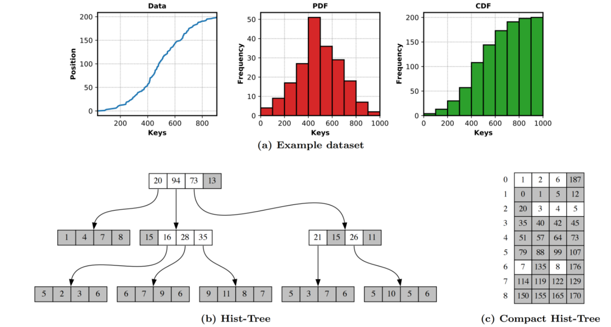

## 背景和应用场景：
在之前的研究中，学习型索引的性能超过过了传统索引，这被归功于是利用数据分布这一特性。但是这篇文章认为，在比较试验中之学习型索引之所以能表现良好，是因为利用了一些隐含条件（例如，bulk-loading时，数据是排序的,数据的范围[min,max],...，））本文提出了一个传统索引结构（Hist-tree），利用了这些隐藏条件，并在只读工作负载的比较实验中，比RMI，PGM-index，RadixSpline的性能要好

## 问题描述：
学习索引做了一些隐含假设，例如 
（1）假设bulk-loading数据已经排序 
（2）数据的范围[min, max] 
（3）数据是不被修改的 
但是传统数据结构例如B-tree并没有这样的假设，这样会让B-tree的构建时间变得更长，或者导致B-tree和学习型索引进行比较实验时，处于劣势 

## 方法：
### Overview
提出Hist-tree（利用了隐含假设（1）（2）） 
以及压缩版本Compact-Hist-tree（利用了隐含假设（1）（2）（3）） 

图中的Hist-tree是从一个数据集中选取200个key构建的，数据集的数据分布如（a）所示，（b）（c）为Hist-tree和Compact Hist-tree 

#### （b）Hist-tree 
每一个node根据histogram分成多个bin，terminal bin是灰色的，non-terminal bin是白色的，每个bin的值为该子树所包含的key的数量 
查找过程为先锁定一个terminal-bin（有threshold），之后进行二分查找

#### （c） Compact Hist-tree
每一行代表一个node，每个node根据histogram分为多个binterminal bin是灰色的，non-terminal bin是白色的，白色的bin存储的值为child node的offset，灰色的bin存储累计直到该bin的所有key的数量

### physical layout
Hist-tree的物理结构为两个32位整形数组，第一个数组包含的inner node（含有child node的node 或者说是 至少包含一个non-terminal bin的node），第二个数组包含leaf node（只有terminal bin的node）
例如：（b）中的root node要存储在第一个数组中占八个元素，其中由四个histogram bin计数组成，后跟四个child pointers(如果该pointer对应的bin为terminal bin或者指向leaf node，将高位flag标记为1)，并且第一个和第四个child pointer的高位flag标记为1

## 结果:

个人实现版本：[https://github.com/jingtao8a/Hist](https://github.com/jingtao8a/Hist)