## 应用场景：
- 只读负载
- 读写负载，但是数据分布变化不大（即CDF随着key的插入删除变化较小）

## 问题描述：
之前的学习索引通过设计更好的启发式方法来划分key空间，使得每一份被分割的sub key空间可以更好地被线性模型拟合。
缺点：
- 为了达到这个目的，学习索引必须构建更深的层次结构，从而产生更多的遍历时间和预测数量
（类似于用一个分段线性函数去拟合数据分布CDF）。

## 难点和分析过程：
本文提出了学习索引NFL（包括两个结构Normalizing Flow 和 Learned Index ）

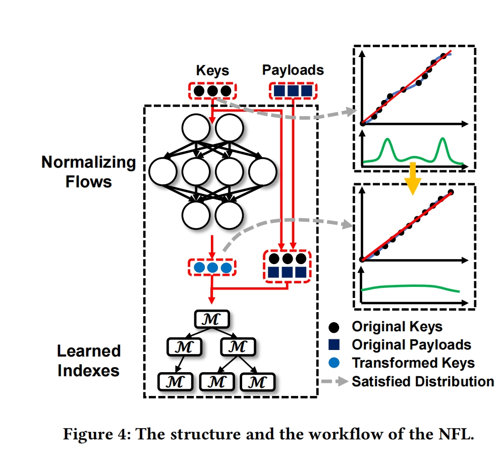
思想： 先用分布转换模型将复杂key分布转换为近似均匀的分布，然后利用转换的key构建学习索引

**难点**

（1）Efficacy of Normalizing flow:
- 由于key的数字数据特征有限，分布转换模型表现不佳
- 均匀分布很难作为训练目标（我们设计了一个具有丰富特征空间的分布转换模型和一个易于操作的训练目标）
  
（2）Efficiency of normalizing flow
  - 分布转化必须是高效的在线步骤，这样就限制了NF的复杂性。但是直接减少参数数量标准化流程可能会降低转换质量（这样会导致学习索引需要更深的层次结构和更多的模型来近似CDF），（我们设计了一套效率优化方案，并且保证NF的功效）

（3）Lack of proper indexes for transformed keys：
- numerica NF的转换使线性模型拟合地更好，学习索引应该以新的视角重新思考。（我们提出了After-Flow Learned Index（AFLI），充分利用转换后的key）
  
**方法**

以下两个是评价模型转换质量的指标
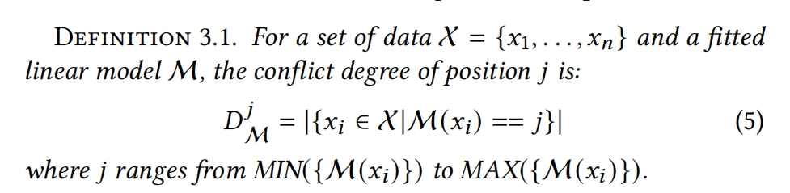

Tail conflict degree：

Numerical Normalizing Flow:
Feature Space Expansion:现有的NF大多用在cv和nlp领域，用于处理高纬的图片和文本，这些数据都有丰富的特征。然而keys都是数值数据，含有的特征较少。
使用Algorithm 3.1分布转换算法（对keys的数值特征进行扩展）
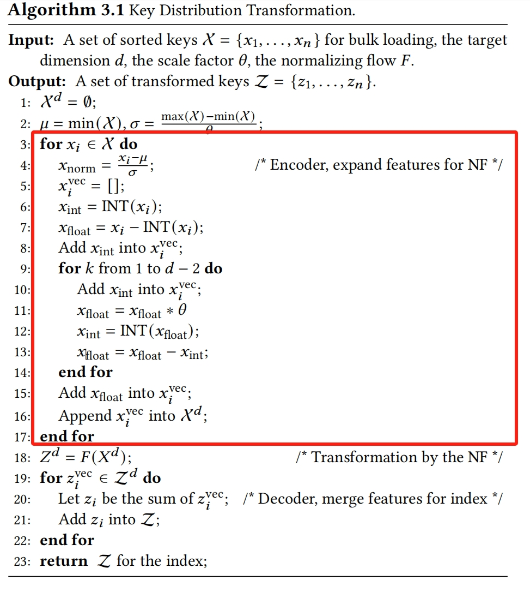

特征扩展的时间复杂度为O（n x d）

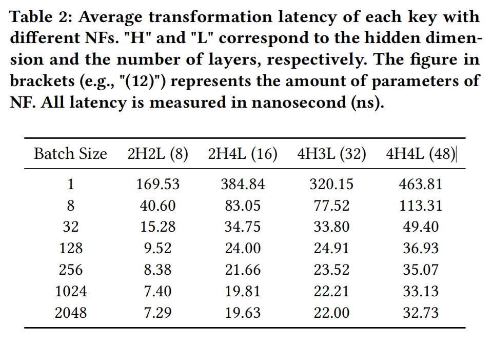

Structure of AFLI：
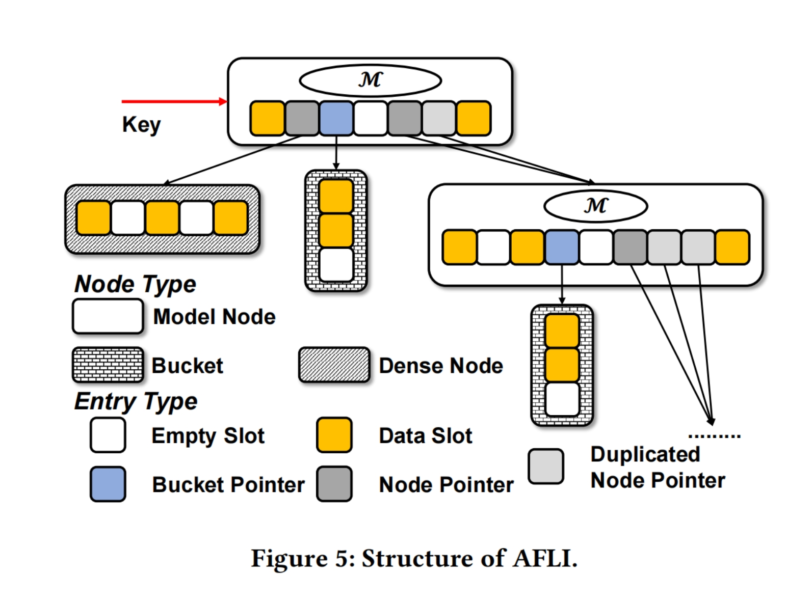

**Model node:**
Empty Slot：unused slot
Data Slot：key payload
Bucket Pointer: 指向一个bucket
Node Pointer：指向一个model node或者dense node
**Bucket:**
a short data array.它的size由tail conflict degree决定，但将保持在预设阈值范围内。我们提供两种桶，线性桶（默认）和有序桶

**Dense node：**
Also a data array，比bucket大一点，但是比Model node小很多，是一个ordered and gapped array, gap的最大值由tail conflict degree

**Analysis:**
当索引无法建立模型节点时，因为节点中的所有键都太近（即拟合线性模型的斜率为0），索引会分配一个dense array

**Queries:**
（1）从root node开始查找，如果是model node，先用linear model预测position，判断它的类型，如果是empty slot，表示不存在；如果是data slot，比较是否是相同的key；如果是bucket pointer，在bucket中查找；如果是node pointer，递归操作
（2）如果node是dense node，使用二分查找查找这个结果。

**Insertions:**
（1）如果key-payload pair被插入model node，先用linear model预测position
- 如果是empty slot，直接存储key-payload
- 如果是data slot，表明发生冲突，创建一个bucket来存储这两个key
- 如果是bucket pointer或者node pointer，插入key-payload到bucket或者child node中
（2）插入到bucket中时，将key-payload会直接被加到sorted data的末尾；如果bucket是一个ordered mode，将会执行一次插入排序。
（3）插入到dense node中时，先在array上执行二分查找，如果那个position是一个empty slot，我们会直接插入key-payload pair；，否则会移动到最近的empty slot再插入。

如果bucket或者dense node没有empty slots，我们尽量通过一个modeling operation将它转换为model node
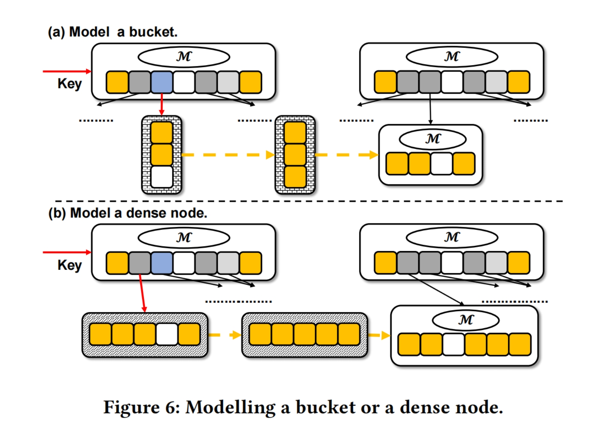

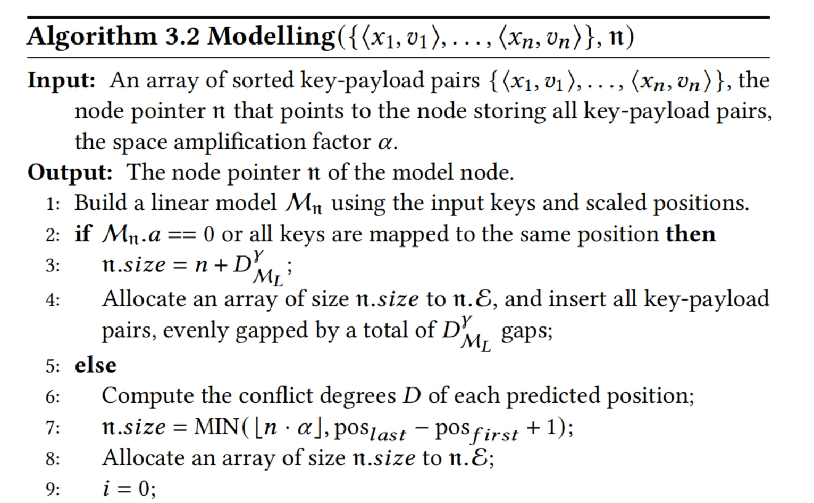
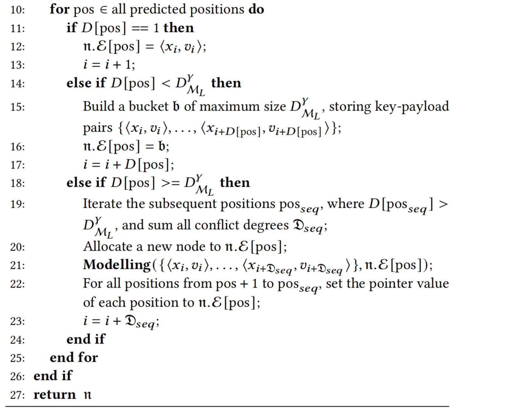

我们首先一个使用线性回归创建线性模型（Line 1）
如果slope 为0（所有key被映射到一个相同的position），我们为创建一个dense node（Line 2 - 4）
否则如果我们成功创建一个linear model，就计算model node所有位置的conflict degree（Line 6）
然后我们遍历所有预测的位置，决定每个pos的entry type。如果conflict degree为1，我们直接在data slot存储该key；如果conflict degree大于1但是比bucket的tail confict degree小，存储在一个bucket中（Line 14 - 17）；
否则，如果某个position的confict degree比bucket的tail conflict degree大，找到下一个conflict degree也大于tail conflict degree的position或者到末尾，并将经过的position的key都收集起来，并分配一个新的节点来处理它们（第18 - 21行）
BulkLoad：首先计算tail conflict degree. The returned result is the root node.
Update: lookup + in-place update
Delete

## 结果：
**数据集：**
选取了7个不同的数据集进行评估
（Key的类型为double     payload的类型是int64）

对每种类型的数据集构建了四种类型的工作负载

每种工作负载包括 批量加载和运行阶段
我们使用批量加载操作来加载数据集的50%的key；在运行阶段，根据不同的操作比率生成请求
- 只读
- 读80% 写20%
- 写 20% 读80%
- 只写

将NFL与LIPP、ALEX、PGM-index、B-Tree、an efficient B-Tree对比

**平均吞吐量**
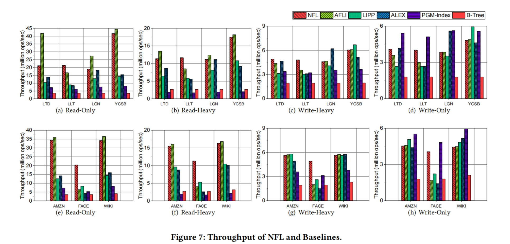

- 只读：NFL与LIPP、ALEX、PGM、B-Tree相比，平均吞吐量分别提高了2.34倍、2.46倍、3.82倍、7.45倍；对于具有大冲突程度的工作负载（即LLT和FB），可以分别实现比LIPP、ALEX高2.41x和3.70x的吞吐量。
- 重读：与LIPP、ALEX、PGM、B-Tree相比，NFL在吞吐量上分别提高72.22%、101.05%、611.48%、389.45%
- 重写：与LIPP、ALEX、PGM、B-Tree相比，NFL在吞吐量上分别提高29.10%、39.28%、50.88%、162.92%
- 只写：与LIPP、ALEX、B-Tree相比，NFL在吞吐量上分别提高22.65%、28.30%和131.58%

**延迟**
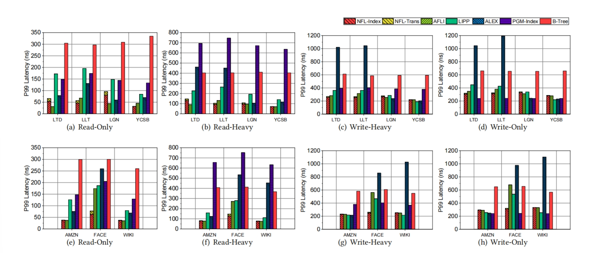
- 只读：与LIPP、ALEX、PGM index、B-Tree相比，NFL可以将延迟分别降低58.68%、32.89%、62.73%和80.77%
- 读写：与LIPP、ALEX、PGM index和B-Tree相比，NFL可以将延迟分别降低26.64%、45.05%、59.49%、65.31%
- 只写：与LIPP、ALEX、B-Tree相比，NFL可以将延迟减少2.26%、27.92%、50.48%

**批量加载时间**
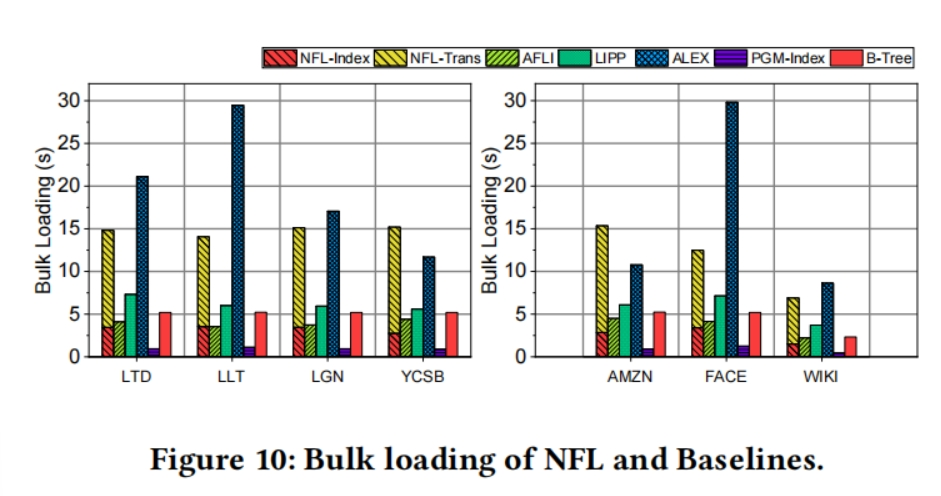

与LIPP、ALEX、B-Tree相比，NFL需要2.25倍、0.86倍、2.81倍的大容量加载时间，其中77%的时间是用来转换key的

**索引大小：**
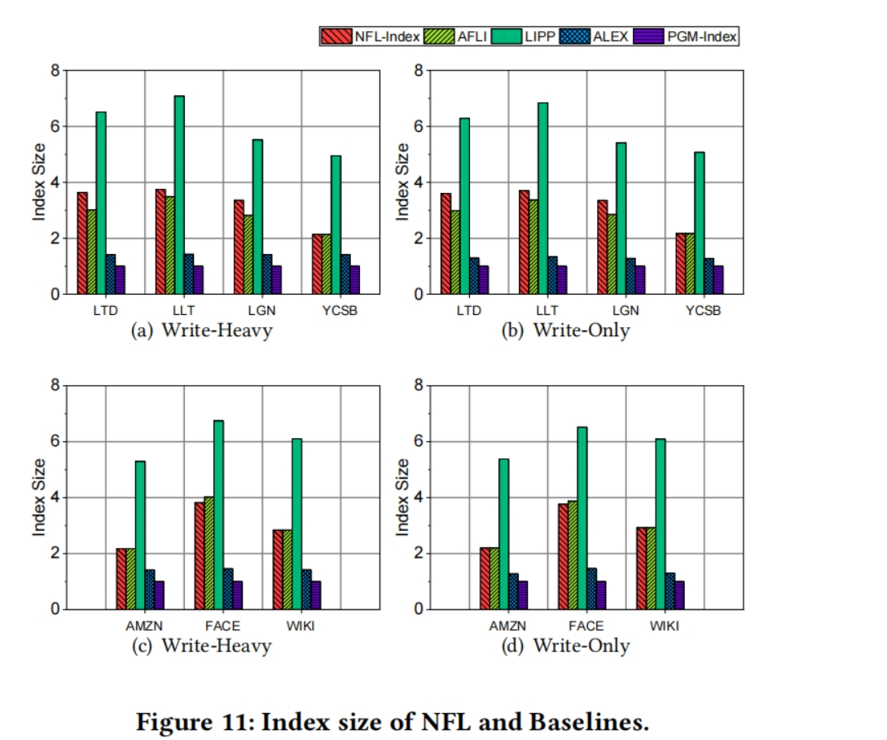
NFL的指数大小分别是ALEX和PGM的2.26倍和3.1倍；然而，NFL的大小仅为LIPP大小的0.51