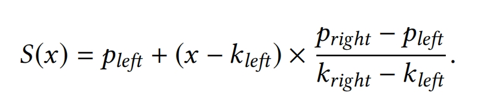
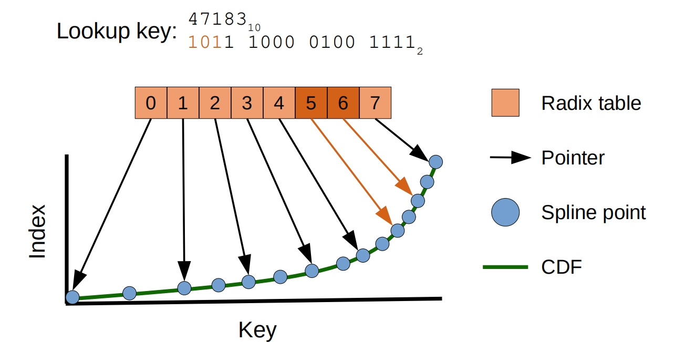

## RadixSpline

### 组成部分
>1. a set of spline points
> 2. a radix table

### 构建
> 1. Build Spline
>> 首先建立一个Spline Model S
>> S(ki) = pi +/- e  
>> (ki, pi)为要查找的key和真实的position e为error
模型的计算如下，其中(kleft,pleft)和(kright, pright)为两个spline point

> 2.Build Radix Tablle
>> **作用：** 用于所定查找key的附近的两个spline point
>> 
>> **过程：** 确定使用的key的prefix的长度r，分配2^r长度的数组，遍历所有的spline points，碰到新的prefix，就插入该数组 