SALI: A Scalable Adaptive Learned Index Framework based on 
Probability Models
一个基于概率模型的可进化学习索引框架

## 研究背景
LI：只读
可写：
1.基于缓冲区的策略（插入时放入缓冲区，到达一个阈值后进行合并操作）
XIndex、FINEdex
2.基于模型的策略（就地插入）
ALEX（在插入冲突中，映射的slot已经被占用，通过移动来尝试重新组织节点）、
LIPP（利用链接方案，为相应的时隙创建一个新节点，将最后一英里问题转化为子树遍历问题）

## 问题描述
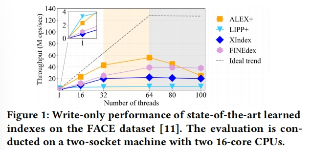
上述的索引结构都不能以高并发性进行扩展

并发数较少的时候，与基于模型的策略（ALEX+、LIPP+）相比，基于缓冲区策略（XIndex、FINEdex）的索引表现出较差的基本性能和较差的扩展性；并且随着并发数的提高，“最后一英里问题”搜索会迅速饱和内存带宽，从而成为系统的瓶颈（ALEX+必须为此操作获取粗粒度写锁，线程数量增加时，越来越多的线程被阻塞）

LIPP+没有最后一英里问题，但是它需要在每个节点中维护统计信息，如访问计数和冲突计数（以触发节点再训练，防止性能下降）。这些节点计数器在线程之间造成高争用。

## 难点与分析过程
我们需要设计一个满足如下要求的可扩展学习索引
1.Efficient Concurrency高效并发：
为了实现高效的插入性能，索引必须跟踪统计信息，这些信息反映了由于新的插入而导致的索引结构随时间的退化（这些信息对于触发节点再训练至关重要），但是节点计数器在线程之间会造成高争用，需要一种轻量级方法
2.Adaptive ability适应能力
与均匀工作负载相比，学习索引在倾斜插入工作负载下表现出次优性能。因此，学习索引需要有自适应能力以保证其在并发场景的鲁棒性。此外，学习的索引缺乏用于查找操作的优化策略。在偏斜的工作负载下，学习索引尚未充分利用显著降低索引空间成本的机会。

3.Low overheads of basic performance基本性能的低开销
(1)Efficient lookup
实现高查找性能，通常取决于最大限度地减少查找的预测错误
(2)Efficient insert
采用基于模型的策略，而不是基于缓冲区的策略，通过在每个节点中保留间隙，可以显著提高学习索引的插入性能

## 方法
提出SALI
1.利用LIPP+结构（使用细粒度锁）
2.除了模型重训练以外定义一组节点进化策略，以允许学习到的索引自适应于不同的工作负载倾斜（建议对具有不同读写热度的节点应用不同的进化策略）
3.用轻量级概率模型取代了现有学习索引中的每个节点的统计信息，以消除统计信息维护的可扩展性瓶颈

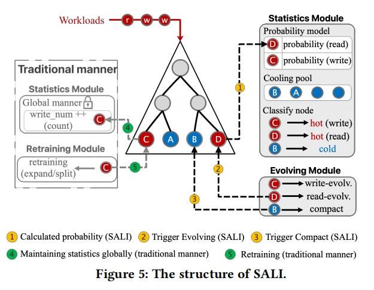
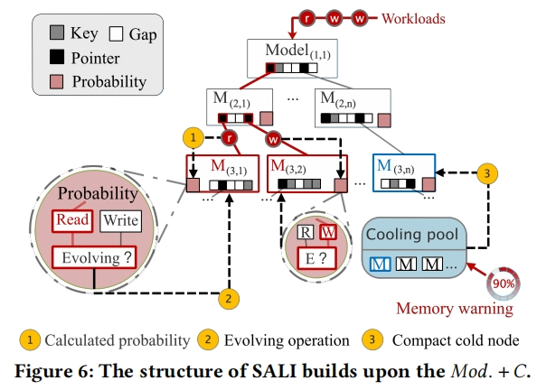

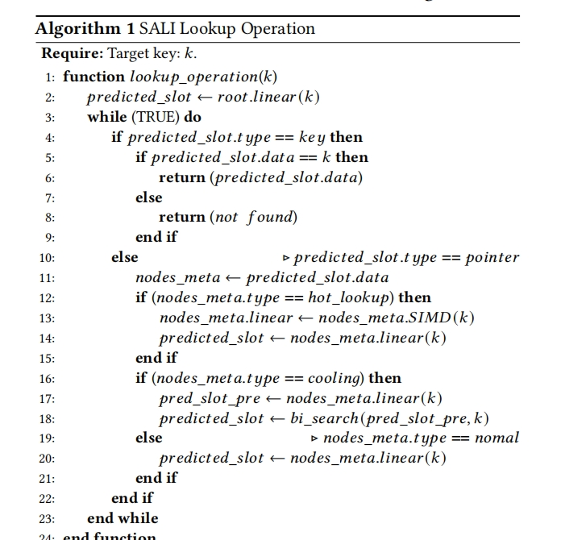
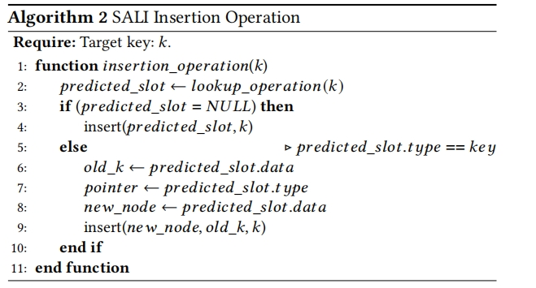

进化策略：
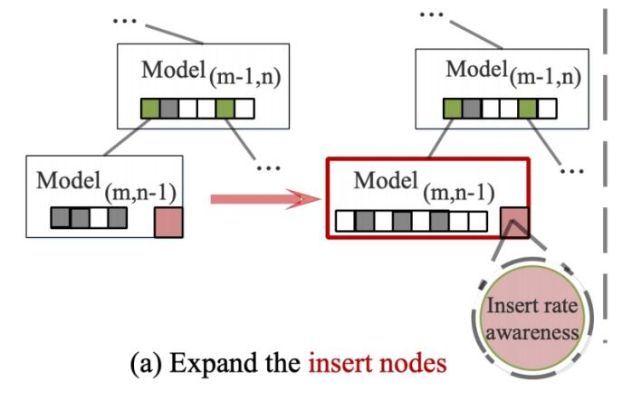
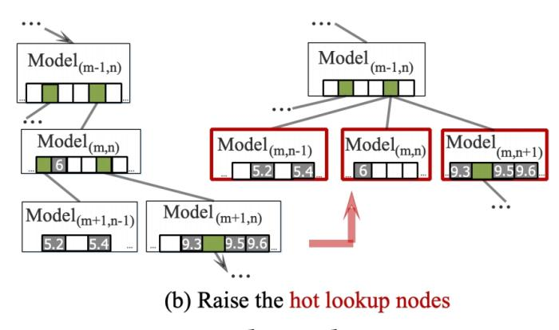
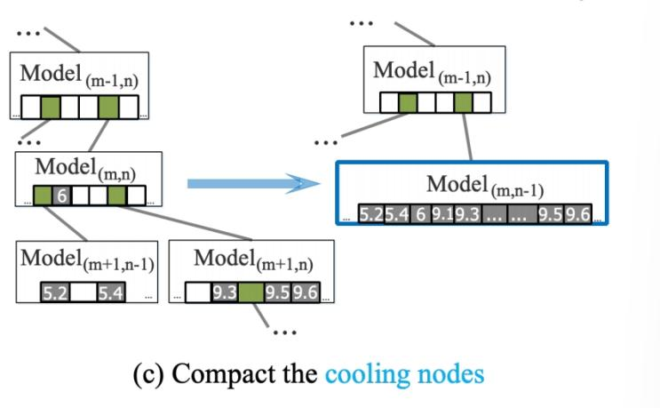

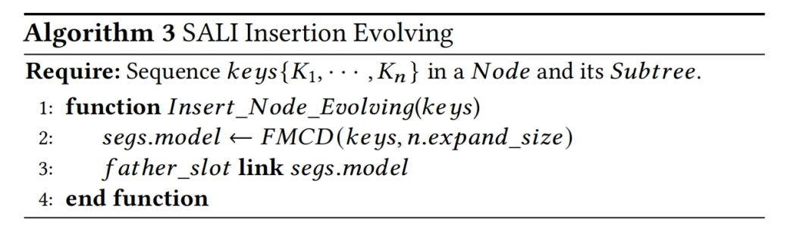
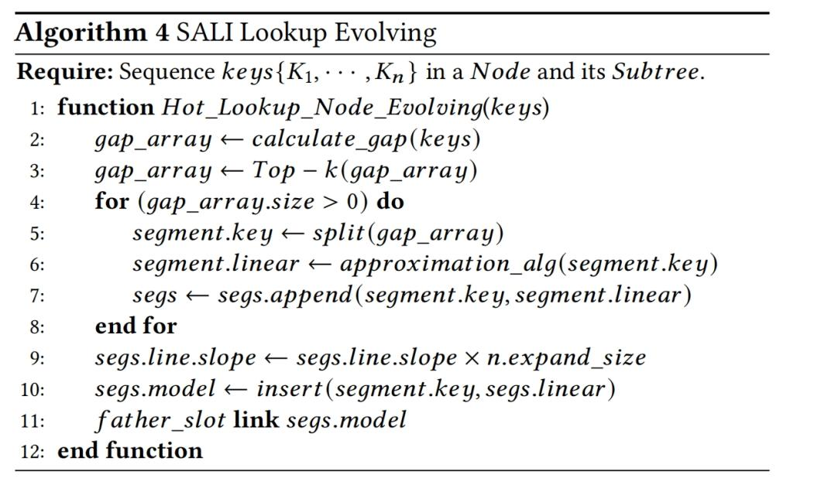
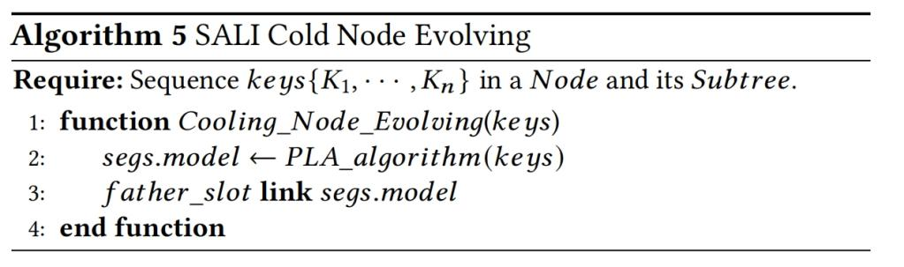

概率模型：
为了确保最佳性能，学习索引必须监控退化统计信息，以便在必要时启动调整；另外，进化策略需要额外的统计信息。
基本概念：模拟信息积累时利用概率

例子：
1.当模拟指定时间段内插入key的累积数量时，我们设计一个基于插入率和插入时间的概率模型
2.几何分布可以用来模拟信息的累计（插入冲突等）

触发insert evolution的条件

Condition1：评估一个节点及其子树中新key插入的频率
该节点容纳足够数量的新插入的key
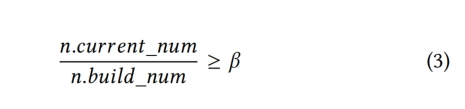

n.current_num:是指在当前插入操作结束时节点中包含的key的数量
n.build_num:是指上一次执行完进化策略后节点中的key的数量
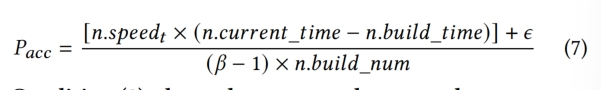

Condition2：节点内冲突的升级（判断节点是否恶化）
Node必须由足够的新插入的key
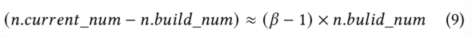
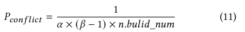

**先计算Pconflict是否被触发，如果触发，再判断Pacc是否被触发，如果两个条件都被触发，执行进化策略**

触发lookup evolution的条件
Phl 
还需要考虑以下两个条件
Condition1:
再很长的一段时间内，节点上的查找操作没有触发进化策略

Condition2:
节点累计数据的速率并不慢

For condition1：如果一个节点的最后一次进化操作是由hot lookup触发的，这意味着自那以后没有插入操作触发该节点进化，即该节点没有严重恶化，并且新插入key的数量可能很少，可以将Phl调整到一个更小的值

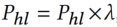

For condition2：引入Pacc，如果自上次进化操作以来插入了大量新的key，则表明可能需要进行新一轮的进化操作

每个线程维护一个skip_counter，每次查找操作，skip_counter加1，10次查找操作后，执行一次伯努利实验来判断Phl是否被触发。如果Phl被触发，判断Pacc是否也被触发，如果触发，执行进化策略。
