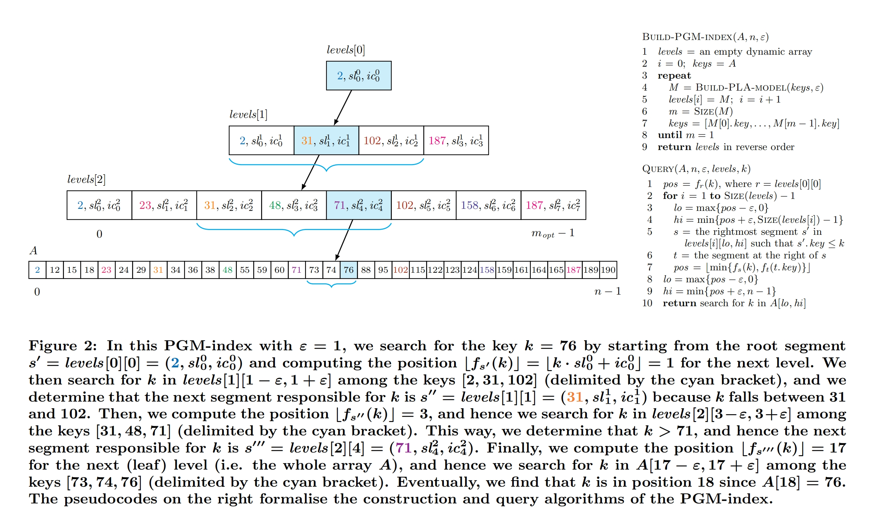
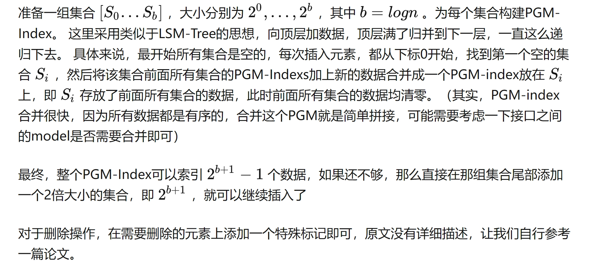

## INTRODUCTION
PGM == PieceWise Geometric Model 分段几何模型
关键词：dynamic(表示PGM-index除了支持查询还支持插入和删除)、compressed(表示还对模型进行了压缩，达到更好的空间效率)

本文的注意力集中在解决所谓的全动态可索引字典问题。这个问题要求存储多重集S，以便有效支持以下查询和更新操作

1. member (x) = true if x ∈ S, false otherwise;
2. lookup(x) returns the satellite data of x ∈ S (if any), nil otherwise;
3. predecessor (x) = max{y ∈ S | y < x};
4. range(x, y) = S ∩ [x, y];
5. insert(x) adds x to S, i.e. S ← S ∪ {x};
6. delete(x) removes x from S, i.e. S ← S \ {x}.
- member(x)，判断关键字x是否属于多重集S
- lookup(x)，给定一个key，若该key已被插入，则返回其value
- predecessor(x)，翻译软件叫“前任”，返回所有小于x的数据中最大的那个，其实可以简单理解为排好序的数组中，x的前一个数据
- range(x, y)，范围查询，给出[x, y]关键字x和y之间的所有对应的value
- insert和delete很好理解，插入和删除对应的（K, V）

本文将 member,lookup,predecessor称为点查询，range称为范围查询
对于点查询和范围查询只要实现rank(x)
member(x) <--> A[rank(x)] == x
predecessor(x) <-->A[rank(x) - 1]
range(x, y) <--> 从rank(x)对应的A数组的位置开始向后查找直到key大于y为止

现存的解决上述问题的经典索引数据结构：（1）哈希索引（2）B树（3）位图索引（4）字典树trie索引
哈希索引不支持predecesor和range，位图索引维护成本过高，字典树空间消耗过大，主流数据库还是使用B树及其变种作为存储引擎

本文提出的PGM-Index不像RMI和FITing-Tree那样混合了传统的索引和学习型索引。(RMI的最后一个stage中的模型若error超过阈值，则将模型替换为B+树，FITing-Tree在确定segment时也是查找B+树)

## PGM-Index
两个关键点：
> 1.PLA-Model(Piecewise Linear Approximation model, 分段线性近似模型)

这里使用了多个线性模型(segment, FITing-Tree中的分段线性模型)组成了一个PLA-Model(PGM-Index中的一层)，一个segment包含了三部分(start key, slope, intercept)

> 2.recursive index structure (递归索引结构)

为了适应key的分布，PGM-Index使用了多层PLA-Model，我们先使用所有的key来构建最底层的PLA-Model，然后提取Segment中的key形成新的集合，然后对该集合再次构建PLA-Model，如此递归直到最高层的PLA-Model只有一个segment

下图包含了PGM-Index的构建伪代码，查找伪代码和查找示意图

### Optimal PLA-model
找到最优的PLA-model的方法是动态规划，但它所需要的O(n^3)是禁止的。FITing-Tree的作者通过收缩锥的方式来在线性时间内解决这个问题但无法保证是最优的PLA-model

然而我们发现这个问题在时间序列的有损压缩和相似性搜索中得到了广泛的研究，并且它允许采用O(n)最优时间和空间的流媒体算法。这类方法的关键思想是将分段线性近似问题简化为构造一组点的凸包在我们的情况下，这是集合{(ki，rank(ki))}为i = 0，…，n−1。只要凸包可以被封闭在一个高度不超过2ε的（可能是旋转的）矩形中，索引i就会递增，集合就会被扩展。一旦包围凸壳的矩形高于2ε，我们就停止构造，通过取将矩形分成两个等尺寸的半的线来确定pla模型的一部分。然后，清空当前的处理元素集，算法从其余的输入点重新启动。这种贪婪方法可以被证明在pla模型的大小上是最优的，并且具有线性的时间和空间复杂度。

## DYNAMIC PGM-INDEX

插入和删除操作

现有学习型索引插入操作的实现方案是，将元素按序插入到相应段的缓存中，当缓存满了，将缓存与主索引合并，合并需要重新训练。这个方案在key非常多时，效率较低。本文提出两个插入策略：（1）面向时序数据（2）面向一般数据

- 如果是时间序列的数据，插入的数据肯定是在数组A的最后面，那么如果最后一个段能够存放这个数据，且满足ε的条件，就直接放在最后一个段；否则新建一个段，然后向上层一层一层更新Segment。在这种策略下，每层更新最多只涉及到一个Segment的添加，因此需要的I/O少。
- 如果是一般的数据，即插入的位置可以是任意的。这里则采用LSM-Tree更新数据的思想。

## COMPRESSED PGM-INDEX
