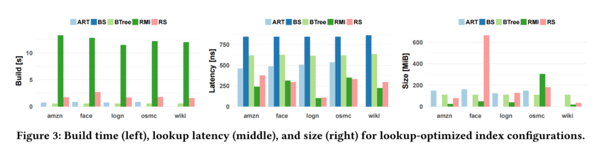

## 背景和应用场景：
(1)Learned Index 

(2)RadixSpline 
- 只读工作负载
- 相对于Learned Index，RadixSpline含有两个超参数构建spline points的error和radix table的大小（b-length prefix of a lookup key），训练更快（one-single pass）或者说bulk-loading时间更短
- 查找过程，radix-table定位包含lookup key的两个spline point，之后使用线性插值得到predict_pos，最后使用二分查找定位real_pos

(3)PLEX
- RadixSpline + CHT
- 只有一个超参数构建spline points的error
- 只读工作负载

## 问题描述：
(1)RadixSpline的超参数（radix table的大小（b-length prefix of a lookup key））很难调试 
(2)RadixSpline的radix-layer可能因为异常值（如face数据集中key的最长公共前缀很长时，这样radix-table所需要的size就会很大）而导致性能下降 

## 解决方案：
提出PLEX(RadixSpline + compact-hist-tree)，需要two-pass

PLEX对RadixSpline改进，解决两个问题 
1.Radix layer很难参数化。 
2.Radix layer会被outliers影响。 
> RadixSpline使用radix table来索引spline points，然而当key的二进制表示的最长公共前缀很大时，RadixSpline可能会降低性能。PLEX通过由CHT表示的RadixTree来解决这个问题

### Hist-tree：
Compact-hist-tree是Hist-tree在只读工作负载中的优化 
Compact-hist-tree的构建方式 
（1）从hist-tree构建 
（2）直接从data构建（本文实现） 

### auto-tuner
为Compact-hist-tree实现auto-tuner（本文实现）

### cost-model
#### radix-Table cost-model
Radix-table使用lookup-key的prefix长度为r 
则radix-table的长度为2^r 
k为lookup key，则bk为radix-table通过k锁定的区间长度 

Average lookup time 如下:

Memory Consumption是O(2^R)

#### CHT cost-model
CHT有两个参数：（1）使用lookup-key的prefix长度为r（2）通过CHT确定对应的node后，在node中对应的bin中需要进行二分查找的bound

Average lookup time 如下:

## 结果

