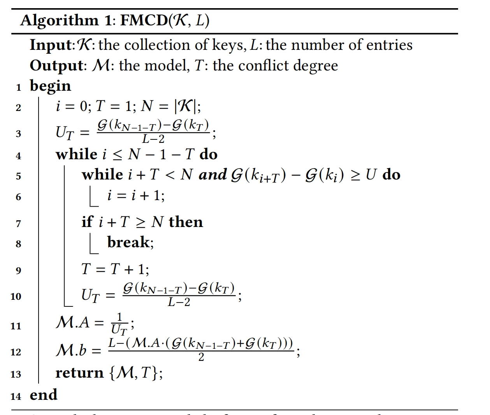
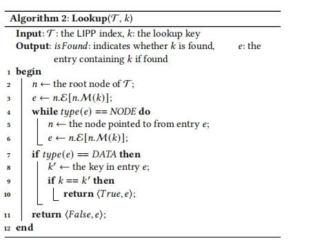
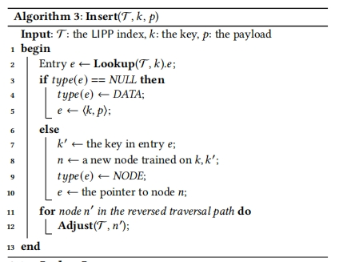
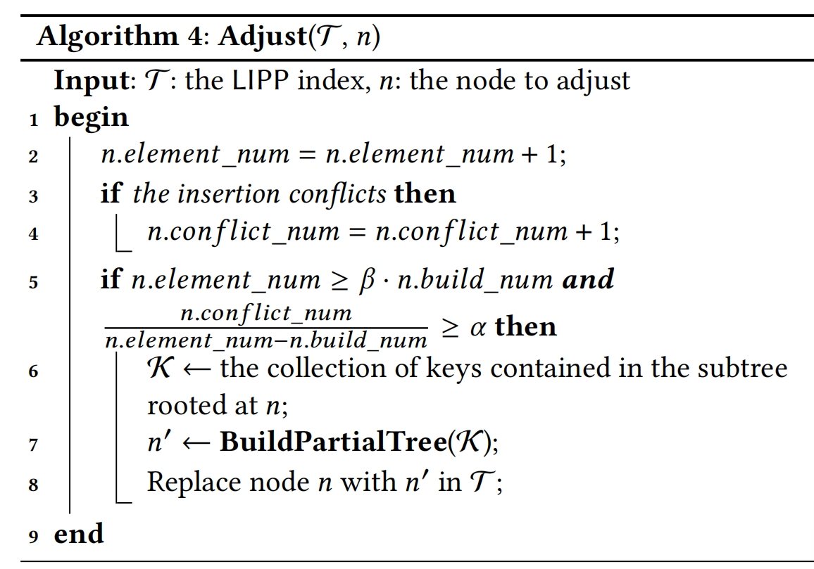
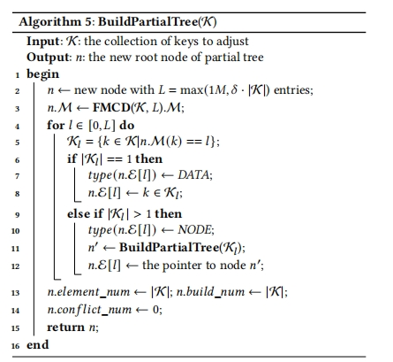

## 应用场景
读写负载

## 问题描述
Learned Index：只能在只读数据集上查找，无法处理索引结构中必不可少的更新操作
ALEX和PGM：它们对更新的支持是以查找操作的额外搜索为代价的；并且这些索引的更新操作也会导致大量元素的移动

需要一种索引可以解决“最后一英里问题”

## 方法
每个Node包含一个model、一个entries array、一个bit数组，
每个bit表示array中一个entry的类型，
类型有
NULL（空entry），
DATA(entry包含一个键值对，如果键值对太大，保存一个指向payload的指针)，
NODE（该entry指向下一层中的一个子节点，将一个新元素插入DATA entry时，创建一个子节点保存这两个entry，该entry指向这个新的节点）

三种类型的entry的大小都为16byte，其中DATA类型的entry由8byte的key和8byte的payload组成
对于第i个entry，bit数组的第2*i位表示该entry是不是NULL,第2*i + 1位表示entry的type

LIPP不区分leaf node和internal node

各种操作的算法：
FMCD算法：
> 给定一组key和数组长度L，计算最小的冲突度T及相应的linear model

