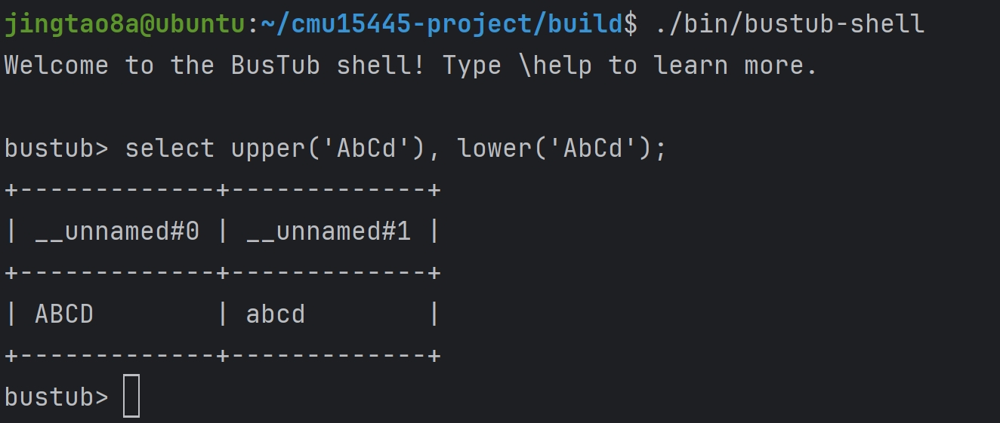
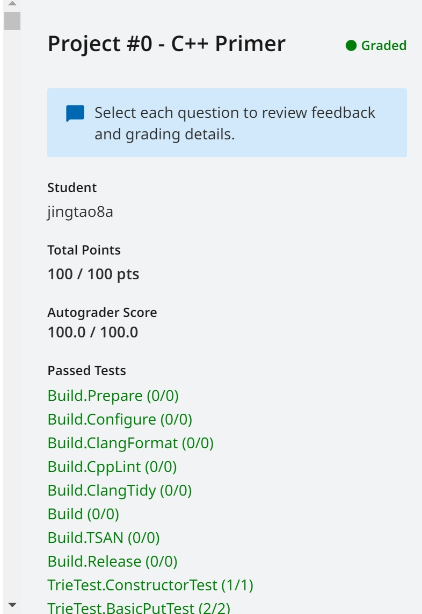

## TASK 1 Copy-On-Write Trie
COW Trie在每次插入和删除时不会改变原有节点，而是对该节点的副本进行修改后，依次为其父节点创建修改后的副本，最后返回一个新的根节点。
此外，删除操作中，如果回溯路径上的某节点无值，且不存在子节点，还需要删除该节点
***
插入("ad", 2),创建了一个新的Node2


***

插入("b", 3)


***

插入("a", "abc") 删除("ab", 1)<br>
注意删除操作后需要清除所有不需要的节点


Get函数实现
> 从root节点遍历Tire树，
> 如果key不存在返回nullptr，
> 如果key存在，但是对应的Node无value或者value的类型不匹配，返回nullptr
> 其它情况，返回value
```cpp
// Get the value associated with the given key.
// 1. If the key is not in the trie, return nullptr.
// 2. If the key is in the trie but the type is mismatched, return nullptr.
// 3. Otherwise, return the value.
template <class T>
auto Trie::Get(std::string_view key) const -> const T * {
  if (!root_) {
    return nullptr;
  }
  std::shared_ptr<const TrieNode> ptr(root_);
  for (char ch : key) {
    if (ptr->children_.count(ch) == 0) {
      return nullptr;
    }
    ptr = ptr->children_.at(ch);
  }
  if (!ptr->is_value_node_) {
    return nullptr;
  }
  auto p = std::dynamic_pointer_cast<const TrieNodeWithValue<T>>(ptr);
  if (!p) {
    return nullptr;
  }
  return p->value_.get();
}
```

``` cpp
template <class T>
auto Trie::Put(std::string_view key, T value) const -> Trie {
  // Note that `T` might be a non-copyable type. Always use `std::move` when creating `shared_ptr` on that value.

  // You should walk through the trie and create new nodes if necessary. If the node corresponding to the key already
  // exists, you should create a new `TrieNodeWithValue`.
  std::shared_ptr<const TrieNode> new_root(nullptr);
  std::map<char, std::shared_ptr<const TrieNode>> children;
  if (key.length() == 0) {//key长度为0，表示在root节点put value
    if (root_) {
      children = root_->children_;
    }
    new_root = std::make_shared<const TrieNodeWithValue<T>>(children, std::make_shared<T>(std::move(value)));//创建一个新的root节点
    return Trie(new_root);
  }

  std::vector<std::unique_ptr<TrieNode>> stack;
  if (root_) {
    stack.push_back(root_->Clone());
  } else {
    stack.push_back(std::make_unique<TrieNode>());
  }
  auto ptr(root_);

  for (int64_t i = 0; i < static_cast<int64_t>(key.length() - 1); ++i) {
    std::unique_ptr<TrieNode> tmp_ptr(nullptr);
    if (ptr && ptr->children_.count(key[i]) == 1) {
      ptr = ptr->children_.at(key[i]);
      tmp_ptr = ptr->Clone();
    } else {
      tmp_ptr = std::make_unique<TrieNode>();
      ptr = nullptr;
    }

    stack.push_back(std::move(tmp_ptr));
  }
  auto value_ptr = std::make_shared<T>(std::move(value));
  if (ptr && ptr->children_.count(key.back())) {
    ptr = ptr->children_.at(key.back());
    children = ptr->children_;
  }
  auto value_node = std::make_unique<TrieNodeWithValue<T>>(children, std::move(value_ptr));
  stack.push_back(std::move(value_node));

  for (int64_t i = key.length() - 1; i >= 0; i--) {
    auto tmp_ptr = std::move(stack.back());
    stack.pop_back();
    stack.back()->children_[key[i]] = std::move(tmp_ptr);
  }
  new_root = std::move(stack.back());
  return Trie(new_root);
}
```


## TASK 2 Concurrent Key-Value Store
> concurrent Key-Value store需要支持 **多个读者和一个写者** 工作的情况
> 也就是当一个写者在创建一个新的root的时候，读者可以在old root进行读操作
Tire_store.cpp文件<br>

读操作
```cpp
template <class T>
auto TrieStore::Get(std::string_view key) -> std::optional<ValueGuard<T>> {
  // Pseudo-code:
  // (1) Take the root lock, get the root, and release the root lock. Don't lookup the value in the
  //     trie while holding the root lock.
  // (2) Lookup the value in the trie.
  // (3) If the value is found, return a ValueGuard object that holds a reference to the value and the
  //     root. Otherwise, return std::nullopt.
  Trie root;
  {
    std::lock_guard<std::mutex> guard(root_lock_);
    root = root_;
  }
  const T *val = root.Get<T>(key);
  if (!val) {
    return std::nullopt;
  }

  return ValueGuard<T>(root, *val);
}
```
写操作
```cpp
template <class T>
void TrieStore::Put(std::string_view key, T value) {
  // You will need to ensure there is only one writer at a time. Think of how you can achieve this.
  // The logic should be somehow similar to `TrieStore::Get`.
  std::lock_guard<std::mutex> guard(write_lock_);
  Trie root;
  {
    std::lock_guard<std::mutex> guard1(root_lock_);
    root = root_;
  }

  Trie new_root = root.Put<T>(key, std::move(value));

  {
    std::lock_guard<std::mutex> guard1(root_lock_);
    root_ = new_root;
  }
}

void TrieStore::Remove(std::string_view key) {
  // You will need to ensure there is only one writer at a time. Think of how you can achieve this.
  // The logic should be somehow similar to `TrieStore::Get`.
  std::lock_guard<std::mutex> guard(write_lock_);
  Trie root;
  {
    std::lock_guard<std::mutex> guard1(root_lock_);
    root = root_;
  }

  Trie new_root = root.Remove(key);

  {
    std::lock_guard<std::mutex> guard1(root_lock_);
    root_ = new_root;
  }
}
```


## TASK 3 Debugging

skip.......


## TASK 4 SQL String Functions
实现Upper方法和Lower方法
src/include/execution/string_expression.h
```cpp
auto Compute(const std::string &val) const -> std::string {
    // TODO(student): implement upper / lower.
    std::string res;
    res.resize(val.length());
    switch (expr_type_) {
      case StringExpressionType::Lower:
        std::transform(val.begin(), val.end(), res.begin(), ::tolower);
        break;
      case StringExpressionType::Upper:
        std::transform(val.begin(), val.end(), res.begin(), ::toupper);
        break;
    }
    return res;
  }
```
运行结果如下:<br/>


测试通过截图：<br/>

