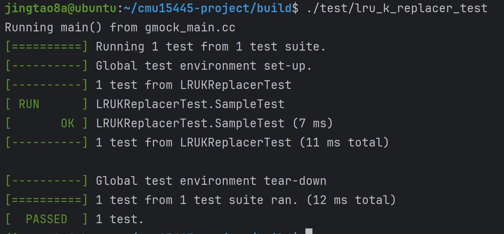
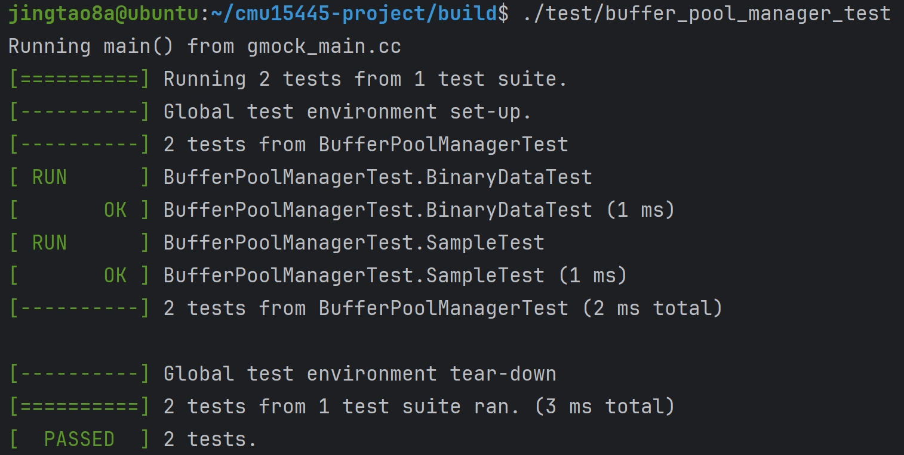
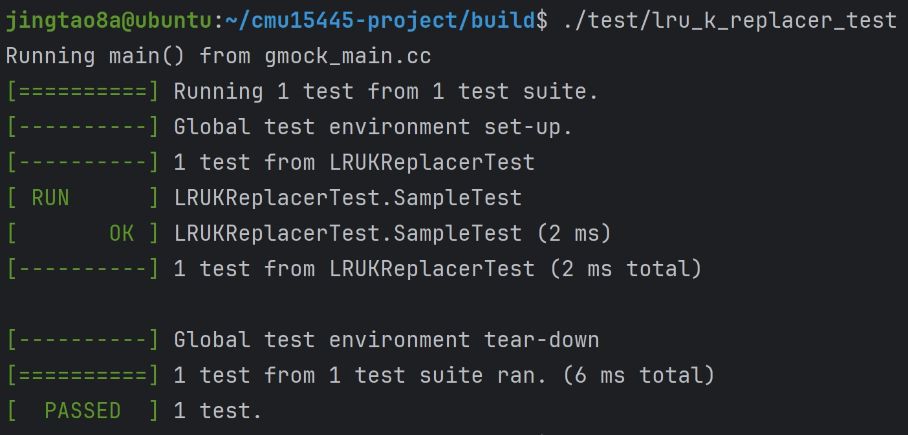

## project1的任务就是实现一个Buffer Pool Manager<br/>
DBMS启动时会从OS申请一片内存区域，即Buffer Pool，并将这块区域划分成大小相同的pages，为了与disk pages区别，通常称为frames，当DBMS请求一个disk page时，它首先需要被复制到Buffer Pool的一个frame中。当Buffer Pool空间不足时，需要采取某种replacement policy，淘汰已有的page。


question 1:
为什么不使用OS自带的磁盘管理模块，OS为开发者提供了mmap这样的调用，使开发者能够依赖OS自动管理数据在内外存之间的移动？
> DBMS比OS拥有更多、更充分的知识来决定数据移动的移动和数量，具体包括
> 1. 将dirty pages按正确的顺序写到磁盘
> 2. 根据具体情况预获取数据
> 3. 定制化缓存置换策略

同时DBMS会维护一个page table，负责记录每个page在内存中的位置，以及是否被写过(Dirty Flag),是否被引用或引用计数(Pin/Reference Counter)等元信息，如下图所示:


当page table中的某page被引用时，会记录引用数(pin/reference),表示该page正在被使用，空间不够时不应该被移除；当被请求的page不再page table中时，DBMS会申请一个latch(lock的别名)，表示该entry被占用，然后从disk中读取相关page到buffer pool，释放latch


## Buffer Replacement Policies
### LRU
维护每个page上一次被访问的时间戳，每次移除时间戳最早的page

### Clock
Clock是LRU的近似策略，它不需要每个page上次被访问的时间戳，而是为每个page保存一个reference
- 每当page被访问时，reference bit设置为1
- 每当需要移动page时，从上次访问的位置开始，按顺序轮询，每个page的reference bit，若该bit为1，则重置为0；若该bit为0，则移除该page

### LRU-K
保存每个page的最后K次访问时间戳，利用这些时间戳来估计它们下次被访问的时间，通常K取1就能获得很好的效果。

## Task#1 LRU-K Replacement Policy
实现LRUKReplacer
实现策略:
> LRU-K算法驱逐replacer的所有frame中backward k-distance最大的frame<br/>
backward k-distance计算方式:当前时间戳与之前k次访问的时间戳之间的时间差。<br/>
历史访问次数少于k的帧被赋予+inf作为其backward k-distance,当多个frame具有+inf backward k-distance时，replacer将驱逐具有最早总体时间戳的frame<br/>

### 代码实现：<br/>
一个LRUKNode对应一个frame
```cpp
class LRUKNode {
 public:
  /** History of last seen K timestamps of this page. Least recent timestamp stored in front. */
  std::list<size_t> history_;//记录一批时间戳
  frame_id_t fid_;//
  bool is_evictable_{false};
};
```
```cpp 
class LRUKReplacer {
  std::unordered_map<frame_id_t, LRUKNode> node_store_;//frame LRUKNode couple
  size_t current_timestamp_{0};//当前时间戳
  //replacer_size_ >= curr_size
  size_t curr_size_{0};//curr_size为当前is_evictable被标记为true的frame数量
  size_t replacer_size_;//replacer_size == num_frames
  size_t k_;
  std::mutex latch_;
};
```

Evict函数
> 驱逐一个frame，驱逐成功返回true，否则返回false
```cpp
auto LRUKReplacer::Evict(frame_id_t *frame_id) -> bool {
  std::lock_guard<std::mutex> guard(latch_);
  *frame_id = -1;
  for (auto &p : node_store_) {
    if (p.second.is_evictable_) {//通过Judge函数选择backward k-distance中最大的frame
      if (*frame_id == -1 || Judge(p.second, node_store_[*frame_id])) {
        *frame_id = p.second.fid_;
      }
    }
  }
  if (*frame_id != -1) {
    node_store_.erase(*frame_id);
    --curr_size_;
    return true;
  }
  return false;
}
```

Judge函数实现如下
```cpp
//lhs的backward k-distance大于rhs的backward k-distance 返回true 否则返回false
  auto Judge(const LRUKNode &lhs, const LRUKNode &rhs) const -> bool {
    if (rhs.history_.size() == k_ && lhs.history_.size() < k_) {
      return true;
    }
    if (rhs.history_.size() < k_ && lhs.history_.size() == k_) {
      return false;
    }
    //比较最早的时间戳,若lhs的时间戳更小，则返回true 否则返回false
    return lhs.history_.back() < rhs.history_.back();
  }
```

RecordAccess函数
> 1. 如果访问的frame_id大于等于replacer_size抛出异常
> 2. 否则，对该frame对应的LRUKNode添加时间戳，并且保证history_列表长度不超过k_
```cpp
void LRUKReplacer::RecordAccess(frame_id_t frame_id, [[maybe_unused]] AccessType access_type) {
  std::lock_guard<std::mutex> lock_guard(latch_);
  if (frame_id >= static_cast<int>(replacer_size_)) {
    throw Exception("frame_id is larger than or equal to replacer_size_");
  }
  if (node_store_.count(frame_id) == 0) {
    node_store_[frame_id] = LRUKNode();
    node_store_[frame_id].fid_ = frame_id;
  }
  auto &node = node_store_[frame_id];
  node.history_.push_front(current_timestamp_++);
  while (node.history_.size() > k_) {
    node.history_.pop_back();
  }
}
```

SetEvictable函数
> 将某个frame的is_evictable标记为set_evictable,如果该frame未被占用，抛出异常
> false->true   curr_size_++
> true->false   curr_size_--
```cpp
void LRUKReplacer::SetEvictable(frame_id_t frame_id, bool set_evictable) {
  std::lock_guard<std::mutex> lock_guard(latch_);
  if (node_store_.count(frame_id) <= 0) {
    throw Exception("frame_id should be used");
  }
  if (!node_store_[frame_id].is_evictable_ && set_evictable) {  // false -> true
    curr_size_++;
  } else if (node_store_[frame_id].is_evictable_ && !set_evictable) {  // true -> false
    curr_size_--;
  }
  node_store_[frame_id].is_evictable_ = set_evictable;
}
```

Remove函数
> 如果删除的frame不存在直接返回
> 如果删除的frame的is_evictable_未被设置为true，抛出异常
> 删除frame，--curr_size_
```cpp
void LRUKReplacer::Remove(frame_id_t frame_id) {
  std::lock_guard<std::mutex> lock_guard(latch_);
  if (node_store_.count(frame_id) <= 0) {
    return;
  }
  if (!node_store_[frame_id].is_evictable_) {
    throw Exception("Remove a non-evictable frame");
  }
  node_store_.erase(frame_id);
  --curr_size_;
}
```
task1本地测试：



## Task#2 -Buffer Pool Manager
完成LRU-K替换策略之后，接下来需要实现Buffer Pool的基本功能。对于DBMS来说，Buffer Pool可以隐藏内存和磁盘交互的细节，包括脏页面写回磁盘的过程。

Page
```cpp
class Page {
  char *data_;//4096字节
  page_id_t page_id;//physical page id
  int pin_count_;//该Page对象的引用计数
  bool is_dirty_;//脏位
  ReaderWriterLatch rwlatch_;//读写锁
};
```

BufferPoolManager
```cpp
class BufferPoolManager {
    /** Number of pages in the buffer pool. */
  const size_t pool_size_;
  /** The next page id to be allocated  */
  std::atomic<page_id_t> next_page_id_ = 0;

  /** Array of buffer pool pages. */
  Page *pages_;
  /** Pointer to the disk manager. */
  DiskManager *disk_manager_ __attribute__((__unused__));
  /** Pointer to the log manager. Please ignore this for P1. */
  LogManager *log_manager_ __attribute__((__unused__));
  /** Page table for keeping track of buffer pool pages. */
  std::unordered_map<page_id_t, frame_id_t> page_table_;
  /** Replacer to find unpinned pages for replacement. */
  std::unique_ptr<LRUKReplacer> replacer_;
  /** List of free frames that don't have any pages on them. */
  std::list<frame_id_t> free_list_;
  /** This latch protects shared data structures. We recommend updating this comment to describe what it protects. */
  std::mutex latch_;
};
```
BufferPoolManager初始化时，分配pool_size_个Page对象，LRUKReplacer的num_frame也设置为pool_size_

### 代码实现：<br/>
NewPage函数实现：
```cpp
auto BufferPoolManager::NewPage(page_id_t *page_id) -> Page * {
  frame_id_t free_frame_id = -1;
  std::lock_guard<std::mutex> guard(latch_);
  //获取一个空闲的frame
  if (!free_list_.empty()) {//存在空的frame
    free_frame_id = free_list_.front();
    free_list_.pop_front();
  } else {//不存在空的frame
    if (!replacer_->Evict(&free_frame_id)) {//通过LRUKReplacer得到一个空闲的frame
      return nullptr;
    }
    if (pages_[free_frame_id].IsDirty()) {//如果被驱逐的frame对应的page为脏页，需要进行写回操作
      disk_manager_->WritePage(pages_[free_frame_id].page_id_, pages_[free_frame_id].data_);
    }
    page_table_.erase(pages_[free_frame_id].page_id_);//将page_table_中该frame对应的page_id_删除
    pages_[free_frame_id].ResetMemory();//重置该改frame对应的内存
  }
  *page_id = AllocatePage();
  pages_[free_frame_id].page_id_ = *page_id;
  pages_[free_frame_id].pin_count_ = 1;
  pages_[free_frame_id].is_dirty_ = false;
  page_table_[*page_id] = free_frame_id;

  replacer_->RecordAccess(free_frame_id);
  replacer_->SetEvictable(free_frame_id, false);  // no use
  return pages_ + free_frame_id;
}
```

FetchPage函数实现:
```cpp
auto BufferPoolManager::FetchPage(page_id_t page_id, [[maybe_unused]] AccessType access_type) -> Page * {
  BUSTUB_ASSERT(page_id != INVALID_PAGE_ID, "page_id is equal to INVALID_PAGE_ID");
  std::lock_guard<std::mutex> guard(latch_);
  if (page_table_.count(page_id) != 0) {//如果page_table_中存在该page_id
    pages_[page_table_[page_id]].pin_count_++;//该page的引用计数增加
    replacer_->RecordAccess(page_table_[page_id]);//增加该page对应的frame的访问时间戳
    replacer_->SetEvictable(page_table_[page_id], false);
    return pages_ + page_table_[page_id];
  }

  frame_id_t free_frame_id = -1;
  //获取一个空闲的frame
  if (!free_list_.empty()) {
    free_frame_id = free_list_.front();
    free_list_.pop_front();
  } else {
    if (!replacer_->Evict(&free_frame_id)) {//通过LRUKReplacer得到一个空闲的frame
      return nullptr;
    }
    if (pages_[free_frame_id].IsDirty()) {//如果被驱逐的frame对应的page为脏页，需要进行写回操作
      disk_manager_->WritePage(pages_[free_frame_id].page_id_, pages_[free_frame_id].data_);
    }
    page_table_.erase(pages_[free_frame_id].page_id_);//将page_table_中该frame对应的page_id_删除
    pages_[free_frame_id].ResetMemory();//重置该改frame对应的内存
  }

  pages_[free_frame_id].page_id_ = page_id;
  pages_[free_frame_id].pin_count_ = 1;
  pages_[free_frame_id].is_dirty_ = false;
  page_table_[page_id] = free_frame_id;
  disk_manager_->ReadPage(page_id, pages_[free_frame_id].data_);//读取该page_id对应的物理页

  replacer_->RecordAccess(free_frame_id);//增加该frame的访问时间戳
  replacer_->SetEvictable(free_frame_id, false);  // no use
  return pages_ + free_frame_id;
}
```
UnpinPage函数实现：<br>
需要注意的是入参is_dirty不能破坏已经置为脏的状态，这里用 | 运算符来实现
```cpp
auto BufferPoolManager::UnpinPage(page_id_t page_id, bool is_dirty, [[maybe_unused]] AccessType access_type) -> bool {
  std::lock_guard<std::mutex> guard(latch_);
  if (page_table_.count(page_id) <= 0) {
    return false;
  }
  frame_id_t frame_id = page_table_[page_id];
  if (pages_[frame_id].pin_count_ == 0) {
    return false;
  }

  if (--pages_[frame_id].pin_count_ == 0) {//引用计数减为0时，将该frame设置为evictable
    replacer_->SetEvictable(frame_id, true);
  }
  pages_[frame_id].is_dirty_ |= is_dirty;
  return true;
}
```

FlushPage函数实现:<br>
强制将page_id对应的Page的内容写回磁盘，并将该Page对应脏位置为false
```cpp
auto BufferPoolManager::FlushPage(page_id_t page_id) -> bool {
  std::lock_guard<std::mutex> guard(latch_);
  if (page_table_.count(page_id) <= 0) {
    return false;
  }
  frame_id_t frame_id = page_table_[page_id];
  disk_manager_->WritePage(page_id, pages_[frame_id].data_);
  pages_[frame_id].is_dirty_ = false;
  return true;
}
```

FlushAllPages函数实现:
写回所有在内存中的Page

DeletePage函数实现：
```cpp
auto BufferPoolManager::DeletePage(page_id_t page_id) -> bool {
  std::lock_guard<std::mutex> guard(latch_);
  if (page_table_.count(page_id) <= 0) {
    return true;
  }
  frame_id_t frame_id = page_table_[page_id];
  if (pages_[frame_id].pin_count_ != 0) {
    return false;
  }
  //只有当该page_id对应的Page的引用计数为0时可以进行删除
  page_table_.erase(page_id);//page_table_删除该page_id
  replacer_->SetEvictable(frame_id, true);//replacer驱逐该frame
  replacer_->Remove(frame_id);
  free_list_.push_back(frame_id);//将该frame加入free_list
  //该Page初始化
  pages_[frame_id].is_dirty_ = false;
  pages_[frame_id].page_id_ = INVALID_PAGE_ID;
  pages_[frame_id].ResetMemory();
  DeallocatePage(page_id);
  return true;
}
```
task2本地测试:


## Task#3 Read/Write Page Guards
FetchPage和NewPage函数返回指向pages的指针，并且pages已经被pinned，并且当一个page不再需要时，要调用UnpinPage。另一方面，如果忘记调用UnPinPage，该Page将永远不会被evict。于是PageGuard就派上用场了

BasicPageGuard
思路：BasicPageGuard析构时调用Page的UnpinPage函数，并且BasicPageGuard中保存变量is_dirty_,调用AsMut或GetDataMut函数时将is_dirty_设置为true

WritePageGuard和ReadPageGuard
思路：与BasicPageGuard思路相似，析构函数调用UnpinPage多了一步释放Page的写锁和读锁

FetchPageBasic、FetchPageRead、FetchPageWrite和NewPageGuarded的实现代码如下:

```cpp
auto BufferPoolManager::FetchPageBasic(page_id_t page_id) -> BasicPageGuard { return {this, FetchPage(page_id)}; }

auto BufferPoolManager::FetchPageRead(page_id_t page_id) -> ReadPageGuard {
  Page *page = FetchPage(page_id);
  if (page != nullptr) {
    page->RLatch();
  }
  return {this, page};
}

auto BufferPoolManager::FetchPageWrite(page_id_t page_id) -> WritePageGuard {
  Page *page = FetchPage(page_id);
  if (page != nullptr) {
    page->WLatch();
  }
  return {this, page};
}

auto BufferPoolManager::NewPageGuarded(page_id_t *page_id) -> BasicPageGuard { return {this, NewPage(page_id)}; }
```
task3本地测试：


测试通过截图：


