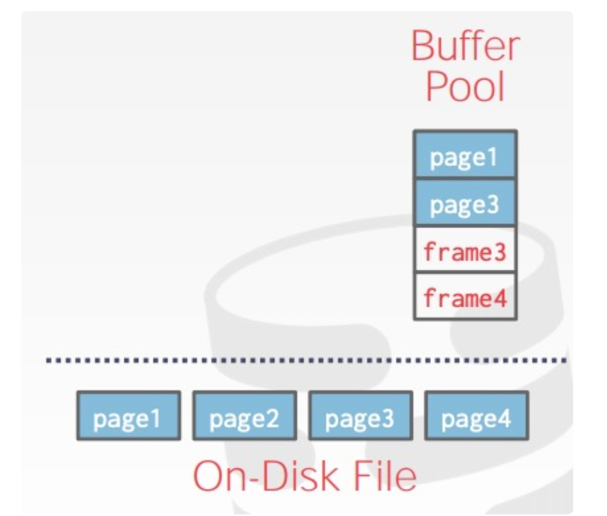
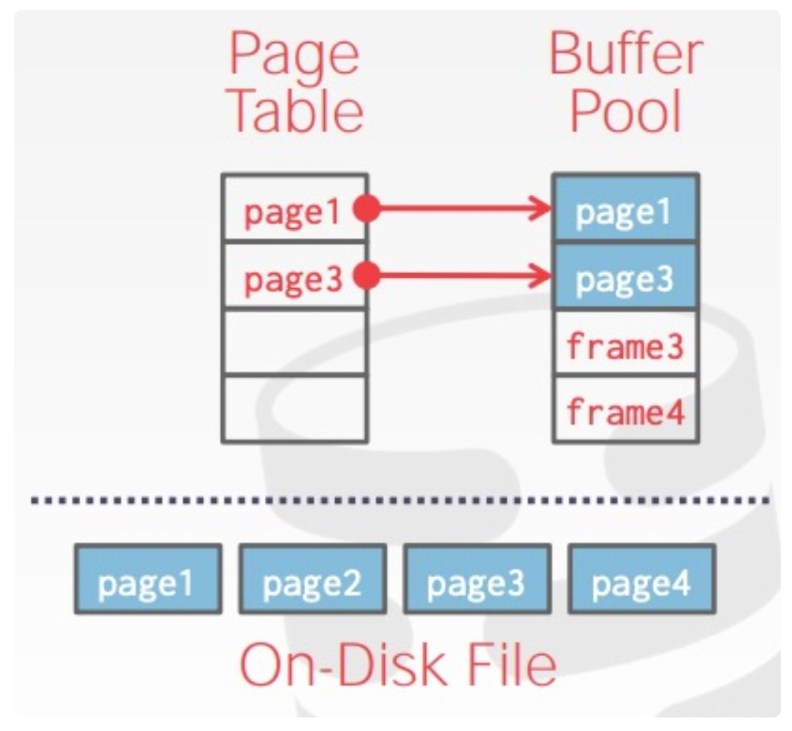
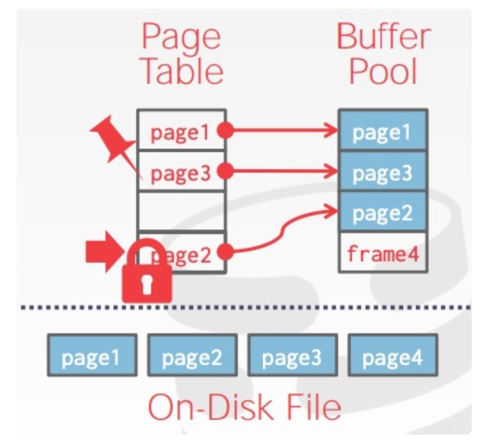
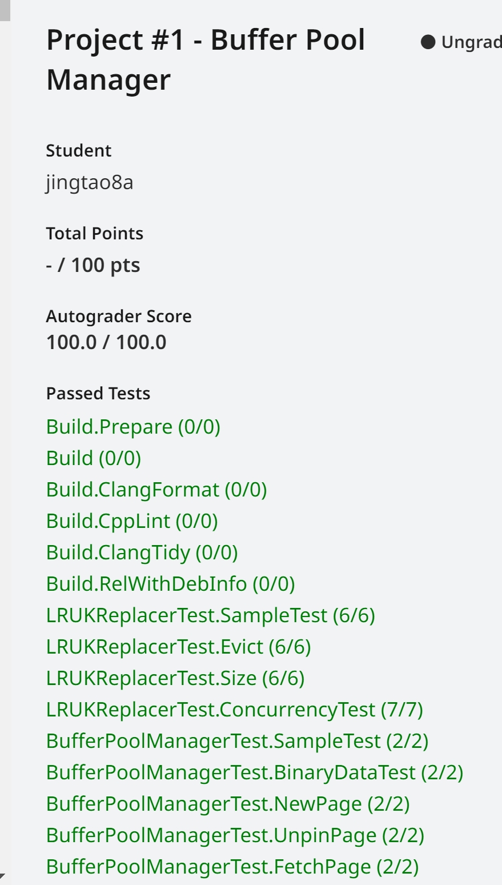

## project1的任务就是实现一个Buffer Pool Manager<br/>
DBMS启动时会从OS申请一片内存区域，即Buffer Pool，并将这块区域划分成大小相同的pages，为了与disk pages区别，通常称为frames，当DBMS请求一个disk page时，它首先需要被复制到Buffer Pool的一个frame中。当Buffer Pool空间不足时，需要采取某种replacement policy，淘汰已有的page。


question 1:
为什么不使用OS自带的磁盘管理模块，OS为开发者提供了mmap这样的调用，使开发者能够依赖OS自动管理数据在内外存之间的移动？
> DBMS比OS拥有更多、更充分的知识来决定数据移动的移动和数量，具体包括
> 1. 将dirty pages按正确的顺序写到磁盘
> 2. 根据具体情况预获取数据
> 3. 定制化缓存置换策略

同时DBMS会维护一个page table，负责记录每个page在内存中的位置，以及是否被写过(Dirty Flag),是否被引用或引用计数(Pin/Reference Counter)等元信息，如下图所示:



当page table中的某page被引用时，会记录引用数(pin/reference),表示该page正在被使用，空间不够时不应该被移除；当被请求的page不再page table中时，DBMS会申请一个latch(lock的别名)，表示该entry被占用，然后从disk中读取相关page到buffer pool，释放latch



## Buffer Replacement Policies
### LRU
维护每个page上一次被访问的时间戳，每次移除时间戳最早的page

### Clock
Clock是LRU的近似策略，它不需要每个page上次被访问的时间戳，而是为每个page保存一个reference
- 每当page被访问时，reference bit设置为1
- 每当需要移动page时，从上次访问的位置开始，按顺序轮询，每个page的reference bit，若该bit为1，则重置为0；若该bit为0，则移除该page

### LRU-K
保存每个page的最后K次访问时间戳，利用这些时间戳来估计它们下次被访问的时间，通常K取1就能获得很好的效果。

## Task#1 LRU-K Replacement Policy
实现LRUKReplacer
实现策略:
LRU-K算法驱逐replacer的所有frame中backward k-distance最大的frame<br/>
backward k-distance计算方式:当前时间戳与之前k次访问的时间戳之间的时间差。<br/>
历史访问次数少于k的帧被赋予+inf作为其backward k-distance,当多个frame具有+inf backward k-distance时，replacer将驱逐具有最早总体时间戳的frame<br/>

实现：<br/>
一个LRUKNode对应一个frame
```cpp
class LRUKNode {
 public:
  /** History of last seen K timestamps of this page. Least recent timestamp stored in front. */
  std::list<size_t> history_;//记录一批时间戳
  frame_id_t fid_;//
  bool is_evictable_{false};
};
```
```cpp 
class LRUKReplacer {
  std::unordered_map<frame_id_t, LRUKNode> node_store_;//frame LRUKNode couple
  size_t current_timestamp_{0};//当前时间戳
  //replacer_size_ >= curr_size
  size_t curr_size_{0};
  size_t replacer_size_;
  size_t k_;
  std::mutex latch_;
};
```

```cpp
auto LRUKReplacer::Evict(frame_id_t *frame_id) -> bool {
  std::lock_guard<std::mutex> guard(latch_);
  *frame_id = -1;
  for (auto &p : node_store_) {
    if (p.second.is_evictable_) {//通过Judge函数选择backward k-distance中最大的frame
      if (*frame_id == -1 || Judge(p.second, node_store_[*frame_id])) {
        *frame_id = p.second.fid_;
      }
    }
  }
  if (*frame_id != -1) {
    node_store_.erase(*frame_id);
    --curr_size_;
    return true;
  }
  return false;
}
```

Judge函数实现如下
```cpp
//lhs的backward k-distance大于rhs的backward k-distance 返回true 否则返回false
  auto Judge(const LRUKNode &lhs, const LRUKNode &rhs) const -> bool {
    if (rhs.history_.size() == k_ && lhs.history_.size() < k_) {
      return true;
    }
    if (rhs.history_.size() < k_ && lhs.history_.size() == k_) {
      return false;
    }
    //比较最新的时间戳,lhs的时间戳更小，表示出现的更早，返回true 否则返回false
    return lhs.history_.back() < rhs.history_.back();
  }
```

RecordAccess函数
> 1. 如果访问的frame_id大于等于replacer_size抛出异常
> 2. 否则，该frame对应的LRUKNode添加时间戳，并且保证history_列表长度不超过k_
```cpp
void LRUKReplacer::RecordAccess(frame_id_t frame_id, [[maybe_unused]] AccessType access_type) {
  std::lock_guard<std::mutex> lock_guard(latch_);
  if (frame_id >= static_cast<int>(replacer_size_)) {
    throw Exception("frame_id is larger than or equal to replacer_size_");
  }
  if (node_store_.count(frame_id) == 0) {
    node_store_[frame_id] = LRUKNode();
    node_store_[frame_id].fid_ = frame_id;
  }
  auto &node = node_store_[frame_id];
  node.history_.push_front(current_timestamp_++);
  while (node.history_.size() > k_) {
    node.history_.pop_back();
  }
}
```


测试通过截图：


