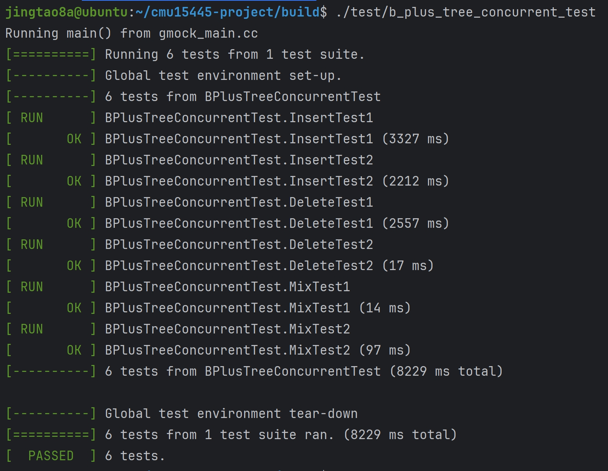

# B+ Tree
B+ Tree是一种自平衡树，它将数据有序地存储，并且在search、sequential access、insertions以及deletions操作的复杂度上都满足O(logn),其中sequential access的最终复杂度还与所需数据总量有关

以M—way B+tree为例，它的特点总结如下：
- 每个节点最多存储M个key，有M+1个children
- B+ Tree是perfectly balanced，即每个leaf node的深度都一样
- 除了root节点，所有节点必须至少处于半满状态，即 M/2 - 1 <= #keys <= M - 1
- 假设每个inner node中包含k个keys，那么它必然有k + 1个children

# B+ Tree Operations
Insert
> 1. 找到对应的leafNode L
> 2. 将key/value pair按顺序插入到 L 中
> 3. 如果L 还有足够的空间，操作结束；如果空间不足，则需要将L分裂成两个节点，同时在parent node上新增entry，若parent node也空间不足，则递归地分裂，直到root node为止

Max.degree = 5时<br>
从1插入到13的情况  [BPlusTree可视化网站](https://www.cs.usfca.edu/~galles/visualization/BPlusTree.html)


Delete
> 1. 从root开始，找到目标entry所在的leaf node L
> 2. 删除该entry
> 3. 如果L仍然处在半满状态，操作结束；否则先尝试从siblings那里借entries，如果失败，则将L 与相应的sibling合并
> 4. 如果合并发生了，则可能需要递归地删除parent node中的entry

# CheckPoint#1
## Task #1 B+ Tree Pages
### class BPlusTreePage的3个类成员

GetMinSize函数实现:
```cpp
auto BPlusTreePage::GetMinSize() const -> int {
  if (IsLeafPage()) {// 叶子节点
    return max_size_ / 2;
  }
  return (max_size_ + 1) / 2; //内部节点
}
```

### class BPlusTreeInternalPage : public BPlusTreePage <br>
> 一个Internal Page存储 m 个顺序 key 和 m + 1 个child pointers(其它BPlusTreePage的page_ids)<br>
使用一个数组存储key/page_id pairs，并且第一个key被设置为invalid，并且查找要从第二个key开始查找

```cpp
INDEX_TEMPLATE_ARGUMENTS
void B_PLUS_TREE_INTERNAL_PAGE_TYPE::Init(int max_size, int size) {
  SetPageType(IndexPageType::INTERNAL_PAGE);
  SetMaxSize(max_size);
  SetSize(size);//size 默认为1
}

INDEX_TEMPLATE_ARGUMENTS
auto B_PLUS_TREE_INTERNAL_PAGE_TYPE::ValueIndex(const ValueType &value) const -> int {
  for (int i = 0; i <= GetSize(); ++i) {//顺序查找
    if (array_[i].second == value) {
      return i;
    }
  }
  return -1;
}

INDEX_TEMPLATE_ARGUMENTS
auto B_PLUS_TREE_INTERNAL_PAGE_TYPE::LookUp(const KeyType &key, const KeyComparator &comparator) const -> ValueType {
  for (int i = 1; i < GetSize(); ++i) {  // 顺序查找
    if (comparator(key, array_[i].first) < 0) {//找到第一个大于key的array_[i].first
      return array_[i - 1].second;
    }
  }
  return array_[GetSize() - 1].second;
}

INDEX_TEMPLATE_ARGUMENTS
auto B_PLUS_TREE_INTERNAL_PAGE_TYPE::Insert(const KeyType &key, const ValueType &value, const KeyComparator &comparator)
    -> bool {
  if (GetSize() == GetMaxSize()) {//已经满了返回false
    return false;
  }
  // upper_bound
  int l = 1;
  int r = GetSize();
  while (l < r) {
    int mid = (l + r) / 2;
    if (comparator(array_[mid].first, key) > 0) {
      r = mid;
    } else {
      l = mid + 1;
    }
  }
  for (int i = GetSize() - 1; i >= l; --i) {//元素移位
    array_[i + 1] = array_[i];
  }
  array_[l] = {key, value};//存储插入的key-value
  IncreaseSize(1);//size ++
  return true;
}
```

### class BPlusTreeLeafPage : public BPlusTreePage
> 一个Leaf Page存储 m 个顺序 key 和 m 个对应的value.value应该为 64-bit record_id 用于表示实际的tuple存储的地方(src/include/common/rid.h)
```cpp
INDEX_TEMPLATE_ARGUMENTS
void B_PLUS_TREE_LEAF_PAGE_TYPE::Init(int max_size, int size, page_id_t next_page_id) {
  SetPageType(IndexPageType::LEAF_PAGE);
  SetMaxSize(max_size);
  SetSize(size);//size 默认为0
  SetNextPageId(next_page_id);//next_page_id默认为INVALID_PAGE_ID
}

INDEX_TEMPLATE_ARGUMENTS
auto B_PLUS_TREE_LEAF_PAGE_TYPE::KeyIndex(const KeyType &key, const KeyComparator &comparator, int &index) const
    -> bool {
  // lower_bound
  int l = 0;
  int r = GetSize();
  if (l >= r) {
    return false;
  }
  while (l < r) {
    int mid = (l + r) / 2;
    if (comparator(array_[mid].first, key) < 0) {
      l = mid + 1;
    } else {
      r = mid;
    }
  }
  index = l;
  return static_cast<bool>(l != GetSize() && comparator(KeyAt(l), key) == 0);
}

INDEX_TEMPLATE_ARGUMENTS
auto B_PLUS_TREE_LEAF_PAGE_TYPE::Insert(const KeyType &key, const ValueType &value, const KeyComparator &comparator)
    -> bool {
  int pos = -1;
  if (KeyIndex(key, comparator, pos)) {  // duplicate key
    return false;//重复的key，直接返回false
  }

  // move
  for (int i = GetSize() - 1; i >= pos; --i) {//移动array_元素
    array_[i + 1] = array_[i];
  }
  // insert
  array_[pos] = {key, value};//插入key-value
  IncreaseSize(1);//size ++
  return true;
}
```

### Class BplusTreeHeaderPage
> 头节点，存储了root page id，使得根节点和非根节点一样拥有父节点


## Task #2a B+ Tree Data Structure(Insertion, Point Search)
GetRootPageId函数实现:
```cpp
INDEX_TEMPLATE_ARGUMENTS auto BPLUSTREE_TYPE::GetRootPageId() const -> page_id_t {
  ReadPageGuard guard = bpm_->FetchPageRead(header_page_id_);
  auto page = guard.As<BPlusTreeHeaderPage>();
  return page->root_page_id_;
}
```

Search操作

```cpp
INDEX_TEMPLATE_ARGUMENTS
auto BPLUSTREE_TYPE::GetValue(const KeyType &key, std::vector<ValueType> *result, Transaction *txn) -> bool {
  // Declaration of context instance.
  Context ctx;
  {
    //先给header_page加读锁判断root_page是否存在，如果存在，给root_page加读锁，放入Context中
    auto header_page_guard = bpm_->FetchPageRead(header_page_id_);
    auto header_page = header_page_guard.As<BPlusTreeHeaderPage>();
    if (header_page->root_page_id_ == INVALID_PAGE_ID) {
      return false;
    }
    ctx.root_page_id_ = header_page->root_page_id_;
    ctx.read_set_.push_back(bpm_->FetchPageRead(ctx.root_page_id_));
  }
  //查找到对应的leafPage
  FindLeafPage(key, Operation::Search, ctx);
  auto leaf_page = ctx.read_set_.back().As<LeafPage>();
  int index = -1;
  if (leaf_page->KeyIndex(key, comparator_, index)) {
    result->push_back(leaf_page->ValueAt(index));//查找成功
    return true;
  }
  return false;//查找失败
}

INDEX_TEMPLATE_ARGUMENTS
auto BPLUSTREE_TYPE::FindLeafPage(const KeyType &key, Operation op, Context &ctx) {
  if (op == Operation::Search) {
    //Search的加锁策略
    //从root往下，不断地
    // - 获取child的read latch
    // - 释放parent的read latch
    auto page = ctx.read_set_.back().As<BPlusTreePage>();
    while (!page->IsLeafPage()) {
      auto internal = ctx.read_set_.back().As<InternalPage>();
      auto next_page_id = internal->LookUp(key, comparator_);
      ctx.read_set_.push_back(bpm_->FetchPageRead(next_page_id));
      ctx.read_set_.pop_front();
      page = ctx.read_set_.back().As<BPlusTreePage>();
    }
    return;
  }
  if (op == Operation::Insert || op == Operation::Remove) {
    //Insert和Remove的加锁策略
    //从root往下，按照需要获取write latch，一旦获取到了child的write latch，检查
    //它是否安全，如果安全，则释放之前获取的所有write latch
    auto page = ctx.write_set_.back().As<BPlusTreePage>();
    while (!page->IsLeafPage()) {
      auto internal = ctx.write_set_.back().As<InternalPage>();
      auto next_page_id = internal->LookUp(key, comparator_);
      ctx.write_set_.push_back(bpm_->FetchPageWrite(next_page_id));
      if (IsSafePage(ctx.write_set_.back().As<BPlusTreePage>(), op, false)) {
        while (ctx.write_set_.size() > 1) {
          ctx.write_set_.pop_front();
        }
      }
      page = ctx.write_set_.back().As<BPlusTreePage>();
    }
    return;
  }
}

INDEX_TEMPLATE_ARGUMENTS
auto BPLUSTREE_TYPE::IsSafePage(const BPlusTreePage *tree_page, Operation op, bool isRootPage) -> bool {
  if (op == Operation::Search) {//no use
    return true;
  }
  if (op == Operation::Insert) {//插入操作
    //若会发生上溢，表示不安全
    if (tree_page->IsLeafPage()) {
      //叶子节点中，size最大为tree_page->GetMaxSize() - 1;
      return tree_page->GetSize() + 1 < tree_page->GetMaxSize();
    }
    //内部节点中，size最大为tree_page->GetMaxSize()
    return tree_page->GetSize() < tree_page->GetMaxSize();
  }
  if (op == Operation::Remove) {//删除操作
    //若会发生下溢，表示不安全
    if (isRootPage) {//对RootPage进行Remove操作
      if (tree_page->IsLeafPage()) {
        //如果为叶子节点，size至少为2
        return tree_page->GetSize() > 1;
      }
      //如果为内部节点，size至少为3
      return tree_page->GetSize() > 2;
    }
    return tree_page->GetSize() > tree_page->GetMinSize();
  }
  return false;
}
```

Insert操作
> 插入到leaf节点中，插入前，如果size == max_size表示溢出，需要进行分裂
> 插入到internal节点中，插入前，如果size == max_size表示溢出，需要进行分裂 
```cpp
INDEX_TEMPLATE_ARGUMENTS auto BPLUSTREE_TYPE::Insert(const KeyType &key, const ValueType &value, Transaction *txn)
    -> bool {
  // Declaration of context instance.
  Context ctx;
  ctx.header_page_ = bpm_->FetchPageWrite(header_page_id_);//先给header_page_id写锁
  auto header_page = ctx.header_page_->AsMut<BPlusTreeHeaderPage>();
  if (header_page->root_page_id_ == INVALID_PAGE_ID) {  // root not exist,start a new tree
    auto root_guard = bpm_->NewPageGuarded(&ctx.root_page_id_);//申请root_page
    header_page->root_page_id_ = ctx.root_page_id_;
    auto leaf_page = root_guard.AsMut<LeafPage>();
    leaf_page->Init(leaf_max_size_, 1);
    leaf_page->GetArray()[0] = {key, value};//插入key-value
    ctx.Drop();
    return true;
  }
  ctx.root_page_id_ = header_page->root_page_id_;
  ctx.write_set_.push_back(bpm_->FetchPageWrite(ctx.root_page_id_));
  if (IsSafePage(ctx.write_set_.back().As<BPlusTreePage>(), Operation::Insert, true)) {//如果root_page安全，释放header_page的写锁
    ctx.header_page_ = std::nullopt;  // unlock header_page
  }
  FindLeafPage(key, Operation::Insert, ctx);
  auto &leaf_page_guard = ctx.write_set_.back();
  auto leaf_page = leaf_page_guard.AsMut<LeafPage>();
  if (!leaf_page->Insert(key, value, comparator_)) {  // duplicate key, 插入失败
    ctx.Drop();
    return false;
  }
  if (leaf_page->GetSize() < leaf_page->GetMaxSize()) {  // 叶子节点未溢出，不需要分裂
    ctx.Drop();
    return true;
  }
  // 发生溢出,叶子节点分裂
  auto new_page_id = 0;
  auto new_leaf_page_guard = bpm_->NewPageGuarded(&new_page_id);
  auto new_leaf_page = new_leaf_page_guard.AsMut<LeafPage>();
  std::copy(leaf_page->GetArray() + leaf_page->GetMinSize(), leaf_page->GetArray() + leaf_page->GetSize(),
            new_leaf_page->GetArray());
  new_leaf_page->Init(leaf_max_size_, leaf_page->GetSize() - leaf_page->GetMinSize(), leaf_page->GetNextPageId());
  leaf_page->SetNextPageId(new_leaf_page_guard.PageId());
  leaf_page->SetSize(leaf_page->GetMinSize());
  KeyType split_key = new_leaf_page->KeyAt(0);
  // 将split_key插入父节点
  InsertIntoParent(split_key, new_leaf_page_guard.PageId(), ctx, ctx.write_set_.size() - 2);
  ctx.Drop();
  return true;
}

INDEX_TEMPLATE_ARGUMENTS
void BPLUSTREE_TYPE::InsertIntoParent(const KeyType &key, page_id_t right_child_id, Context &ctx, int index) {
  if (index < 0) {  // parent为header_page
    //创建新的root_page，并更新header_page中的root_page_id_
    auto new_root_page_id = 0;
    auto new_root_page_guard = bpm_->NewPageGuarded(&new_root_page_id);
    auto new_root_page = new_root_page_guard.AsMut<InternalPage>();
    new_root_page->Init(internal_max_size_, 2);
    new_root_page->GetArray()[0].second = ctx.write_set_[index + 1].PageId();
    new_root_page->GetArray()[1] = {key, right_child_id};
    auto header_page = ctx.header_page_->AsMut<BPlusTreeHeaderPage>();
    header_page->root_page_id_ = new_root_page_id;
    return;
  }
  auto parent_page = ctx.write_set_[index].AsMut<InternalPage>();
  if (parent_page->Insert(key, right_child_id, comparator_)) {  // 父节点不需要分裂
    return;
  }
  // 父节点需要分裂
  auto new_parent_page_id = 0;
  auto new_parent_page_guard = bpm_->NewPageGuarded(&new_parent_page_id);
  auto new_parent_page = new_parent_page_guard.AsMut<InternalPage>();
  auto array = new std::pair<KeyType, page_id_t>[parent_page->GetMaxSize() + 1];
  std::copy(parent_page->GetArray(), parent_page->GetArray() + parent_page->GetMaxSize(), array);
  // upper_bound
  int l = 1;
  int r = parent_page->GetMaxSize();
  while (l < r) {
    int mid = (l + r) / 2;
    if (comparator_(array[mid].first, key) > 0) {
      r = mid;
    } else {
      l = mid + 1;
    }
  }
  // 右移一位，腾出空间
  for (int i = parent_page->GetMaxSize() - 1; i >= l; --i) {
    array[i + 1] = array[i];
  }
  array[l] = {key, right_child_id};
  std::copy(array, array + parent_page->GetMinSize(), parent_page->GetArray());
  std::copy(array + parent_page->GetMinSize(), array + parent_page->GetMaxSize() + 1, new_parent_page->GetArray());
  new_parent_page->Init(internal_max_size_, parent_page->GetMaxSize() + 1 - parent_page->GetMinSize());
  parent_page->SetSize(parent_page->GetMinSize());
  delete[] array;
  InsertIntoParent(new_parent_page->KeyAt(0), new_parent_page_id, ctx, index - 1);
}
```
CheckPoint#1本地测试<br/>


线上测试<br/>


# CheckPoint#2
## Task #2b B+ Tree Data Structure(Deletion)
Deletion操作:
> 如果删除的leaf节点是root节点，那么删除后的size == 0,表示下溢，需要将header_page中的root_page设置为INVALID_PAGE_ID<br>
> 如果删除的leaf节点不是root节点，那么删除后的size < min_size表示下溢<br>
> 1.如果有右孩子<br>
> > 2.判断是否能merge(merge_size < max_size),能则merge，否则转3<br>
> > 3.向右孩子进行borrow<br>

> 4.如果有左孩子<br>
> > 5.判断是否能merge(merge_size < min_size),能则merge，否则转6<br>
> > 6.向左孩子进行borrow<br>

> merge操作后需要删除internal节点中的entry, 与删除leaf节点中的entry十分相似<br>

>如果删除的internal节点是root节点，那么删除后的size==1表示下溢，需要将header_page_中的root_page_id_设置为page->GetArray()[0].second<br>
> 如果删除的internal节点不是root节点，那么删除后的size < min_size表示下溢<br>
> 1.如果有右孩子<br>
> > 2.判断是否能merge(merge_size <= max_size),能则merge，否则转3<br>
> > 3.向右孩子进行borrow<br>

> 4.如果有左孩子<br>
> > 5.判断是否能merge(merge_size <= max_size),能则merge，否则转6<br>
> > 6.向左孩子进行borrow<br>

```cpp
INDEX_TEMPLATE_ARGUMENTS
void BPLUSTREE_TYPE::Remove(const KeyType &key, Transaction *txn) {
  // Declaration of context instance.
  Context ctx;
  ctx.header_page_ = bpm_->FetchPageWrite(header_page_id_);
  auto header_page = ctx.header_page_->AsMut<BPlusTreeHeaderPage>();
  if (header_page->root_page_id_ == INVALID_PAGE_ID) {  // root not exist
    return;
  }
  ctx.root_page_id_ = header_page->root_page_id_;
  ctx.write_set_.push_back(bpm_->FetchPageWrite(ctx.root_page_id_));
  if (IsSafePage(ctx.write_set_.back().As<BPlusTreePage>(), Operation::Remove, true)) {
    ctx.header_page_ = std::nullopt;  // unlock header_page
  }
  FindLeafPage(key, Operation::Remove, ctx);
  auto &leaf_page_guard = ctx.write_set_.back();
  auto leaf_page = leaf_page_guard.AsMut<LeafPage>();
  int pos = -1;
  // key不存在
  if (!leaf_page->KeyIndex(key, comparator_, pos)) {
    ctx.Drop();
    return;
  }
  // key存在,将其从leaf中删除
  for (int i = pos + 1; i < leaf_page->GetSize(); ++i) {
    leaf_page->GetArray()[i - 1] = leaf_page->GetArray()[i];
  }
  leaf_page->SetSize(leaf_page->GetSize() - 1);  // 更新leaf_page的size

  if (leaf_page->GetSize() >= leaf_page->GetMinSize()) {  // 无underflow 直接返回
    ctx.Drop();
    return;
  }
  // underflow
  if (ctx.IsRootPage(leaf_page_guard.PageId())) {  // 该叶子节点是根节点
    if (leaf_page->GetSize() == 0) {               // size为0
      header_page->root_page_id_ = INVALID_PAGE_ID;
    }
    ctx.Drop();
    return;
  }

  auto &parent_page_guard = ctx.write_set_[ctx.write_set_.size() - 2];
  auto parent_page = parent_page_guard.AsMut<InternalPage>();
  auto index = parent_page->ValueIndex(leaf_page_guard.PageId());
  BUSTUB_ASSERT(index != -1, "index must not be -1");
  // 如果有右brother
  if (index < parent_page->GetSize() - 1) {
    page_id_t right_brother_page_id = parent_page->GetArray()[index + 1].second;
    auto right_brother_page_guard = bpm_->FetchPageWrite(right_brother_page_id);
    auto right_brother_page = right_brother_page_guard.AsMut<LeafPage>();

    auto merge_size = right_brother_page->GetSize() + leaf_page->GetSize();
    if (merge_size < leaf_page->GetMaxSize()) {  // 可以合并
      // merge
      std::copy(right_brother_page->GetArray(), right_brother_page->GetArray() + right_brother_page->GetSize(),
                leaf_page->GetArray() + leaf_page->GetSize());
      leaf_page->SetSize(merge_size);
      leaf_page->SetNextPageId(right_brother_page->GetNextPageId());
      RemoveFromParent(index + 1, ctx, ctx.write_set_.size() - 2);
    } else {
      // borrow
      leaf_page->GetArray()[leaf_page->GetSize()] = right_brother_page->GetArray()[0];
      std::copy(right_brother_page->GetArray() + 1, right_brother_page->GetArray() + right_brother_page->GetSize(),
                right_brother_page->GetArray());
      leaf_page->IncreaseSize(1);
      right_brother_page->SetSize(right_brother_page->GetSize() - 1);
      parent_page->SetKeyAt(index + 1, right_brother_page->GetArray()[0].first);
    }
  } else {
    // 左brother
    BUSTUB_ASSERT(index - 1 >= 0, "left brother must exist");
    page_id_t left_brother_page_id = parent_page->GetArray()[index - 1].second;
    auto left_brother_page_guard = bpm_->FetchPageWrite(left_brother_page_id);
    auto left_brother_page = left_brother_page_guard.AsMut<LeafPage>();

    auto merge_size = left_brother_page->GetSize() + leaf_page->GetSize();
    if (merge_size < left_brother_page->GetMaxSize()) {  // 可以合并
      // merge
      std::copy(leaf_page->GetArray(), leaf_page->GetArray() + leaf_page->GetSize(),
                left_brother_page->GetArray() + left_brother_page->GetSize());
      left_brother_page->SetSize(merge_size);
      left_brother_page->SetNextPageId(leaf_page->GetNextPageId());
      RemoveFromParent(index, ctx, ctx.write_set_.size() - 2);
    } else {
      // borrow
      for (int i = leaf_page->GetSize(); i >= 1; --i) {
        leaf_page->GetArray()[i] = leaf_page->GetArray()[i - 1];
      }
      leaf_page->GetArray()[0] = left_brother_page->GetArray()[left_brother_page->GetSize() - 1];
      leaf_page->IncreaseSize(1);
      left_brother_page->SetSize(left_brother_page->GetSize() - 1);
      parent_page->SetKeyAt(index, leaf_page->GetArray()[0].first);
    }
  }
  ctx.Drop();
}

INDEX_TEMPLATE_ARGUMENTS
void BPLUSTREE_TYPE::RemoveFromParent(int valueIndex, Context &ctx, int index) {
  auto &page_guard = ctx.write_set_[index];
  auto page = page_guard.AsMut<InternalPage>();
  for (int i = valueIndex + 1; i < page->GetSize(); ++i) {  // 删除key value
    page->GetArray()[i - 1] = page->GetArray()[i];
  }
  page->SetSize(page->GetSize() - 1);  // 更新page的size

  if (page->GetSize() >= page->GetMinSize()) {  // 无underflow
    return;
  }
  // underflow
  if (ctx.IsRootPage(page_guard.PageId())) {  // 该page是根节点
    if (page->GetSize() == 1) {               // 根节点需要更换了
      BUSTUB_ASSERT(ctx.header_page_ != std::nullopt, "ctx.header_page must exist");
      auto header_page = ctx.header_page_->AsMut<BPlusTreeHeaderPage>();
      header_page->root_page_id_ = page->GetArray()[0].second;
    }
    return;
  }
  BUSTUB_ASSERT(index - 1 >= 0, "parent_page_guard must exist");
  auto &parent_page_guard = ctx.write_set_[index - 1];
  auto parent_page = parent_page_guard.AsMut<InternalPage>();
  auto pos = parent_page->ValueIndex(page_guard.PageId());
  BUSTUB_ASSERT(pos != -1, "pos must not be -1");
  // 如果有右brother
  if (pos < parent_page->GetSize() - 1) {
    page_id_t right_brother_page_id = parent_page->GetArray()[pos + 1].second;
    auto right_brother_page_guard = bpm_->FetchPageWrite(right_brother_page_id);
    auto right_brother_page = right_brother_page_guard.AsMut<InternalPage>();

    auto merge_size = right_brother_page->GetSize() + page->GetSize();
    if (merge_size <= page->GetMaxSize()) {  // 可以合并
      // merge
      std::copy(right_brother_page->GetArray(), right_brother_page->GetArray() + right_brother_page->GetSize(),
                page->GetArray() + page->GetSize());
      page->SetSize(merge_size);
      RemoveFromParent(pos + 1, ctx, index - 1);
    } else {
      // borrow
      page->GetArray()[page->GetSize()] = right_brother_page->GetArray()[0];
      std::copy(right_brother_page->GetArray() + 1, right_brother_page->GetArray() + right_brother_page->GetSize(),
                right_brother_page->GetArray());
      page->IncreaseSize(1);
      right_brother_page->SetSize(right_brother_page->GetSize() - 1);
      parent_page->SetKeyAt(pos + 1, right_brother_page->GetArray()[0].first);
    }
  } else {
    // 左brother
    BUSTUB_ASSERT(pos - 1 >= 0, "left brother must exist");
    page_id_t left_brother_page_id = parent_page->GetArray()[pos - 1].second;
    auto left_brother_page_guard = bpm_->FetchPageWrite(left_brother_page_id);
    auto left_brother_page = left_brother_page_guard.AsMut<InternalPage>();

    auto merge_size = left_brother_page->GetSize() + page->GetSize();
    if (merge_size <= left_brother_page->GetMaxSize()) {  // 可以合并
      // merge
      std::copy(page->GetArray(), page->GetArray() + page->GetSize(),
                left_brother_page->GetArray() + left_brother_page->GetSize());
      left_brother_page->SetSize(merge_size);
      RemoveFromParent(pos, ctx, index - 1);
    } else {
      // borrow
      for (int i = page->GetSize(); i >= 1; --i) {
        page->GetArray()[i] = page->GetArray()[i - 1];
      }
      page->GetArray()[0] = left_brother_page->GetArray()[left_brother_page->GetSize() - 1];
      page->IncreaseSize(1);
      left_brother_page->SetSize(left_brother_page->GetSize() - 1);
      parent_page->SetKeyAt(pos, page->GetArray()[0].first);
    }
  }
}
```
## Task #3 Index Iterator
Index Iterator 代码实现：
> Index Iterator的实现只需要支持单线程
```cpp
INDEX_TEMPLATE_ARGUMENTS
auto INDEXITERATOR_TYPE::IsEnd() const -> bool { return read_guard_ == std::nullopt; }

INDEX_TEMPLATE_ARGUMENTS
auto INDEXITERATOR_TYPE::operator*() -> const MappingType & {
  auto page = read_guard_->As<B_PLUS_TREE_LEAF_PAGE_TYPE>();
  BUSTUB_ASSERT(page->GetSize() > index_, "index_ must be valid");
  return page->GetArray()[index_];
}

INDEX_TEMPLATE_ARGUMENTS
auto INDEXITERATOR_TYPE::operator++() -> INDEXITERATOR_TYPE & {
  if (IsEnd()) {
    return *this;
  }
  auto leaf_page = read_guard_->As<B_PLUS_TREE_LEAF_PAGE_TYPE>();
  if (index_ + 1 < leaf_page->GetSize()) {
    index_++;
    return *this;
  }
  if (leaf_page->GetNextPageId() != INVALID_PAGE_ID) {
    read_guard_ = bpm_->FetchPageRead(leaf_page->GetNextPageId());
    index_ = 0;
    return *this;
  }
  read_guard_ = std::nullopt;
  index_ = INVALID_PAGE_ID;
  return *this;
}

  auto operator==(const IndexIterator &itr) const -> bool {
    if (IsEnd() && itr.IsEnd()) {
      return true;
    }
    if (IsEnd() || itr.IsEnd()) {
      return false;
    }
    return read_guard_->PageId() == itr.read_guard_->PageId() && index_ == itr.index_;
  }

  auto operator!=(const IndexIterator &itr) const -> bool { return !(*this == itr); }

```

BplusTree实现Begin和End函数

```cpp
INDEX_TEMPLATE_ARGUMENTS
auto BPLUSTREE_TYPE::Begin() -> INDEXITERATOR_TYPE {
  Context ctx;
  auto header_page_guard = bpm_->FetchPageRead(header_page_id_);
  auto header_page = header_page_guard.As<BPlusTreeHeaderPage>();
  if (header_page->root_page_id_ == INVALID_PAGE_ID) {
    return INDEXITERATOR_TYPE();
  }
  ctx.root_page_id_ = header_page->root_page_id_;
  ctx.read_set_.push_back(bpm_->FetchPageRead(ctx.root_page_id_));
  header_page_guard.Drop();

  auto page = ctx.read_set_.back().As<BPlusTreePage>();
  while (!page->IsLeafPage()) {
    auto internal = ctx.read_set_.back().As<InternalPage>();
    page_id_t id = internal->ValueAt(0);
    ctx.read_set_.push_back(bpm_->FetchPageRead(id));
    ctx.read_set_.pop_front();
    page = ctx.read_set_.back().As<BPlusTreePage>();
  }
  return INDEXITERATOR_TYPE(bpm_, std::move(ctx.read_set_.back()));
}

INDEX_TEMPLATE_ARGUMENTS
auto BPLUSTREE_TYPE::Begin(const KeyType &key) -> INDEXITERATOR_TYPE {
  Context ctx;
  auto header_page_guard = bpm_->FetchPageRead(header_page_id_);
  auto header_page = header_page_guard.As<BPlusTreeHeaderPage>();
  if (header_page->root_page_id_ == INVALID_PAGE_ID) {
    return INDEXITERATOR_TYPE();
  }
  ctx.root_page_id_ = header_page->root_page_id_;
  ctx.read_set_.push_back(bpm_->FetchPageRead(ctx.root_page_id_));
  header_page_guard.Drop();
  FindLeafPage(key, Operation::Search, ctx);
  int pos = -1;
  if (!ctx.read_set_.back().As<LeafPage>()->KeyIndex(key, comparator_, pos)) {
    throw Exception("key not exist");
  }
  return INDEXITERATOR_TYPE(bpm_, std::move(ctx.read_set_.back()), pos);
}

INDEX_TEMPLATE_ARGUMENTS
auto BPLUSTREE_TYPE::End() -> INDEXITERATOR_TYPE { return INDEXITERATOR_TYPE(); }
```

## Task #4 Concurrency Control
### Latch Crabbing/Coupling<br>
Latch Crabbing 的基本思想如下：<br>
1. 获取 parent 的 latch<br>
2. 获取 child 的 latch<br>
3. 如果安全，则可以释放 parent 的 latch

这里的“安全”指的是，当发生更新操作时，该节点不会发生 split 或 merge 的操作，即：
- 在插入元素时，节点未满
- 在删除元素时，节点超过半满


Search
从 root 往下，不断地：
- 获取 child 的 read latch
- 释放 parent 的 read latch


Insert/Delete<br>
从 root 往下，按照需要获取 write latch，一旦获取了 child 的 write latch，检查它是否安全，如果安全，则释放之前获取的所有 write latch。
安全判断函数逻辑见函数IsSafePage<br>

### Better Latching Algorithm<br>
- Search：与 Latch Crabbing 相同<br>
- Insert/Delete:<br>
  - 使用与 Search 相同的方式在查询路径上获取、释放 latch，在 leaf node 上获取 write latch<br>
  - 如果 leaf node 不安全，可能会引起其它节点的变动，则使用 Latch Crabbing 的策略再执行一遍<br>

该方法乐观地假设整个操作只会引起 leaf node 的变化，若假设错误，则使用 Latch Crabbing 的原始方案。<br>

CheckPoint#2本地测试<br/>




[Bustub Tree printer](https://15445.courses.cs.cmu.edu/spring2023/bpt-printer/)<br>

CheckPoint#2线上测试<br/>
