## Query Processing Model

OLAP与OLTP数据库
- OLAP数据库架构将数据读取优先于数据写入操作。可以快速地对大量数据执行复杂的查询
- OLTP数据库架构将数据写入优先于数据读取操作。它针对写入密集型工作负载进行了优化

example:<br>
以一家大型零售公司为例。该公司有一个庞大的数据库，用于跟踪销售、库存、客户数据等
- 使用OLTP数据库实时处理交易、更新库存水平和管理客户账户
- 使用OLAP数据库来分析有关销售趋势、库存水平、客户人口统计等

***
DBMS的Processing Model定义了系统如何执行一个query plan,目前主要有三种模型
- Iterator Model
- Materialization Model
- Vectorized/Batch Model
### Iterator Model
query plan 中的每步 operator 都实现一个 next 函数，每次调用时，operator 返回一个 tuple 或者 null，后者表示数据已经遍历完毕。operator 本身实现一个循环，每次调用其 child operators 的 next 函数，从它们那边获取下一条数据供自己操作，这样整个 query plan 就被从上至下地串联起来，它也称为 Volcano/Pipeline Model：

Iterator 几乎被用在每个 DBMS 中，包括 sqlite、MySQL、PostgreSQL 等等，其它需要注意的是:
- 有些 operators 会等待 children 返回所有 tuples 后才执行，如 Joins, Subqueries 和 Order By
- Output Control 在 Iterator Model 中比较容易，如 Limit，只按需调用 next 即可

### Materialization Model
每个 operator 处理完所有输入后，将所有结果一次性输出，DBMS 会将一些参数传递到 operator 中防止处理过多的数据，这是一种从下至上的思路，示意如下：

materialization model：
- 更适合 OLTP 场景，因为后者通常指需要处理少量的 tuples，这样能减少不必要的执行、调度成本
- 不太适合会产生大量中间结果的 OLAP 查询

### Vectorization Model
Vectorization Model 是 Iterator 与 Materialization Model 折衷的一种模型：
- 每个 operator 实现一个 next 函数，但每次 next 调用返回一批 tuples，而不是单个 tuple
- operator 内部的循环每次也是一批一批 tuples 地处理
- batch 的大小可以根据需要改变（hardware、query properties)<br>


vectorization model 是 OLAP 查询的理想模型:
- 极大地减少每个 operator 的调用次数
- 允许 operators 使用 vectorized instructions (SIMD) 来批量处理 tuples

## BACKGROUND：QUERY PROCESSING
BusTub架构如下


### note:
- BusTub只支持SQL的一个小子集，可以通过tests/sql中的SQLLogicTest文件来查看它所支持的SQL语句
- 如果你使用Clion来运行Bustub shell，添加--disable-tty参数
- SQL语句使用;结尾
- BusTub只支持INT和VARCHAR(n)类型，字符串使用单引号
- Bustub使用Iterator Porcessing Model

### Inspecting SQL query plans
BusTub支持EXPLAIN来打印SQL查询计划

EXPLAIN会展示query processing这一层的转换过程 Parser -> Binder -> Planner -> Optimizer<br>
Parser解析SQL语句生成Binder AST语法树，接着生成query plan，然后由Optimizer优化query plan生成executor树


## Task#1 Access Method Executors
我们并不需要关心query plan是如何创建的；但有必要理解query plan的组成结构:这是棵树，每个plan节点都对应具体的算子，Bustub采用iterator procesing model，也就是Top-to-Bottom的火山模型，因此query plan的执行就是从根节点开始，将plan节点转换为对应的算子

Plan节点的类型如下

还是有必要阅读一些相关代码<br>

表Table的元信息
> 其中TableHeap代表磁盘上的一张表，是一个doubly-linked of pages

```cpp
struct TableInfo {
  /** The table schema */
  Schema schema_;
  /** The table name */
  const std::string name_;
  /** An owning pointer to the table heap */
  std::unique_ptr<TableHeap> table_;
  /** The table OID */
  const table_oid_t oid_;
};

class TableHeap {
  page_id_t first_page_id_{INVALID_PAGE_ID};
  page_id_t last_page_id_{INVALID_PAGE_ID};
};
```

索引Index的元信息
```cpp
struct IndexInfo {
  /** The schema for the index key */
  Schema key_schema_;
  /** The name of the index */
  std::string name_;
  /** An owning pointer to the index */
  std::unique_ptr<Index> index_;
  /** The unique OID for the index */
  index_oid_t index_oid_;
  /** The name of the table on which the index is created */
  std::string table_name_;
  /** The size of the index key, in bytes */
  const size_t key_size_;
};
```

catalog<br>
> 记录所有TableInfo和IndexInfo
```cpp 
class Catalog {
  std::unordered_map<table_oid_t, std::unique_ptr<TableInfo>> tables_;
  /** Map table name -> table identifiers. */
  std::unordered_map<std::string, table_oid_t> table_names_;
  
  std::unordered_map<index_oid_t, std::unique_ptr<IndexInfo>> indexes_;

  /** Map table name -> index names -> index identifiers. */
  std::unordered_map<std::string, std::unordered_map<std::string, index_oid_t>> index_names_;
};
```
### SeqScanExecutor实现
```cpp
//添加数据成员
class SeqScanExecutor {
  const SeqScanPlanNode *plan_;//对应的SeqScanPlanNode
  TableInfo *table_info_;//扫描的table
  std::unique_ptr<TableIterator> iterator_;//TableIterator
};

void SeqScanExecutor::Init() {
  auto catalog = exec_ctx_->GetCatalog();
  table_info_ = catalog->GetTable(plan_->table_oid_);//获取TableInfo
  iterator_ = std::make_unique<TableIterator>(table_info_->table_->MakeIterator());//获取对应Table的TableIterator
}

auto SeqScanExecutor::Next(Tuple *tuple, RID *rid) -> bool {
  std::pair<TupleMeta, Tuple> pair;
  while (!iterator_->IsEnd()) {//如果未遍历完Table
    pair = iterator_->GetTuple();//获取一个TupleMeta-Tuple pair
    if (pair.first.is_deleted_) {//如果该TupleMeta标记Tuple为已删除
      ++(*iterator_);//跳过
      continue;
    }
    if (plan_->filter_predicate_) {//如果该算子对应的SeqScanPlanNode含有filter_predicate表达式
      auto res = plan_->filter_predicate_->Evaluate(&pair.second, table_info_->schema_);
      if (!(!res.IsNull() && res.GetAs<bool>())) {//如果该Tuple不满足该filter_predicate表达式
        ++(*iterator_);//跳过
        continue;
      }
    }
    ++(*iterator_);//迭代器前进一步
    *tuple = std::move(pair.second);
    *rid = tuple->GetRid();
    return true;
  }
  return false;
}
```

### InsertExecutor实现
```cpp
//添加数据成员
class InsertExecutor {
  const InsertPlanNode *plan_;//对应的InsertPlanNode
  bool successful_;//是否插入成功
  TableInfo *table_info_;//插入的Table
  std::vector<IndexInfo *> index_infos_;//该Table对应的Index，如果Table变更，索引也需更改
  std::unique_ptr<AbstractExecutor> child_executor_;//一个孩子executor
};

void InsertExecutor::Init() {
  child_executor_->Init();
  auto cata_log = exec_ctx_->GetCatalog();
  table_info_ = cata_log->GetTable(plan_->table_oid_);
  index_infos_ = cata_log->GetTableIndexes(table_info_->name_);
  successful_ = false;
}

auto InsertExecutor::Next(Tuple *tuple, RID *rid) -> bool {
  TupleMeta meta;
  if (successful_) {
    return false;
  }
  meta.insert_txn_id_ = INVALID_TXN_ID;
  meta.delete_txn_id_ = INVALID_TXN_ID;
  meta.is_deleted_ = false;
  auto count = 0;
  while (child_executor_->Next(tuple, rid)) {//从孩子executor获取tuple
    auto tuple_rid = table_info_->table_->InsertTuple(meta, *tuple, exec_ctx_->GetLockManager(), exec_ctx_->GetTransaction(), table_info_->oid_);//插入Table
    if (tuple_rid == std::nullopt) {
      continue;
    }
    //更新该Table的所有索引结构
    for (auto index_info : index_infos_) {
      auto key = tuple->KeyFromTuple(table_info_->schema_, index_info->key_schema_, index_info->index_->GetKeyAttrs());
      index_info->index_->InsertEntry(key, *tuple_rid, exec_ctx_->GetTransaction());
    }
    ++count;//插入记录count++
  }
  std::vector<Value> values;
  values.emplace_back(TypeId::INTEGER, count);
  *tuple = Tuple(values, &GetOutputSchema());//入参tuple返回插入的记录的数量
  successful_ = true;
  return true;
}
```
### UpdateExecutor实现
> 这里实现的思路就是将旧的Tuple删除，插入新的Tuple
```cpp
//添加数据成员
class UpdateExecutor {
  const UpdatePlanNode *plan_;//对应的UpdatePlanNode
  /** Metadata identifying the table that should be updated */
  const TableInfo *table_info_;//要update的table
  /** The child executor to obtain value from */
  std::unique_ptr<AbstractExecutor> child_executor_;//孩子executor

  std::vector<IndexInfo *> index_infos_;//该Table上的所有index

  bool successful_;//更新是否成功
};

void UpdateExecutor::Init() {
  child_executor_->Init();
  successful_ = false;
  auto cata_log = exec_ctx_->GetCatalog();
  table_info_ = cata_log->GetTable(plan_->TableOid());
  index_infos_ = cata_log->GetTableIndexes(table_info_->name_);
}

auto UpdateExecutor::Next(Tuple *tuple, RID *rid) -> bool {
  TupleMeta tuple_meta;
  if (successful_) {
    return false;
  }
  tuple_meta.delete_txn_id_ = INVALID_TXN_ID;
  tuple_meta.insert_txn_id_ = INVALID_TXN_ID;
  auto count = 0;
  while (child_executor_->Next(tuple, rid)) {//从孩子executor拿到需要更新的tuple
    // 删除tuple
    tuple_meta.is_deleted_ = true;
    table_info_->table_->UpdateTupleMeta(tuple_meta, *rid);//将Table中相同rid的Tuple标记为删除
    for (auto index_info : index_infos_) {//将Table对应的Index中与该Tuple对应的key删除
      auto key = tuple->KeyFromTuple(table_info_->schema_, index_info->key_schema_, index_info->index_->GetKeyAttrs());
      index_info->index_->DeleteEntry(key, *rid, exec_ctx_->GetTransaction());
    }
    // 计算新的tuple
    std::vector<Value> values;
    for (auto &expresssion : plan_->target_expressions_) {
      values.emplace_back(expresssion->Evaluate(tuple, child_executor_->GetOutputSchema()));
    }
    auto new_tuple = Tuple(values, &child_executor_->GetOutputSchema());
    // 插入新的tuple
    tuple_meta.is_deleted_ = false;
    auto tuple_rid = table_info_->table_->InsertTuple(tuple_meta, new_tuple, exec_ctx_->GetLockManager(), exec_ctx_->GetTransaction(), table_info_->oid_);
    if (tuple_rid == std::nullopt) {
      continue;
    }
    for (auto index_info : index_infos_) {
      auto key = new_tuple.KeyFromTuple(table_info_->schema_, index_info->key_schema_, index_info->index_->GetKeyAttrs());
      index_info->index_->InsertEntry(key, *tuple_rid, exec_ctx_->GetTransaction());//Index插入key
    }
    ++count;
  }
  std::vector<Value> values;
  values.emplace_back(TypeId::INTEGER, count);
  *tuple = {values, &GetOutputSchema()};//入参tuple返回update的参数个数
  successful_ = true;
  return true;
}
```

### DeleteExecutor实现
```cpp
class DeleteExecutor {
  const DeletePlanNode *plan_;//对应的DeletePlanNode
  /** The child executor from which RIDs for deleted tuples are pulled */
  std::unique_ptr<AbstractExecutor> child_executor_;//孩子DeleteExecutor
  bool successful_;//判断删除是否成功
  TableInfo *table_info_;//删除的Table
  std::vector<IndexInfo *> index_infos_;//Table对应的所有Index
};

void DeleteExecutor::Init() {
  child_executor_->Init();
  successful_ = false;
  auto catalog = exec_ctx_->GetCatalog();
  table_info_ = catalog->GetTable(plan_->TableOid());
  index_infos_ = catalog->GetTableIndexes(table_info_->name_);
}

auto DeleteExecutor::Next(Tuple *tuple, RID *rid) -> bool {
  TupleMeta tuple_meta;
  if (successful_) {
    return false;
  }
  tuple_meta.delete_txn_id_ = INVALID_TXN_ID;
  tuple_meta.insert_txn_id_ = INVALID_TXN_ID;
  tuple_meta.is_deleted_ = true;
  auto count = 0;
  while (child_executor_->Next(tuple, rid)) {//从孩子节点获取tuple
    table_info_->table_->UpdateTupleMeta(tuple_meta, *rid);//删除Table中对应的Tuple，标记为删除
    for (auto index_info : index_infos_) {//删除该Table上所有Index中与该Tuple对应的key
      auto key = tuple->KeyFromTuple(table_info_->schema_, index_info->key_schema_, index_info->index_->GetKeyAttrs());
      index_info->index_->DeleteEntry(key, *rid, exec_ctx_->GetTransaction());
    }
    count++;//删除计数count++
  }
  std::vector<Value> values;
  values.emplace_back(TypeId::INTEGER, count);
  *tuple = Tuple(values, &GetOutputSchema());//入参tuple返回删除的tuple数量
  successful_ = true;
  return true;
}
```
### IndexScanExecutor实现
SELECT FROM <table> ORDER BY <index column>中的ORDER BY会被转为IndexScan<br>

```cpp
//添加数据成员
class IndexScanExecutor {
  const IndexScanPlanNode *plan_;//对应的IndexScanPlanNode
  IndexInfo *index_info_;//IndexInfo
  TableInfo *table_info_;//TableInfo
  BPlusTreeIndexForTwoIntegerColumn *index_;//扫描的Index
  std::unique_ptr<BPlusTreeIndexIteratorForTwoIntegerColumn> index_iterator_;//扫描的Index的IndexIterator
};

void IndexScanExecutor::Init() {
  auto catalog = exec_ctx_->GetCatalog();
  index_info_ = catalog->GetIndex(plan_->index_oid_);//获取对应的Index_Info
  table_info_ = catalog->GetTable(index_info_->table_name_);//获取对应的Table_Info
  index_ = dynamic_cast<BPlusTreeIndexForTwoIntegerColumn *>(index_info_->index_.get());
  index_iterator_ = std::make_unique<BPlusTreeIndexIteratorForTwoIntegerColumn>(index_->GetBeginIterator());
}

auto IndexScanExecutor::Next(Tuple *tuple, RID *rid) -> bool {
  while (!index_iterator_->IsEnd()) {//遍历Index
    auto map = *(*index_iterator_);
    *rid = map.second;//拿到rid
    if (!table_info_->table_->GetTupleMeta(*rid).is_deleted_) {  // 未被删除
      index_iterator_->operator++();
      *tuple = table_info_->table_->GetTuple(*rid).second;//入参tuple返回rid指向的tuple
      return true;
    }
    index_iterator_->operator++();
  }
  return false;
}
```
这里通过SQLLogicTests#1 to #6
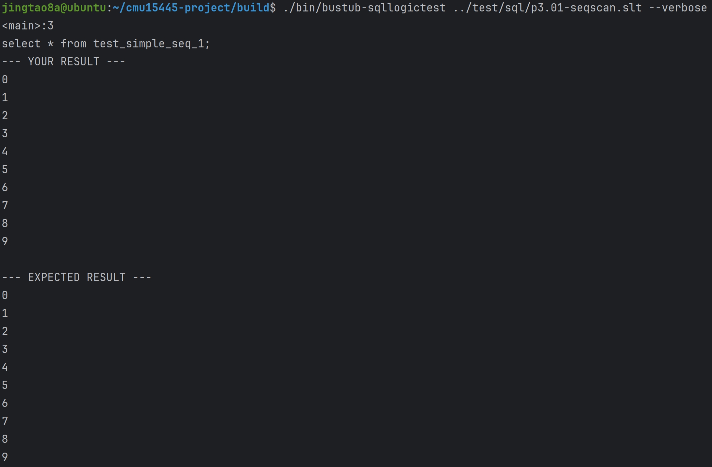
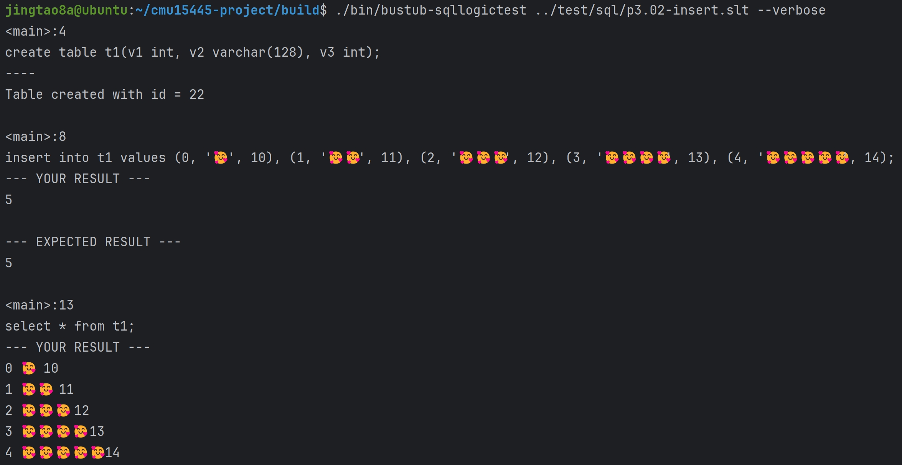
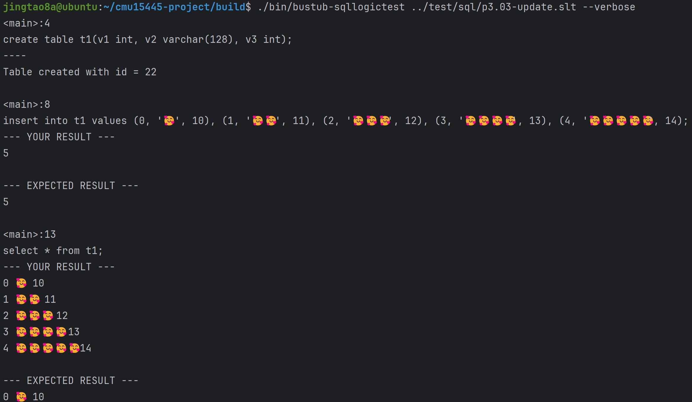
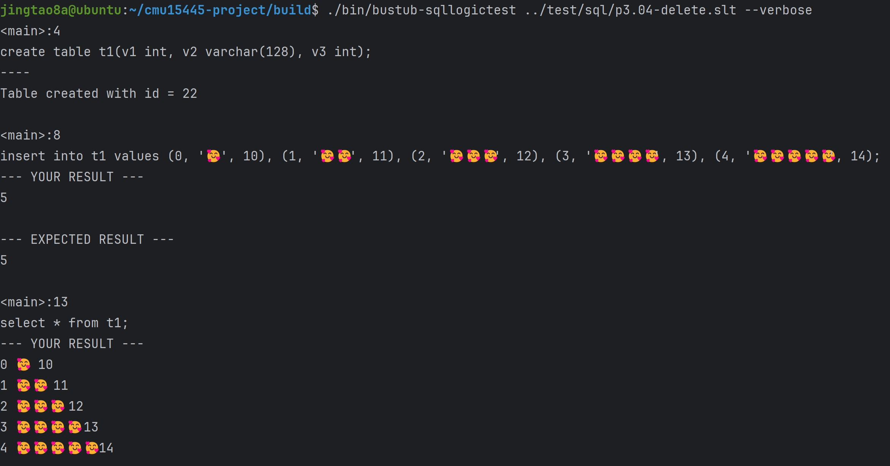
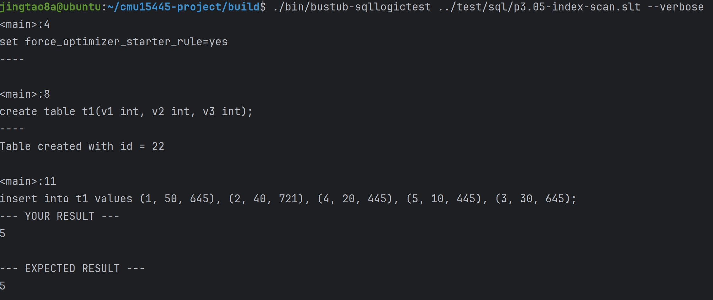
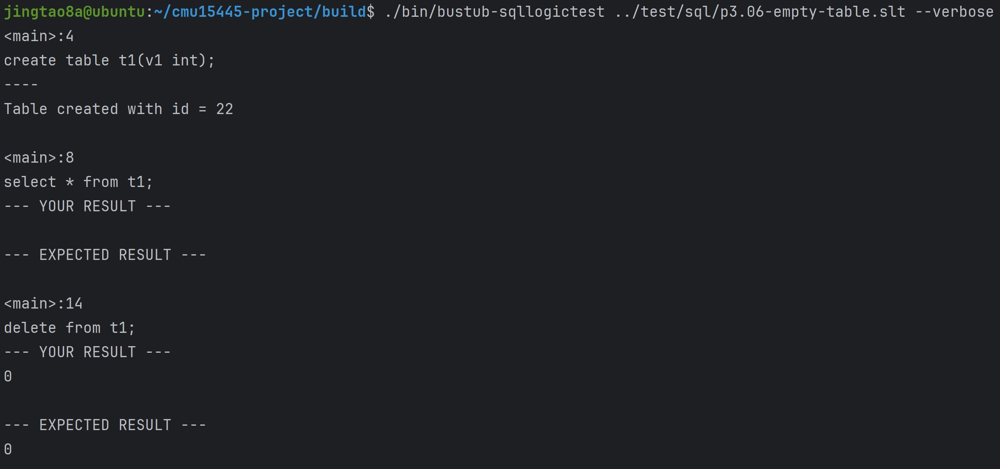

## Task#2 Aggregation & Join Executors

### AggregationExecutor实现
> AggregationExecutor用来支持以下的sql查询，第四条sql语句的DISTINCT相当于GROUP BY<br>
AggregationExecutor不需要处理HAVING语句，planner会让AggregationPlanNode跟着一个FilterPlanNode
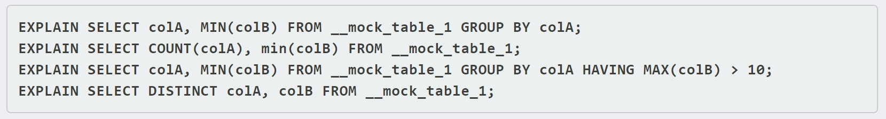

补充完成SimpleAggregationHashTable，其中哈希表的键AggregateKey就是GROUP BY的columns<br>

```cpp
class SimpleAggregationHashTable {
private:
  /** The hash table is just a map from aggregate keys to aggregate values */
  std::unordered_map<AggregateKey, AggregateValue> ht_{};
  /** The aggregate expressions that we have */
  const std::vector<AbstractExpressionRef> &agg_exprs_;
  /** The types of aggregations that we have */
  const std::vector<AggregationType> &agg_types_;
public:
  auto GenerateInitialAggregateValue() -> AggregateValue {
    std::vector<Value> values{};
    for (const auto &agg_type : agg_types_) {
      switch (agg_type) {
        case AggregationType::CountStarAggregate:
          // Count start starts at zero.
          values.emplace_back(ValueFactory::GetIntegerValue(0));
          break;
        case AggregationType::CountAggregate:
        case AggregationType::SumAggregate:
        case AggregationType::MinAggregate:
        case AggregationType::MaxAggregate:
          // Others starts at null.
          values.emplace_back(ValueFactory::GetNullValueByType(TypeId::INTEGER));
          break;
      }
    }
    return {values};
  }

  void CombineAggregateValues(AggregateValue *result, const AggregateValue &input) {
    for (uint32_t i = 0; i < agg_exprs_.size(); i++) {
      switch (agg_types_[i]) {
        case AggregationType::CountStarAggregate://count(*)统计null数量
          result->aggregates_[i] = {INTEGER, result->aggregates_[i].GetAs<int32_t>() + 1};
          break;
        case AggregationType::CountAggregate://count()不统计null数量
          if (input.aggregates_[i].IsNull()) {
            break;
          }
          if (result->aggregates_[i].IsNull()) {
            result->aggregates_[i] = {INTEGER, 1};
          } else {
            result->aggregates_[i] = {INTEGER, result->aggregates_[i].GetAs<int32_t>() + 1};
          }
          break;
        case AggregationType::SumAggregate:
          if (input.aggregates_[i].IsNull()) {
            break;
          }
          if (result->aggregates_[i].IsNull()) {
            result->aggregates_[i] = input.aggregates_[i];
          } else {
            result->aggregates_[i] = result->aggregates_[i].Add((input.aggregates_[i]));
          }
          break;
        case AggregationType::MinAggregate:
          if (input.aggregates_[i].IsNull()) {
            break;
          }
          if (result->aggregates_[i].IsNull()) {
            result->aggregates_[i] = input.aggregates_[i];
          } else {
            result->aggregates_[i] = result->aggregates_[i].Min(input.aggregates_[i]);
          }
          break;
        case AggregationType::MaxAggregate:
          if (input.aggregates_[i].IsNull()) {
            break;
          }
          if (result->aggregates_[i].IsNull()) {
            result->aggregates_[i] = input.aggregates_[i];
          } else {
            result->aggregates_[i] = result->aggregates_[i].Max(input.aggregates_[i]);
          }
          break;
      }
    }
  }

  void InsertCombine(const AggregateKey &agg_key, const AggregateValue &agg_val) {
    if (ht_.count(agg_key) == 0) {
      ht_.insert({agg_key, GenerateInitialAggregateValue()});
    }
    CombineAggregateValues(&ht_[agg_key], agg_val);
  }

  void Insert(const AggregateKey &agg_key, const AggregateValue &agg_val) { ht_.insert({agg_key, agg_val}); }

};

```
***


```cpp
class AggregationExecutor {
  // 添加数据成员
  const AggregationPlanNode *plan_;
  /** The child executor that produces tuples over which the aggregation is computed */
  std::unique_ptr<AbstractExecutor> child_;
  /** Simple aggregation hash table */
  SimpleAggregationHashTable aht_;
  /** Simple aggregation hash table iterator */
  std::unique_ptr<SimpleAggregationHashTable::Iterator> aht_iterator_;
};

void AggregationExecutor::Init() {
  child_->Init();
  Tuple tuple;
  RID rid;
  while (child_->Next(&tuple, &rid)) {//遍历孩子executor中所有的tuple
    //构建AggregateKey 和 AggregateValue 插入哈希表
    AggregateKey key = MakeAggregateKey(&tuple);
    AggregateValue value = MakeAggregateValue(&tuple);
    aht_.InsertCombine(key, value);
  }
  if (aht_.Begin() == aht_.End() && plan_->GetGroupBys().empty()) {  // hash表为空,
    AggregateKey key;
    aht_.Insert(key, aht_.GenerateInitialAggregateValue());
  }
  aht_iterator_ = std::make_unique<SimpleAggregationHashTable::Iterator>(aht_.Begin());
}

auto AggregationExecutor::Next(Tuple *tuple, RID *rid) -> bool {
  if ((*aht_iterator_) == aht_.End()) {
    return false;
  }
  auto key = aht_iterator_->Key();
  auto value = aht_iterator_->Val();
  ++(*aht_iterator_);//迭代器++
  key.group_bys_.insert(key.group_bys_.end(), value.aggregates_.begin(), value.aggregates_.end());
  *tuple = {key.group_bys_, &GetOutputSchema()};//key和value合并后由入参tuple返回
  return true;
}
```


### NestedLoopJoinExecutor实现
NestedLoopJoinExecutor将支持inner join和left join，使用simple nested loop join算法
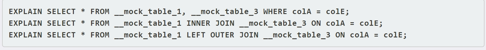

#### NestedLoopJoin是流水线破坏者吗？
BusTub采用火山模型(iterator processing
 model)执行算子。但是某些算子直到子算子提交所有元组的计算结果，才会解除阻塞。如Join、SubQueries、Ordering等，此类操作就被称为Pipeline Breaker。在Task2中，Aggregation、HashJoin都备注了是Pipeline Breaker，但NestedLoopJoin并没有这么说明，如果把它当做Pipeline Breaker，则无法通过测试，Spring2023要求NestedLoopJoin左子节点每次调用一次Next()方法,右子节点都需要Init()一次，因此并非Pipeline Breaker。这也意味着NestedLoopJoin的性能非常糟糕。


 ```cpp
class NestedLoopJoinExecutor { 
  const NestedLoopJoinPlanNode *plan_;
  std::unique_ptr<AbstractExecutor> left_executor_;//左孩子
  std::unique_ptr<AbstractExecutor> right_executor_;//右孩子
  std::vector<Tuple> right_tuples_;
  int index_;
  Tuple left_tuple_;
  bool is_match_;//表示当前left_tuple_是否有匹配项
};

void NestedLoopJoinExecutor::Init() {
  left_executor_->Init();
  right_executor_->Init();
  Tuple right_tuple;
  RID right_rid;
  //将右孩子的所有Tuple遍历出来放在right_tuples中
  while (right_executor_->Next(&right_tuple, &right_rid)) {
    right_tuples_.emplace_back(right_tuple);
  }
  index_ = 0;
  is_match_ = false;
}

auto NestedLoopJoinExecutor::Next(Tuple *tuple, RID *rid) -> bool {
  RID left_rid;
  if (index_ != 0) {
    // 上次右侧循环还未结束
    if (NestedLoop(tuple, rid)) {
      return true;
    }
  }
  //获取左孩子的一个tuple存储在left_tuple_中
  while (left_executor_->Next(&left_tuple_, &left_rid)) {
    right_executor_->Init();  // no use 单纯为了通过测试
    if (NestedLoop(tuple, rid)) {
      return true;
    }
  }
  return false;
}

auto NestedLoopJoinExecutor::NestedLoop(Tuple *tuple, RID *rid) -> bool {
  while (index_ < static_cast<int>(right_tuples_.size())) {
    if (plan_->predicate_) {
      auto res = plan_->predicate_->EvaluateJoin(&left_tuple_, left_executor_->GetOutputSchema(), &right_tuples_[index_], right_executor_->GetOutputSchema());
      if (!(!res.IsNull() && res.GetAs<bool>())) {  // 不符合条件
        index_++;
        continue;  // 过滤
      }
    }
    // 符合条件
    MergeTuple(tuple);
    index_ = (index_ + 1) % right_tuples_.size();
    is_match_ = (index_ != 0);
    return true;
  }

  index_ = 0;
  if (!is_match_ && plan_->GetJoinType() == JoinType::LEFT) {
    // left join
    std::vector<Value> values;
    values.reserve(GetOutputSchema().GetColumnCount());
    for (auto i = 0; i < static_cast<int>(left_executor_->GetOutputSchema().GetColumnCount()); ++i) {
      values.emplace_back(left_tuple_.GetValue(&left_executor_->GetOutputSchema(), i));
    }
    for (auto i = 0; i < static_cast<int>(right_executor_->GetOutputSchema().GetColumnCount()); ++i) {
      values.emplace_back(ValueFactory::GetNullValueByType(right_executor_->GetOutputSchema().GetColumn(i).GetType()));
    }
    *tuple = {values, &GetOutputSchema()};
    return true;
  }

  is_match_ = false;
  return false;
}

void NestedLoopJoinExecutor::MergeTuple(Tuple *tuple) {
  // inner join
  std::vector<Value> values;
  values.reserve(GetOutputSchema().GetColumnCount());
  for (auto i = 0; i < static_cast<int>(left_executor_->GetOutputSchema().GetColumnCount()); ++i) {
    values.emplace_back(left_tuple_.GetValue(&left_executor_->GetOutputSchema(), i));
  }
  for (auto i = 0; i < static_cast<int>(right_executor_->GetOutputSchema().GetColumnCount()); ++i) {
    values.emplace_back(right_tuples_[index_].GetValue(&right_executor_->GetOutputSchema(), i));
  }
  *tuple = {values, &GetOutputSchema()};
}

 ```
到这里为止，通过SQLLogicTests #7 to #12
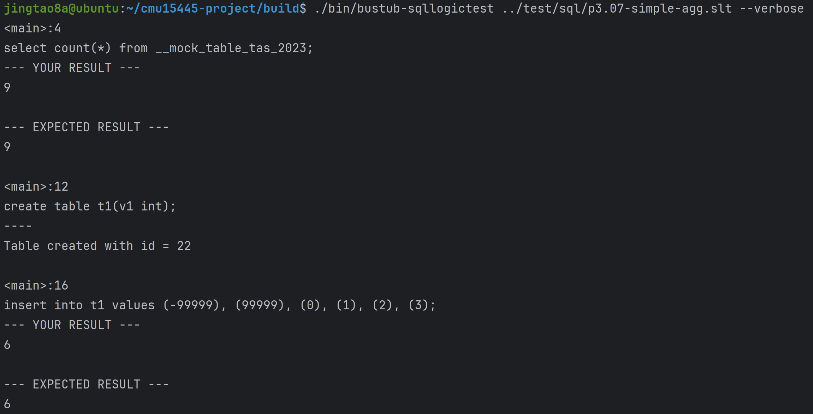
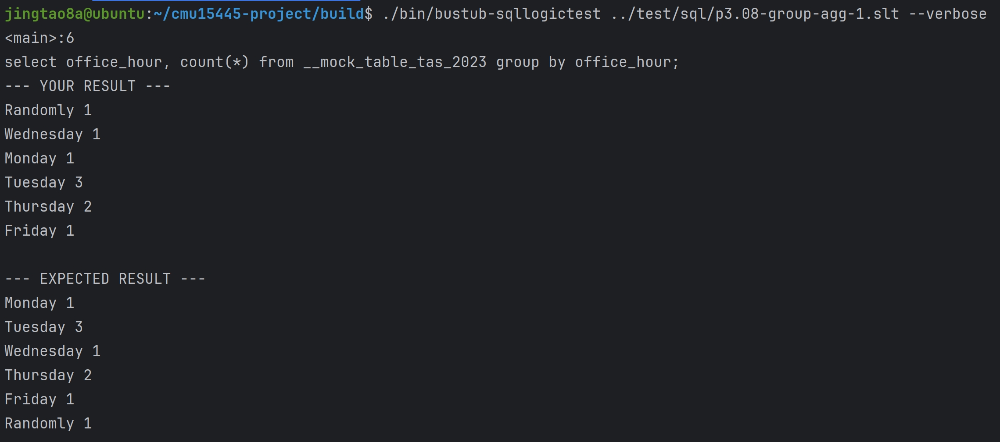
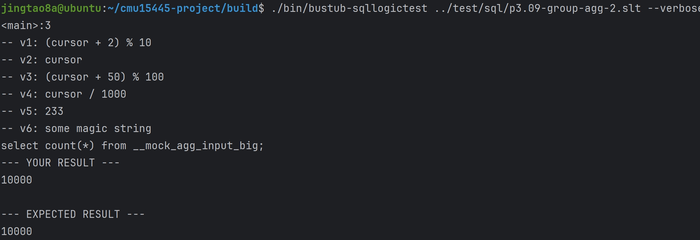
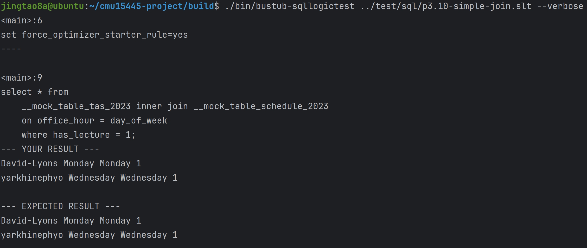
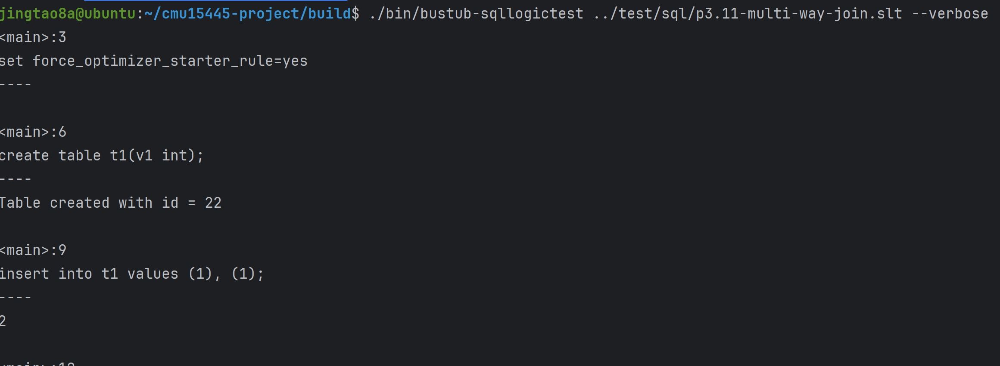
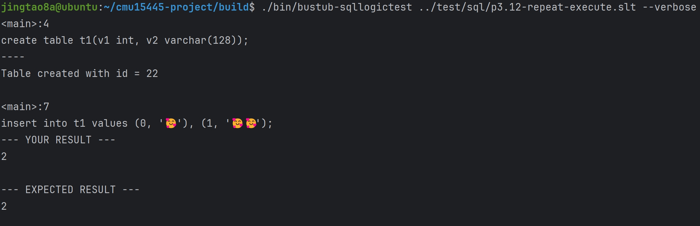


 ### HashJoinExecutor实现
 你将要为HashJoinExecutor实现inner join和left join，使用hash join算法
 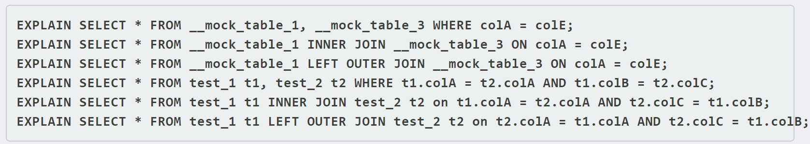
 和NestedLoopJoin相同，HashJoin要处理inner join和left join两种情况，而这就会影响HashJoin建表的选择———对于Left join，需要在右表不存在对应匹配时，返回将右表字段用NULL填充的记录。因此对Left Join，在创建哈希表时应该选择右表。

实现思路：<br>
先遍历右表的所有tuple，收集右表的HashJoinKey，加入哈希表(键值对为HashJoinKey-tuple)<br>
然后遍历左表的所有tuple，收集左表的HashJoinKey，在哈希表中查找是否有匹配的HashJoinKey，如果匹配成功，拼接<br>
如果匹配失败，并且是left join，左表的tuple拼接null<br>
拼接好的结果保存在result_中，由index_下标遍历<br>


```cpp
 class HashJoinExecutor {
  const HashJoinPlanNode *plan_;
  std::unique_ptr<AbstractExecutor> left_child_;
  std::unique_ptr<AbstractExecutor> right_child_;
  std::unordered_map<HashJoinKey, std::vector<Tuple>> map_;
  std::vector<Tuple> result_;
  int index_;
 };

 void HashJoinExecutor::Init() {
  left_child_->Init();
  right_child_->Init();
  Tuple right_tuple;
  RID right_rid;
  while (right_child_->Next(&right_tuple, &right_rid)) {
    HashJoinKey key;
    for (auto &expression : plan_->RightJoinKeyExpressions()) {
      key.column_values_.emplace_back(expression->Evaluate(&right_tuple, right_child_->GetOutputSchema()));
    }
    // 加入哈希表
    if (map_.count(key) != 0) {
      map_[key].emplace_back(right_tuple);
    } else {
      map_[key] = {right_tuple};
    }
  }
  // 遍历左侧查询,得到查询结果
  Tuple left_tuple;
  RID left_rid;
  while (left_child_->Next(&left_tuple, &left_rid)) {
    HashJoinKey key;
    for (auto &expression : plan_->LeftJoinKeyExpressions()) {
      key.column_values_.emplace_back(expression->Evaluate(&left_tuple, left_child_->GetOutputSchema()));
    }
    if (map_.count(key) != 0) {  // 匹配成功
      for (auto &t : map_[key]) {
        std::vector<Value> values;
        values.reserve(GetOutputSchema().GetColumnCount());
        for (auto i = 0; i < static_cast<int>(left_child_->GetOutputSchema().GetColumnCount()); ++i) {
          values.emplace_back(left_tuple.GetValue(&left_child_->GetOutputSchema(), i));
        }
        for (auto i = 0; i < static_cast<int>(right_child_->GetOutputSchema().GetColumnCount()); ++i) {
          values.emplace_back(t.GetValue(&right_child_->GetOutputSchema(), i));
        }
        result_.emplace_back(values, &GetOutputSchema());
      }
    } else if (plan_->GetJoinType() == JoinType::LEFT) {  // 匹配失败,但是为LEFT JOIN
      std::vector<Value> values;
      values.reserve(GetOutputSchema().GetColumnCount());
      for (auto i = 0; i < static_cast<int>(left_child_->GetOutputSchema().GetColumnCount()); ++i) {
        values.emplace_back(left_tuple.GetValue(&left_child_->GetOutputSchema(), i));
      }
      for (auto i = 0; i < static_cast<int>(right_child_->GetOutputSchema().GetColumnCount()); ++i) {
        values.emplace_back(ValueFactory::GetNullValueByType(right_child_->GetOutputSchema().GetColumn(i).GetType()));
      }
      result_.emplace_back(values, &GetOutputSchema());
    }
  }

  index_ = 0;
}

auto HashJoinExecutor::Next(Tuple *tuple, RID *rid) -> bool {
  if (index_ >= static_cast<int>(result_.size())) {
    return false;
  }
  *tuple = result_[index_];
  index_++;
  return true;
}
 ```

### Optimizing NestedLoopJoin to HashJoin
具体来说，当连接谓词是两列之间等条件的合取时，可以使用散列连接算法。就本项目而言，处理单个等值条件以及通过 AND 连接的两个等值条件将获得满分<br>
代码实现
```cpp
auto Optimizer::OptimizeNLJAsHashJoin(const AbstractPlanNodeRef &plan) -> AbstractPlanNodeRef {
  // TODO(student): implement NestedLoopJoin -> HashJoin optimizer rule
  // Note for 2023 Spring: You should at least support join keys of the form:
  // 1. <column expr> = <column expr>
  // 2. <column expr> = <column expr> AND <column expr> = <column expr>
  std::vector<AbstractPlanNodeRef> children;
  for (auto &child : plan->GetChildren()) {//递归优化
    children.emplace_back(OptimizeNLJAsHashJoin(child));
  }
  auto optimized_plan = plan->CloneWithChildren(std::move(children));

  if (optimized_plan->GetType() == PlanType::NestedLoopJoin) {
    const auto nlj_plan = dynamic_cast<const NestedLoopJoinPlanNode &>(*optimized_plan);
    BUSTUB_ENSURE(nlj_plan.children_.size() == 2, "NLJ should have exactly 2 children.");
    if (auto *expr = dynamic_cast<ComparisonExpression *>(nlj_plan.Predicate().get()); expr != nullptr) {
      if (expr->comp_type_ == ComparisonType::Equal) { // 如果表达式的Type为 ComparisonType::Equal
        if (auto *left_expr = dynamic_cast<ColumnValueExpression *>(expr->children_[0].get()); left_expr != nullptr) {
          if (auto *right_expr = dynamic_cast<ColumnValueExpression *>(expr->children_[1].get());
              right_expr != nullptr) {
            std::vector<AbstractExpressionRef> left_key_expressions;
            std::vector<AbstractExpressionRef> right_key_expressions;
            if (left_expr->GetTupleIdx() == 0 && right_expr->GetTupleIdx() == 1) {
              left_key_expressions.emplace_back(
                  std::make_shared<ColumnValueExpression>(0, left_expr->GetColIdx(), left_expr->GetReturnType()));
              right_key_expressions.emplace_back(
                  std::make_shared<ColumnValueExpression>(1, right_expr->GetColIdx(), right_expr->GetReturnType()));
            } else if (left_expr->GetTupleIdx() == 1 && right_expr->GetTupleIdx() == 0) {
              left_key_expressions.emplace_back(
                  std::make_shared<ColumnValueExpression>(0, right_expr->GetColIdx(), right_expr->GetReturnType()));
              right_key_expressions.emplace_back(
                  std::make_shared<ColumnValueExpression>(1, left_expr->GetColIdx(), left_expr->GetReturnType()));
            }
            return std::make_shared<HashJoinPlanNode>(nlj_plan.output_schema_, nlj_plan.GetLeftPlan(),
                                                      nlj_plan.GetRightPlan(), std::move(left_key_expressions),
                                                      std::move(right_key_expressions), nlj_plan.GetJoinType());
          }
        }
      }
    }
    if (auto *expr = dynamic_cast<LogicExpression *>(nlj_plan.Predicate().get()); expr != nullptr) {
      if (expr->logic_type_ == LogicType::And) {//如果表达式的 Type为 LogicType::And
        BUSTUB_ASSERT(expr->GetChildren().size() == 2, "LogicExpression has two children");
        if (auto *expr1 = dynamic_cast<ComparisonExpression *>(expr->children_[0].get()); expr1 != nullptr) {
          if (auto *expr2 = dynamic_cast<ComparisonExpression *>(expr->children_[1].get()); expr2 != nullptr) {
            if (expr1->comp_type_ == ComparisonType::Equal && expr2->comp_type_ == ComparisonType::Equal) { // 两个子表达式的Type均为 ComparisonType::Equal
              std::vector<AbstractExpressionRef> left_key_expressions;
              std::vector<AbstractExpressionRef> right_key_expressions;
              if (auto *left_expr = dynamic_cast<ColumnValueExpression *>(expr1->children_[0].get());
                  left_expr != nullptr) {
                if (auto *right_expr = dynamic_cast<ColumnValueExpression *>(expr1->children_[1].get());
                    right_expr != nullptr) {
                  if (left_expr->GetTupleIdx() == 0 && right_expr->GetTupleIdx() == 1) {
                    left_key_expressions.emplace_back(
                        std::make_shared<ColumnValueExpression>(0, left_expr->GetColIdx(), left_expr->GetReturnType()));
                    right_key_expressions.emplace_back(std::make_shared<ColumnValueExpression>(
                        1, right_expr->GetColIdx(), right_expr->GetReturnType()));
                  } else if (left_expr->GetTupleIdx() == 1 && right_expr->GetTupleIdx() == 0) {
                    left_key_expressions.emplace_back(std::make_shared<ColumnValueExpression>(
                        0, right_expr->GetColIdx(), right_expr->GetReturnType()));
                    right_key_expressions.emplace_back(
                        std::make_shared<ColumnValueExpression>(1, left_expr->GetColIdx(), left_expr->GetReturnType()));
                  }
                }
              }
              if (auto *left_expr = dynamic_cast<ColumnValueExpression *>(expr2->children_[0].get());
                  left_expr != nullptr) {
                if (auto *right_expr = dynamic_cast<ColumnValueExpression *>(expr2->children_[1].get());
                    right_expr != nullptr) {
                  if (left_expr->GetTupleIdx() == 0 && right_expr->GetTupleIdx() == 1) {
                    left_key_expressions.emplace_back(
                        std::make_shared<ColumnValueExpression>(0, left_expr->GetColIdx(), left_expr->GetReturnType()));
                    right_key_expressions.emplace_back(std::make_shared<ColumnValueExpression>(
                        1, right_expr->GetColIdx(), right_expr->GetReturnType()));
                  } else if (left_expr->GetTupleIdx() == 1 && right_expr->GetTupleIdx() == 0) {
                    left_key_expressions.emplace_back(std::make_shared<ColumnValueExpression>(
                        0, right_expr->GetColIdx(), right_expr->GetReturnType()));
                    right_key_expressions.emplace_back(
                        std::make_shared<ColumnValueExpression>(1, left_expr->GetColIdx(), left_expr->GetReturnType()));
                  }
                }
              }
              return std::make_shared<HashJoinPlanNode>(nlj_plan.output_schema_, nlj_plan.GetLeftPlan(),
                                                        nlj_plan.GetRightPlan(), std::move(left_key_expressions),
                                                        std::move(right_key_expressions), nlj_plan.GetJoinType());
            }
          }
        }
      }
    }
  }

  return optimized_plan;
}
```
到这里为止，通过SQLLogicTests #14 to #15
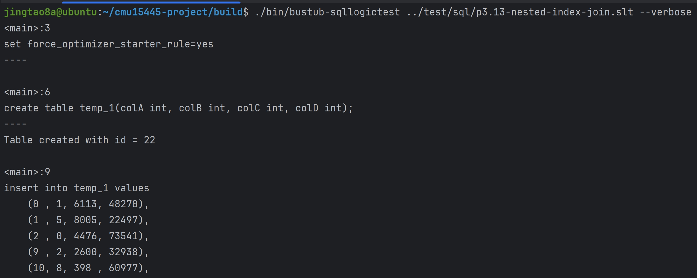
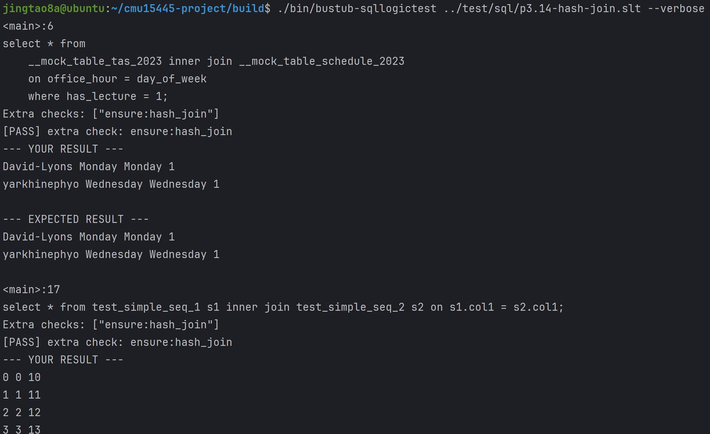
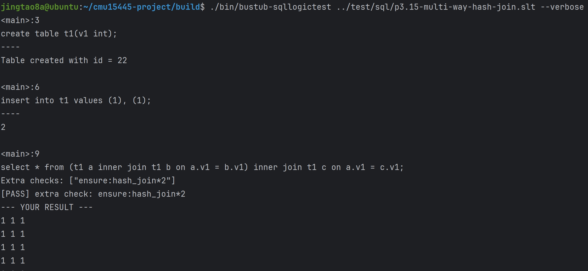

## Task#3 Sort + Limit Executors and Top-N Optimization
### SortExecutor实现：
如果查询的ORDER BY属性与索引的key不匹配，BusTub将为查询生成一个SortPlanNode<br>
如果查询不包含排序方向(即ASC、DESC)，则排序模式将为默认(即ASC)

```cpp
class SortExecutor {
  //添加数据成员
  const SortPlanNode *plan_;
  std::unique_ptr<AbstractExecutor> child_executor_;
  std::vector<Tuple> result_;
  int index_;
};

void SortExecutor::Init() {
  Tuple tuple;
  RID rid;
  child_executor_->Init();
  while (child_executor_->Next(&tuple, &rid)) {//遍历孩子executor的所有tuple放入result_
    result_.emplace_back(tuple);
  }
  std::sort(result_.begin(), result_.end(),
            [this](const Tuple &left, const Tuple &right) -> bool { return this->TupleComparator(left, right); });//对result_进行排序
  index_ = 0;
}

auto SortExecutor::Next(Tuple *tuple, RID *rid) -> bool {
  if (index_ >= static_cast<int>(result_.size())) {
    return false;
  }
  *tuple = result_[index_];
  index_++;
  return true;
}

//自定义排序函数
auto SortExecutor::TupleComparator(const Tuple &left, const Tuple &right) -> bool {
  auto &order_by = plan_->GetOrderBy();
  for (auto &p : order_by) {
    auto order = p.first;
    auto &exp = p.second;
    auto lvalue = exp->Evaluate(&left, child_executor_->GetOutputSchema());
    auto rvalue = exp->Evaluate(&right, child_executor_->GetOutputSchema());
    if (order == OrderByType::DESC) {
      if (lvalue.CompareGreaterThan(rvalue) == CmpBool::CmpTrue) {
        return true;
      }
      if (lvalue.CompareLessThan(rvalue) == CmpBool::CmpTrue) {
        return false;
      }
    } else {
      if (lvalue.CompareLessThan(rvalue) == CmpBool::CmpTrue) {
        return true;
      }
      if (lvalue.CompareGreaterThan(rvalue) == CmpBool::CmpTrue) {
        return false;
      }
    }
  }
  UNREACHABLE("duplicate key is not allowed");
}
```

### LimitExecutor实现:
LimitExectutor限制其子executor的输出tuple数量。如果其子executor生成的元组数量小于LimitExecutor中指定的限制，则该executor无效并生成它接受到的所有tuple

```cpp
class LimitExecutor {
  //添加数据成员
  const LimitPlanNode *plan_;
  /** The child executor from which tuples are obtained */
  std::unique_ptr<AbstractExecutor> child_executor_;
  size_t num_;
};

void LimitExecutor::Init() {
  child_executor_->Init();
  num_ = 0;
}

auto LimitExecutor::Next(Tuple *tuple, RID *rid) -> bool {
  if (num_ >= plan_->GetLimit()) {
    return false;
  }
  if (child_executor_->Next(tuple, rid)) {
    num_++;
    return true;
  }
  return false;
}
```

### Top-N Optimization Rule
用一个优先队列维护top n 条tuple
```cpp
class TopNExecutor {
  //数据成员
  const TopNPlanNode *plan_;
  /** The child executor from which tuples are obtained */
  std::unique_ptr<AbstractExecutor> child_executor_;
  std::priority_queue<HeapKeyType> heap_;//一个优先队列
  std::deque<Tuple> result_;
};

void TopNExecutor::Init() {
  child_executor_->Init();
  Tuple tuple;
  RID rid;
  while (child_executor_->Next(&tuple, &rid)) {//child_executor_遍历所有的tuple
    HeapKeyType key(tuple, plan_->GetOrderBy(), child_executor_.get());
    heap_.emplace(tuple, plan_->GetOrderBy(), child_executor_.get());//加入优先队列中
    if (heap_.size() > plan_->GetN()) {//保证优先队列中的size不超过N
      heap_.pop();
    }
  }

  while (!heap_.empty()) {//将heap中的tuple_都放入result_
    result_.emplace_front(heap_.top().tuple_);
    heap_.pop();
  }
}

auto TopNExecutor::Next(Tuple *tuple, RID *rid) -> bool {
  if (GetNumInHeap() != 0) {
    *tuple = result_.front();
    result_.pop_front();
    return true;
  }
  return false;
}

auto TopNExecutor::GetNumInHeap() -> size_t { return result_.size(); }
```

到这里为止，通过SQLLogicTests #16 to #19
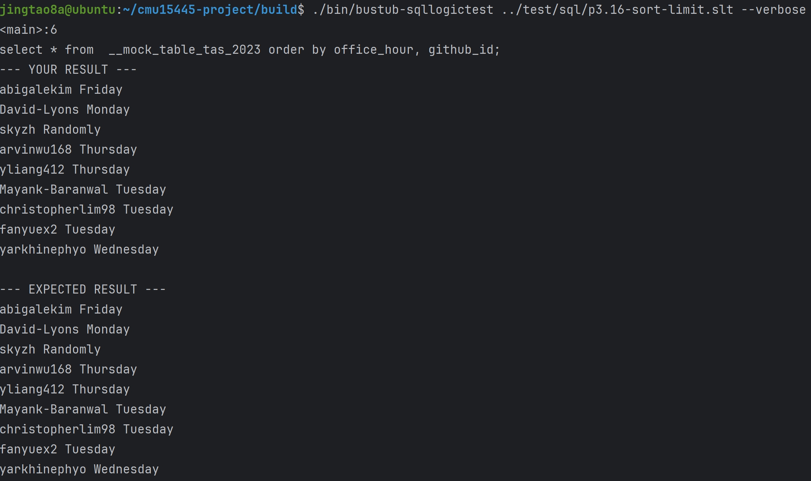
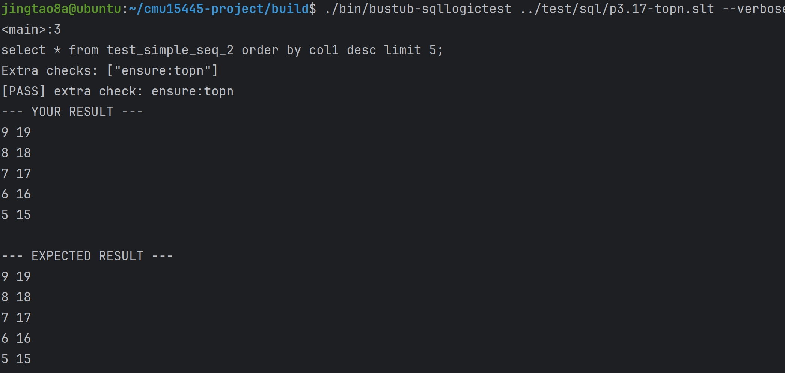
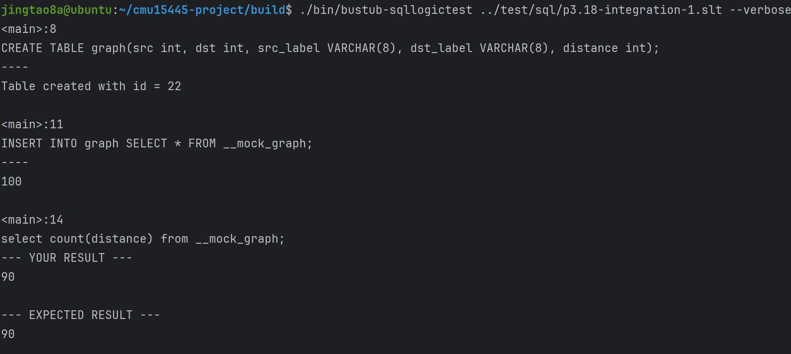
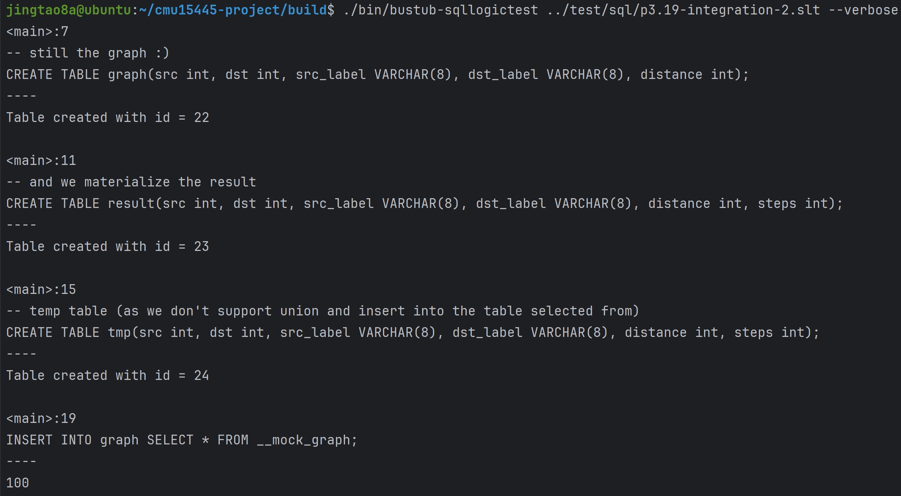


通过线上测试:
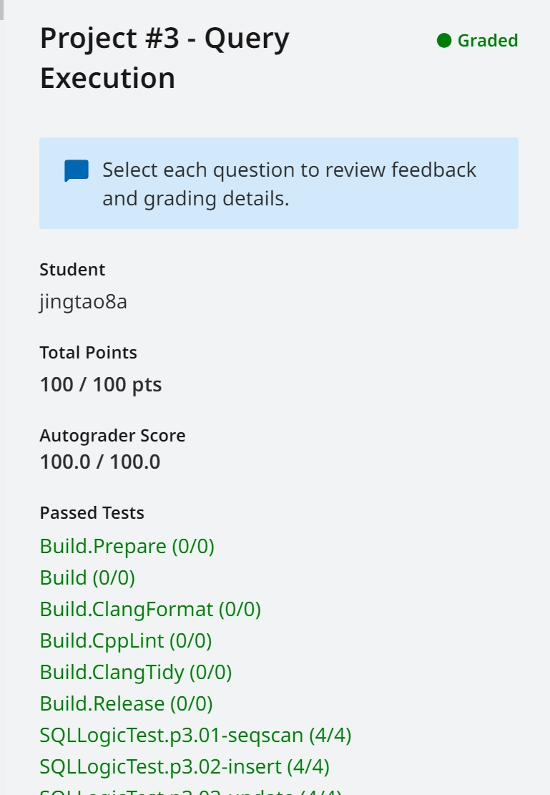