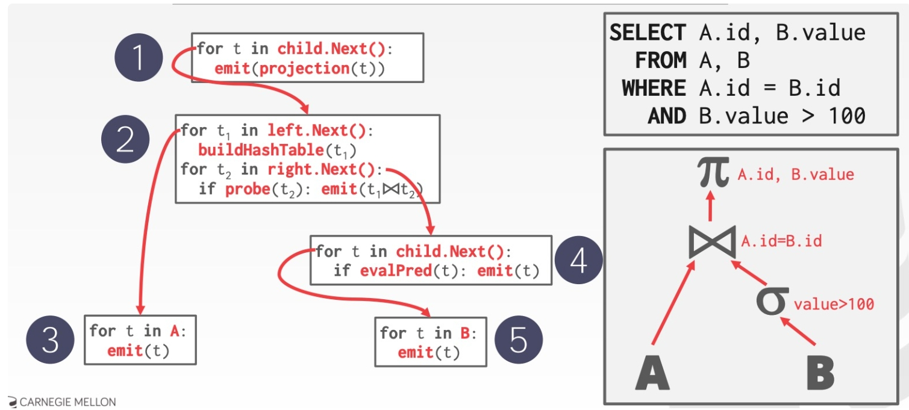
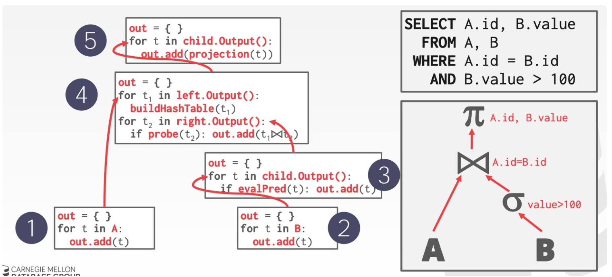
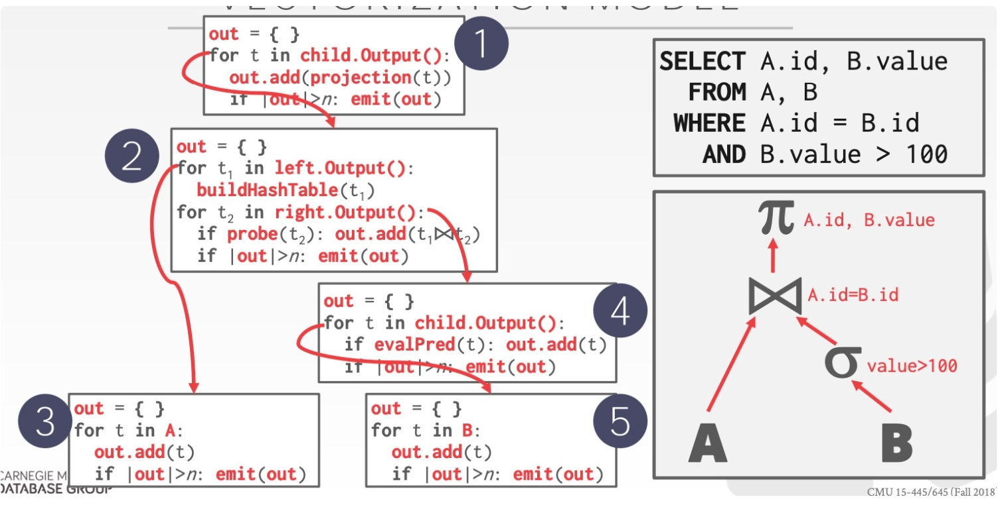
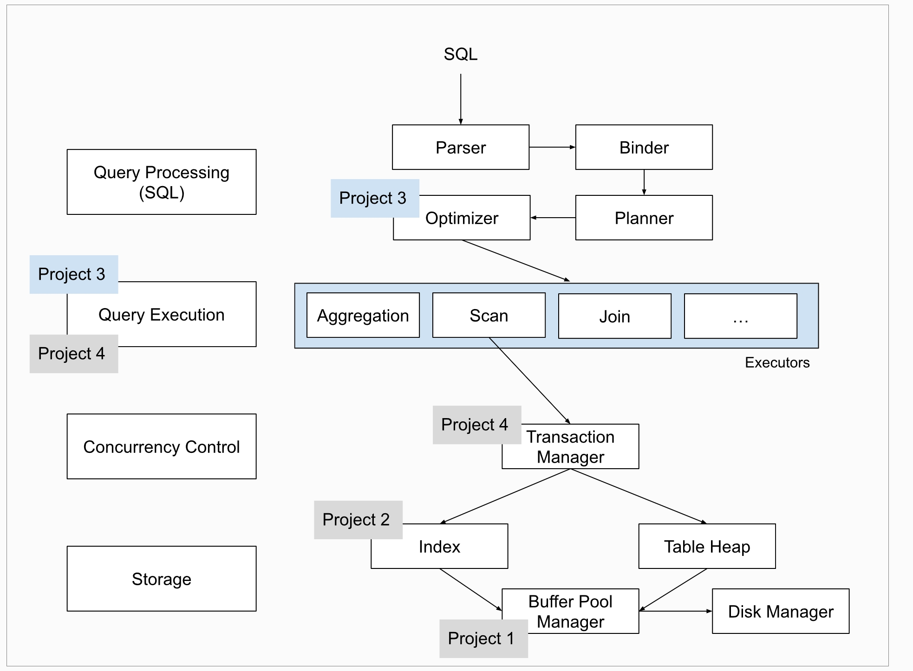
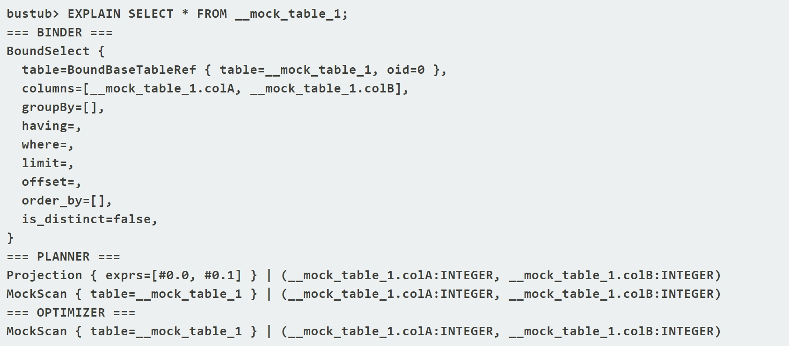
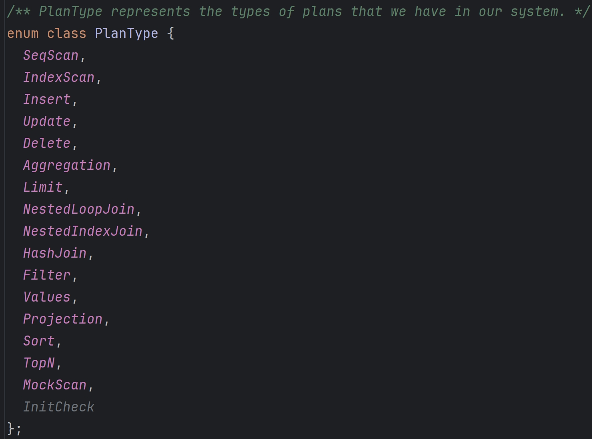

## Query Processing Model

OLAP与OLTP数据库
- OLAP数据库架构将数据读取优先于数据写入操作。可以快速地对大量数据执行复杂的查询
- OLTP数据库架构将数据写入优先于数据读取操作。它针对写入密集型工作负载进行了优化

example:<br>
以一家大型零售公司为例。该公司有一个庞大的数据库，用于跟踪销售、库存、客户数据等
- 使用OLTP数据库实时处理交易、更新库存水平和管理客户账户
- 使用OLAP数据库来分析有关销售趋势、库存水平、客户人口统计等

***
DBMS的Processing Model定义了系统如何执行一个query plan,目前主要有三种模型
- Iterator Model
- Materialization Model
- Vectorized/Batch Model
### Iterator Model
query plan 中的每步 operator 都实现一个 next 函数，每次调用时，operator 返回一个 tuple 或者 null，后者表示数据已经遍历完毕。operator 本身实现一个循环，每次调用其 child operators 的 next 函数，从它们那边获取下一条数据供自己操作，这样整个 query plan 就被从上至下地串联起来，它也称为 Volcano/Pipeline Model：

Iterator 几乎被用在每个 DBMS 中，包括 sqlite、MySQL、PostgreSQL 等等，其它需要注意的是:
- 有些 operators 会等待 children 返回所有 tuples 后才执行，如 Joins, Subqueries 和 Order By
- Output Control 在 Iterator Model 中比较容易，如 Limit，只按需调用 next 即可

### Materialization Model
每个 operator 处理完所有输入后，将所有结果一次性输出，DBMS 会将一些参数传递到 operator 中防止处理过多的数据，这是一种从下至上的思路，示意如下：

materialization model：
- 更适合 OLTP 场景，因为后者通常指需要处理少量的 tuples，这样能减少不必要的执行、调度成本
- 不太适合会产生大量中间结果的 OLAP 查询
### Vectorization Model
Vectorization Model 是 Iterator 与 Materialization Model 折衷的一种模型：
- 每个 operator 实现一个 next 函数，但每次 next 调用返回一批 tuples，而不是单个 tuple
- operator 内部的循环每次也是一批一批 tuples 地处理
- batch 的大小可以根据需要改变（hardware、query properties)<br>


vectorization model 是 OLAP 查询的理想模型:
- 极大地减少每个 operator 的调用次数
- 允许 operators 使用 vectorized instructions (SIMD) 来批量处理 tuples

## BACKGROUND：QUERY PROCESSING
BusTub架构如下


### note:
- BusTub只支持SQL的一个小子集，可以通过tests/sql中的SQLLogicTest文件来查看它所支持的SQL语句
- 如果你使用Clion来运行Bustub shell，添加--disable-tty参数
- SQL语句使用;结尾
- BusTub只支持INT和VARCHAR(n)类型，字符串使用单引号
- Bustub使用Iterator Porcessing Model

### Inspecting SQL query plans
BusTub支持EXPLAIN来打印SQL查询计划

EXPLAIN会展示query processing这一层的转换过程 Parser -> Binder -> Planner -> Optimizer<br>
Parser解析SQL语句生成Binder AST语法树，接着生成query plan，然后由Optimizer优化query plan生成executor树


## Task#1 Access Method Executors
我们并不需要关心query plan是如何创建的；但有必要理解query plan的组成结构:这是棵树，每个plan节点都对应具体的算子，Bustub采用iterator procesing model，也就是Top-to-Bottom的火山模型，因此query plan的执行就是从根节点开始，将plan节点转换为对应的算子

Plan节点的类型如下

还是有必要阅读一些相关代码<br>

表Table的元信息
> 其中TableHeap代表磁盘上的一张表，是一个doubly-linked of pages

```cpp
struct TableInfo {
  /** The table schema */
  Schema schema_;
  /** The table name */
  const std::string name_;
  /** An owning pointer to the table heap */
  std::unique_ptr<TableHeap> table_;
  /** The table OID */
  const table_oid_t oid_;
};

class TableHeap {
  page_id_t first_page_id_{INVALID_PAGE_ID};
  page_id_t last_page_id_{INVALID_PAGE_ID};
};
```

索引Index的元信息
```cpp
struct IndexInfo {
  /** The schema for the index key */
  Schema key_schema_;
  /** The name of the index */
  std::string name_;
  /** An owning pointer to the index */
  std::unique_ptr<Index> index_;
  /** The unique OID for the index */
  index_oid_t index_oid_;
  /** The name of the table on which the index is created */
  std::string table_name_;
  /** The size of the index key, in bytes */
  const size_t key_size_;
};
```

catalog<br>
> 记录所有TableInfo和IndexInfo
```cpp 
class Catalog {
  std::unordered_map<table_oid_t, std::unique_ptr<TableInfo>> tables_;
  /** Map table name -> table identifiers. */
  std::unordered_map<std::string, table_oid_t> table_names_;
  
  std::unordered_map<index_oid_t, std::unique_ptr<IndexInfo>> indexes_;

  /** Map table name -> index names -> index identifiers. */
  std::unordered_map<std::string, std::unordered_map<std::string, index_oid_t>> index_names_;
};
```
### SeqScanExecutor实现
```cpp
添加数据成员
Class SeqScanExecutor {
  const SeqScanPlanNode *plan_;
  TableInfo *table_info_;
  std::unique_ptr<TableIterator> iterator_;
};

void SeqScanExecutor::Init() {
  auto catalog = exec_ctx_->GetCatalog();
  table_info_ = catalog->GetTable(plan_->table_oid_);//获取TableInfo
  iterator_ = std::make_unique<TableIterator>(table_info_->table_->MakeIterator());//获取对应Table的TableIterator
}

auto SeqScanExecutor::Next(Tuple *tuple, RID *rid) -> bool {
  std::pair<TupleMeta, Tuple> pair;
  while (!iterator_->IsEnd()) {//如果未遍历完Table
    pair = iterator_->GetTuple();//获取一个TupleMeta-Tuple pair
    if (pair.first.is_deleted_) {//如果该TupleMeta标记Tuple为已删除
      ++(*iterator_);//跳过
      continue;
    }
    if (plan_->filter_predicate_) {//如果该算子对应的SeqScanPlanNode含有filter_predicate表达式
      auto res = plan_->filter_predicate_->Evaluate(&pair.second, table_info_->schema_);
      if (!(!res.IsNull() && res.GetAs<bool>())) {//如果该Tuple不满足该filter_predicate表达式
        ++(*iterator_);//跳过
        continue;
      }
    }
    ++(*iterator_);//迭代器前进一步
    *tuple = std::move(pair.second);
    *rid = tuple->GetRid();
    return true;
  }
  return false;
}

```
