## Concurrency Control Theory
### formal Definitions
Database: A fixed set of named data objects (e.g., A, B, C, ...)
Transaction: A sequence of read and write operations (e.g., R(A), W(B), ...)

transaction的正确性标准ACID：
- Atomicity: 原子性 "all or nothing"
- Consistency: 一致性 "it looks correct to me"
- Isolation: 隔离性 "as if alone"
- Durability: 持久性 "survive failures"

### Conflicting Operations
多个transaction并发执行时会发生冲突:
- 读写冲突(R-W)
- 写读冲突(W-R)
- 写写冲突(W-W)

读写冲突造成的问题：<br>
- 不可重复读(在一个事务内多次读取同一个数据，如果出现前后两次读到的数据不一样的情况，就意味着发生了[不可重复读]的现象)
- 幻读：在一个事务内多次查询某个符合查询条件的[记录数量]，出现前后两次查询到的记录数量不一样

写读冲突造成的问题：<br>
- 脏读(一个事务[读到]了另一个[未提交事务修改过的数据],就意味着发生了[脏读]现象)

写写冲突造成的问题: <br>
- 丢失修改

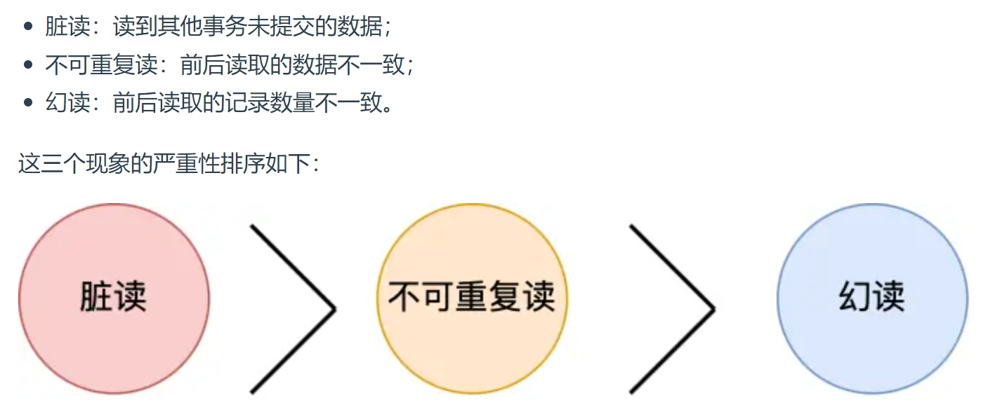
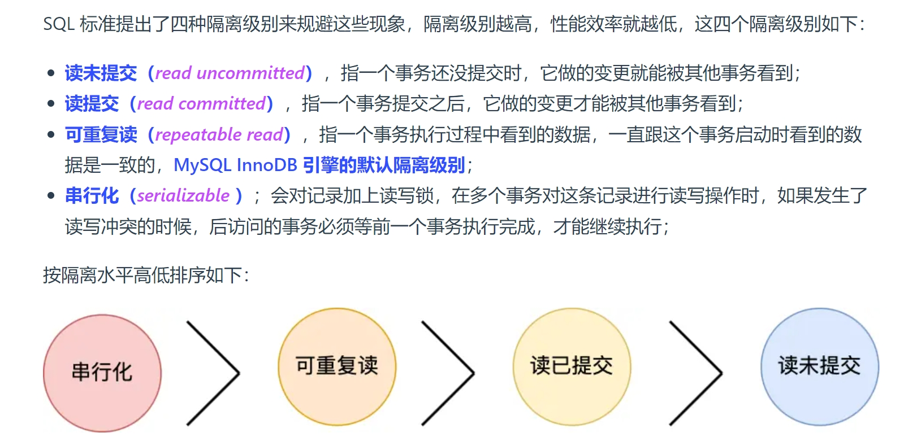
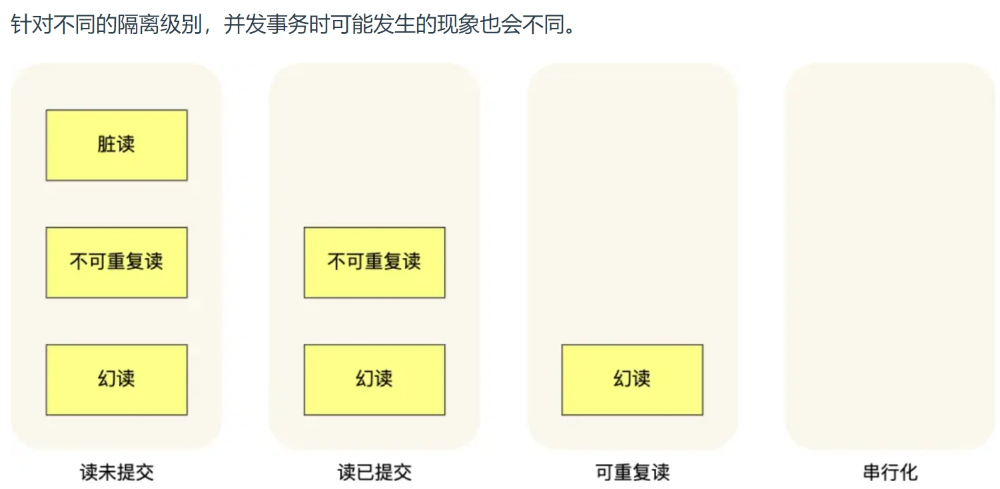

> MySQL InnoDB引擎的默认隔离级别虽然是[可重复读]，但是它很大程度上避免幻读现象，并没有解决幻读 [参考文章](https://xiaolincoding.com/mysql/transaction/phantom.html)<br>
***
> 解决方案有两种:
> - 普通select语句(快照读),通过MVCC方式解决了幻读问题
> - select ... for update语句(当前读)，通过next-key lock(记录锁 + 间隙锁)方式解决了幻读

### Read View在MVCC里如何工作的?

Read View有四个重要的字段<br>
四个字段只有m_ids是一个集合，creator_trx_id在m_ids集合中，
min_trx_id是m_ids集合的最小值
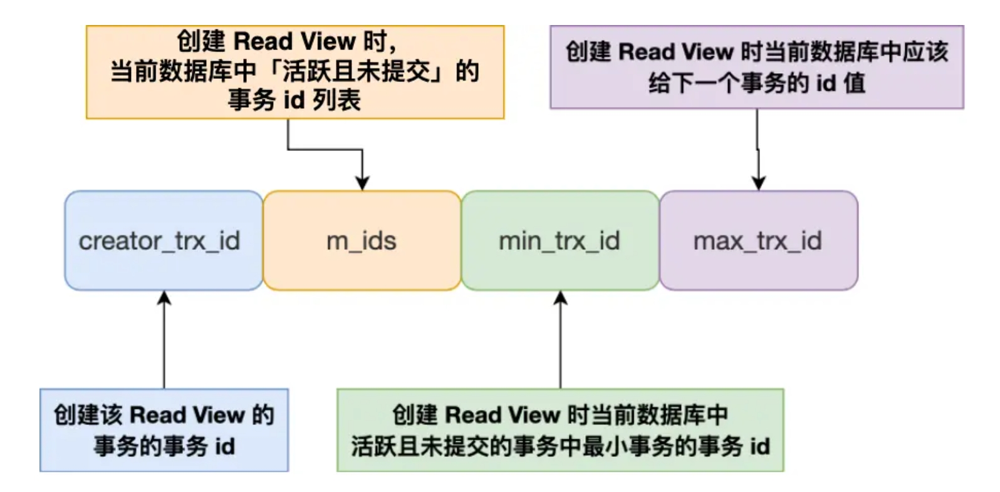

记录的两个隐藏列
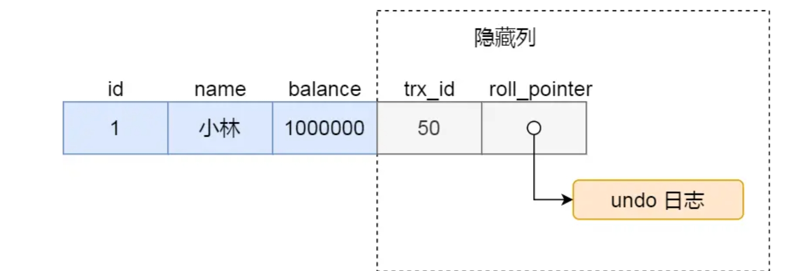

- trx_id，当一个事务对某条聚簇索引记录进行改动时，就会把该事务的事务 id 记录在 trx_id 隐藏列里；
- roll_pointer，每次对某条聚簇索引记录进行改动时，都会把旧版本的记录写入到 undo 日志中，然后这个隐藏列是个指针，指向每一个旧版本记录，于是就可以通过它找到修改前的记录

在创建ReadView后，一个事务去访问记录的时候，除了自己的更新记录总是可见之外，还有几种情况：
- 如果记录的trx_id小于ReadView的min_trx_id，表示这个版本的记录是在创建 Read View 前已经提交的事务生成的，所以该版本的记录对当前事务可见
- 如果记录的trx_id大于等于ReadView中的max_trx_id,表示这个版本的记录是在创建 Read View 后才启动的事务生成的，所以该版本的记录对当前事务不可见
- 如果记录的 trx_id 值在 Read View 的 min_trx_id 和 max_trx_id 之间，需要判断 trx_id 是否在 m_ids 列表中：
    - 如果记录的 trx_id 在 m_ids 列表中，表示生成该版本记录的活跃事务依然活跃着（还没提交事务），所以该版本的记录对当前事务不可见。
    - 如果记录的 trx_id 不在 m_ids列表中，表示生成该版本记录的活跃事务已经被提交，所以该版本的记录对当前事务可见。


### Two Phase Locking 两阶段锁
2PL将事务划分为两个阶段:
- Growing Phase: 只获得锁
- Shrink Phase: 只释放锁

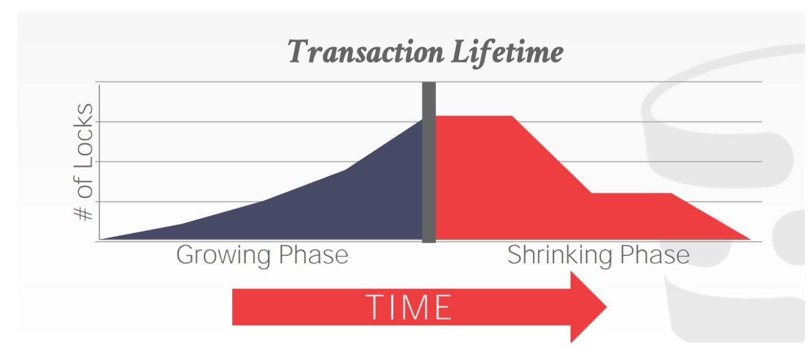
2PL本身已经足够保证schedule是seriable的，但2PL可能导致cascading aborts，举例如下:
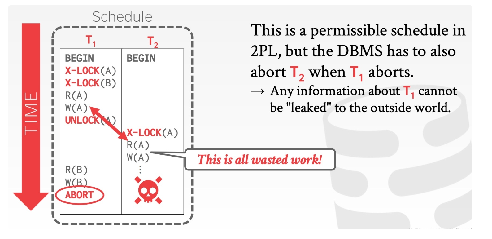

于是引入2PL的增强版变种，Rigorous 2PL，后者每个事务在结束之前，其写过的数据不能被其它事务读取或者重写

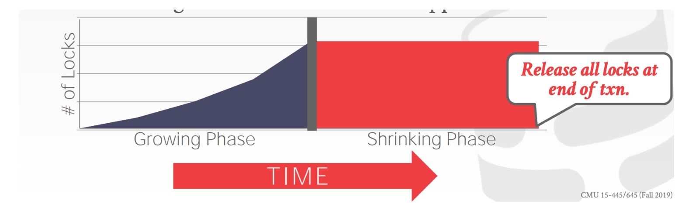

### Deadlock Detection & Prevention
2PL 无法避免的一个问题就是死锁，解决方案：<br>

#### Deadlock Detection 事后检测
为了检测死锁，DBMS 会维护一张 waits-for graph，来跟踪每个事务正在等待 (释放锁) 的其它事务，然后系统会定期地检查 waits-for graph，看其中是否有成环，如果成环了就要决定如何打破这个环。<br>
waits-for graph 中的节点是事务，从 Ti 到 Tj 的边就表示 Ti 正在等待 Tj 释放锁，举例如下
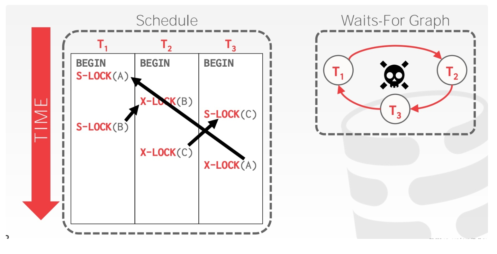
当 DBMS 检测到死锁时，它会选择一个 "受害者" (事务)，将该事务回滚，打破环形依赖，而这个 "受害者" 将依靠配置或者应用层逻辑重试或中止。这里有两个设计决定：
1. 检测死锁的频率
2. 如何选择合适的 "受害者"

检测死锁的频率越高，陷入死锁的事务等待的时间越短，但消耗的 cpu 也就越多。所以这是个典型的 trade-off，通常有一个调优的参数供用户配置。

选择 "受害者" 的指标可能有很多：事务持续时间、事务的进度、事务锁住的数据数量、级联事务的数量、事务曾经重启的次数等等。在选择完 "受害者" 后，DBMS 还有一个设计决定需要做：完全回滚还是回滚到足够消除环形依赖即可。

#### Deadlock Prevention 事前阻止
通常 prevention 会按照事务的年龄来赋予优先级，事务的时间戳越老，优先级越高。有两种 prevention 的策略： <br>
- Old Waits for Young：如果 requesting txn 优先级比 holding txn 更高则等待后者释放锁；更低则自行中止<br>
- Young Waits for Old：如果 requesting txn 优先级比 holding txn 更高则后者自行中止释放锁，让前者获取锁，否则 requesting txn 等待 holding txn 释放锁

举例如下:

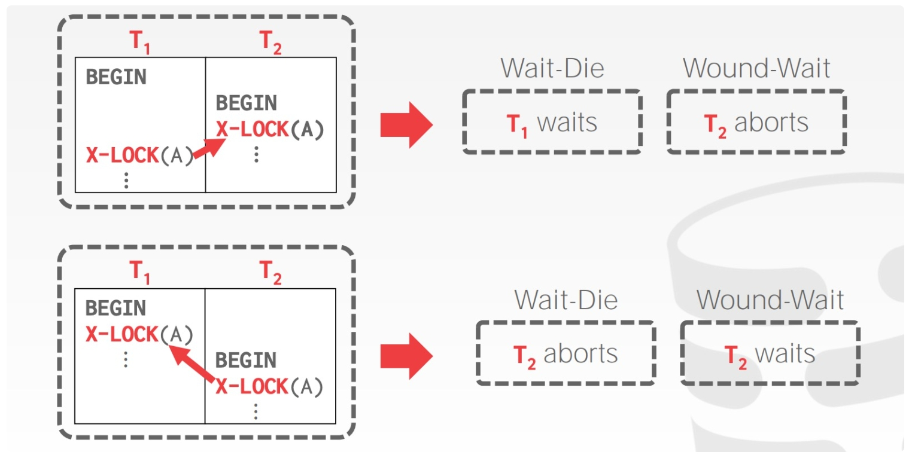

死锁产生的必要条件是<br>
1.互斥 2.请求与保持 3.不可抢占 4.循环等待<br>

## Task#1 Lock Manager
五种锁 S X IS IX SIX
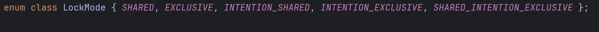
这里只实现三种隔离级别READ_UNCOMMITTED、READ_COMMITTED、REPEATABLE_READ
### LOCK NOTE
1. GENERAL BEHAVIOUR:
   *    Both LockTable() and LockRow() are blocking methods; they should wait till the lock is granted and then return.
   *    If the transaction was aborted in the meantime, do not grant the lock and return false.
2. MULTIPLE TRANSACTIONS:
   *    LockManager should maintain a queue for each resource; locks should be granted to transactions in a FIFO manner.
   *    If there are multiple compatible lock requests, all should be granted at the same time
   *    as long as FIFO is honoured.
3. SUPPORTED LOCK MODES:
   *    Table locking should support all lock modes.
   *    Row locking should not support Intention locks. Attempting this should set the TransactionState as
   *    ABORTED and throw a TransactionAbortException (ATTEMPTED_INTENTION_LOCK_ON_ROW)
4. ISOLATION LEVEL:
    * REPEATABLE_READ:<br>
        The transaction is required to take all locks.
        All locks are allowed in the GROWING state
        No locks are allowed in the SHRINKING state

    * READ_COMMITTED:<br>
           The transaction is required to take all locks.
           All locks are allowed in the GROWING state
           Only IS, S locks are allowed in the SHRINKING state
   
    * READ_UNCOMMITTED:<br>
           The transaction is required to take only IX, X locks.
           X, IX locks are allowed in the GROWING state.
           S, IS, SIX locks are never allowed
5. MULTILEVEL LOCKING:
    *    While locking rows, Lock() should ensure that the transaction has an appropriate lock on the table which the row
    belongs to. For instance, if an exclusive lock is attempted on a row, the transaction must hold either X, IX, or SIX on the table. If such a lock does not exist on the table, Lock() should set the TransactionState as ABORTED and throw a TransactionAbortException (TABLE_LOCK_NOT_PRESENT)

6. LOCK UPGRADE:<br>
   Calling Lock() on a resource that is already locked should have the following behaviour:    
   - If requested lock mode is the same as that of the lock presently held, Lock() should return true since it already has the lock.
   - If requested lock mode is different, Lock() should upgrade the lock held by the transaction.<br>
    While upgrading, only the following transitions should be allowed:<br>
        1.   IS -> [S, X, IX, SIX]
        2.   S -> [X, SIX]
        3.   IX -> [X, SIX]
        4.   SIX -> [X]
    * Any other upgrade is considered incompatible, and such an attempt should set the TransactionState as ABORTED and throw a TransactionAbortException (INCOMPATIBLE_UPGRADE)
    * Furthermore, only one transaction should be allowed to upgrade its lock on a given resource. Multiple concurrent lock upgrades on the same resource should set the TransactionState as ABORTED and throw a TransactionAbortException (UPGRADE_CONFLICT).

### UNLOCK NOTE
1. GENERAL BEHAVIOUR:
   *    Both UnlockTable() and UnlockRow() should release the lock on the resource and return. Both should ensure that the transaction currently holds a lock on the resource it is attempting to unlock.
   If not, LockManager should set the TransactionState as ABORTED and throw a TransactionAbortException (ATTEMPTED_UNLOCK_BUT_NO_LOCK_HELD)
   *    Additionally, unlocking a table should only be allowed if the transaction does not hold locks on any row on that table. If the transaction holds locks on rows of the table, Unlock should set the Transaction State as ABORTED and throw a TransactionAbortException (TABLE_UNLOCKED_BEFORE_UNLOCKING_ROWS).
   *  Finally, unlocking a resource should also grant any new lock requests for the resource (if possible).
2. TRANSACTION STATE UPDATE
   * REPEATABLE_READ:<br>
        Unlocking S/X locks should set the transaction state to SHRINKING
   * READ_COMMITTED:<br>
        Unlocking X locks should set the transaction state to SHRINKING.<br>
        Unlocking S locks does not affect transaction state.
   * READ_UNCOMMITTED:<br>
        Unlocking X locks should set the transaction state to SHRINKING.<br>
        S locks are not permitted under READ_UNCOMMITTED.<br>
        The behaviour upon unlocking an S lock under this isolation level is undefined.


<br><br><br>
- LockTable(Transaction, LockMode, TableOID)
- UnlockTable(Transction, TableOID)

```cpp
auto LockManager::LockTable(Transaction *txn, LockMode lock_mode, const table_oid_t &oid) -> bool {
  return LockTableDirectlyOrNot(txn, lock_mode, oid, true);
}

auto LockManager::LockTableDirectlyOrNot(Transaction *txn, LockMode lock_mode, const table_oid_t &oid, bool directly)
    -> bool {
  auto txn_state = txn->GetState();
  auto iso_level = txn->GetIsolationLevel();
  if (txn_state == TransactionState::COMMITTED || txn_state == TransactionState::ABORTED) {
    return false;//事务已经提交或终止，返回false
  }
  switch (iso_level) {
    case IsolationLevel::REPEATABLE_READ:
      if (txn_state == TransactionState::SHRINKING) {//REPEATABLE_READ级别下,SHRINKING阶段不可加锁
        ABORT_FOR_REASON_DIRECTLY_OR_NOT(AbortReason::LOCK_ON_SHRINKING, directly);//抛出异常
      }
      break;
    case IsolationLevel::READ_COMMITTED:
      if (txn_state == TransactionState::SHRINKING) {
        //READ_COMMITTED级别下，SHRINGKING阶段只可加IS、S锁
        if (lock_mode != LockMode::INTENTION_SHARED && lock_mode != LockMode::SHARED) {
          ABORT_FOR_REASON_DIRECTLY_OR_NOT(AbortReason::LOCK_ON_SHRINKING, directly);
        }
      }
      break;
    case IsolationLevel::READ_UNCOMMITTED:
      //READ_UNCOMMITTED级别下,SHRINKING阶段不可加锁
      if (txn_state == TransactionState::SHRINKING) {
        ABORT_FOR_REASON_DIRECTLY_OR_NOT(AbortReason::LOCK_ON_SHRINKING, directly);//抛出异常
      }
      //READ_UNCOMMITTED级别下,只可以加IX和X锁
      if (lock_mode != LockMode::INTENTION_EXCLUSIVE && lock_mode != LockMode::EXCLUSIVE) {
        ABORT_FOR_REASON_DIRECTLY_OR_NOT(AbortReason::LOCK_SHARED_ON_READ_UNCOMMITTED, directly);//抛出异常
      }
      break;
    default:
      UNREACHABLE("wrong IsolationLevel");
  }

  table_lock_map_latch_.lock();
  if (table_lock_map_.count(oid) == 0) {
    table_lock_map_[oid] = std::make_shared<LockRequestQueue>();
  }
  auto lrq = table_lock_map_[oid];//拿到该table的LockRequestQueue
  std::unique_lock<std::mutex> lock(lrq->latch_);
  table_lock_map_latch_.unlock();

  // 检查此锁的请求是否为一次锁升级
  bool upgrade = false;
  for (auto iter = lrq->request_queue_.begin(); iter != lrq->request_queue_.end(); iter++) {//遍历LockRequestQueue
    auto lr = *iter;
    if (lr->txn_id_ == txn->GetTransactionId()) {  // 同一个事务对相同table请求加锁
      if (lr->lock_mode_ == lock_mode) {           // 加锁的类型相同,直接返回
        return true;
      }
      if (lrq->upgrading_ != INVALID_TXN_ID) {  // 有事务正在对该resource进行锁升级
        ABORT_FOR_REASON_DIRECTLY_OR_NOT(AbortReason::UPGRADE_CONFLICT, directly);//抛出异常
      }
      if (!CanLockUpgrade(lr->lock_mode_, lock_mode)) {  // 不能够进行锁升级
        ABORT_FOR_REASON_DIRECTLY_OR_NOT(AbortReason::INCOMPATIBLE_UPGRADE, directly);//抛出异常
      }
      //锁升级
      lrq->upgrading_ = txn->GetTransactionId();
      lrq->request_queue_.erase(iter);//将lr从LockRequestQueue中删除
      RemoveFromTxnTableLockSet(txn, lr->lock_mode_, oid);//将txn事务持有该table的锁删除
      delete lr;  // 防止内存泄露
      lrq->request_queue_.push_back(new LockRequest(txn->GetTransactionId(), lock_mode, oid));//加入LockRequest
      upgrade = true;
      break;
    }
  }
  // 不是锁升级
  if (!upgrade) {
    lrq->request_queue_.push_back(new LockRequest(txn->GetTransactionId(), lock_mode, oid));//加入LockRequest
  }

  while (!CanTxnTakeLock(txn, lock_mode, lrq)) {//判断是否可以给改Table加锁
    lrq->cv_.wait(lock);//互斥阻塞
    // 可能死锁检测将该事务ABORTED 或者 手动ABORT该事务
    if (txn->GetState() == TransactionState::ABORTED) {
      // 删除该事务对该资源的request
      for (auto iter = lrq->request_queue_.begin(); iter != lrq->request_queue_.end(); iter++) {
        auto lr = *iter;
        if (lr->txn_id_ == txn->GetTransactionId()) {
          lrq->request_queue_.erase(iter);
          delete lr;
          break;
        }
      }
      lrq->cv_.notify_all();
      return false;
    }
  }

  AddIntoTxnTableLockSet(txn, lock_mode, oid);//该Table获得锁
  // LOG_DEBUG("txn:%d LockTable %d lock_mode:%d", txn->GetTransactionId(), oid, lock_mode);
  return true;
}

auto LockManager::CanTxnTakeLock(Transaction *txn, LockMode lock_mode,
                                 std::shared_ptr<LockRequestQueue> &lock_request_queue) -> bool {
  for (auto lr : lock_request_queue->request_queue_) {
    if (lr->granted_ && !AreLocksCompatible(lock_mode, lr->lock_mode_)) {  // 存在锁冲突
      return false;
    }
  }
  // 锁升级优先级最高
  if (lock_request_queue->upgrading_ != INVALID_TXN_ID) {
    if (lock_request_queue->upgrading_ == txn->GetTransactionId()) {  // 事务进行锁升级
      lock_request_queue->upgrading_ = INVALID_TXN_ID;
      for (auto lr : lock_request_queue->request_queue_) {
        if (!lr->granted_ && lr->txn_id_ == txn->GetTransactionId()) {
          lr->granted_ = true;
          break;
        }
      }
      return true;
    }
    return false;  // 进行锁升级的是其它事务,那么该事务需要等待
  }
  // 遵循FIFO规则
  for (auto lr : lock_request_queue->request_queue_) {
    if (lr->txn_id_ == txn->GetTransactionId()) {
      lr->granted_ = true;
      break;
    }
    if (!lr->granted_ && !AreLocksCompatible(lock_mode, lr->lock_mode_)) {  // 锁冲突
      return false;
    }
  }
  return true;
}

auto LockManager::UnlockTable(Transaction *txn, const table_oid_t &oid) -> bool {
  if (!CheckAllRowsUnLock(txn, oid)) {//检查该Table下的所有row的锁是否释放
    ABORT_FOR_REASON_DIRECTLY_OR_NOT(AbortReason::TABLE_UNLOCKED_BEFORE_UNLOCKING_ROWS, true);//抛出异常
  }

  table_lock_map_latch_.lock();
  if (table_lock_map_.count(oid) == 0) {
    table_lock_map_latch_.unlock();
    ABORT_FOR_REASON_DIRECTLY_OR_NOT(AbortReason::ATTEMPTED_UNLOCK_BUT_NO_LOCK_HELD, true);//该table未加锁
  }
  auto lrq = table_lock_map_[oid];
  std::unique_lock<std::mutex> lock(lrq->latch_);
  table_lock_map_latch_.unlock();

  for (auto iter = lrq->request_queue_.begin(); iter != lrq->request_queue_.end(); ++iter) {
    auto lr = *iter;
    if (lr->granted_ && lr->txn_id_ == txn->GetTransactionId()) {//找到该事务对该table的LockRequest
      auto iso_level = txn->GetIsolationLevel();
      switch (iso_level) {
        case IsolationLevel::REPEATABLE_READ:
          if (lr->lock_mode_ == LockMode::SHARED || lr->lock_mode_ == LockMode::EXCLUSIVE) {
            txn->SetState(TransactionState::SHRINKING);
            // LOG_DEBUG("txn:%d be set SHRINGKING", txn->GetTransactionId());
          }
          break;
        case IsolationLevel::READ_COMMITTED:
        case IsolationLevel::READ_UNCOMMITTED:
          if (lr->lock_mode_ == LockMode::EXCLUSIVE) {
            txn->SetState(TransactionState::SHRINKING);
          }
          break;
        default:
          UNREACHABLE("wrong IsolationLevel");
      }

      RemoveFromTxnTableLockSet(txn, lr->lock_mode_, oid);
      // LOG_DEBUG("txn:%d UnlockTable %d", txn->GetTransactionId(), oid);
      lrq->request_queue_.erase(iter);
      delete lr;
      lrq->cv_.notify_all();//资源释放，cv_进行notify
      return true;
    }
  }

  ABORT_FOR_REASON_DIRECTLY_OR_NOT(AbortReason::ATTEMPTED_UNLOCK_BUT_NO_LOCK_HELD, true);
}
```

- LockRow(Transaction, LockMode, TableOID, RID)
- UnlockRow(Transaction, TableOID, RID, force)
```cpp
auto LockManager::LockRow(Transaction *txn, LockMode lock_mode, const table_oid_t &oid, const RID &rid) -> bool {
    //row只能加S和E锁
  if (lock_mode != LockMode::SHARED && lock_mode != LockMode::EXCLUSIVE) {
    ABORT_FOR_REASON_DIRECTLY_OR_NOT(AbortReason::ATTEMPTED_INTENTION_LOCK_ON_ROW, true);
  }

  auto txn_state = txn->GetState();
  auto iso_level = txn->GetIsolationLevel();
  if (txn_state == TransactionState::COMMITTED || txn_state == TransactionState::ABORTED) {
    return false;
  }
  switch (iso_level) {
    case IsolationLevel::REPEATABLE_READ:
    //REPEATABLE_READ级别下SHRINKING阶段不可以加锁
      if (txn_state == TransactionState::SHRINKING) {
        ABORT_FOR_REASON_DIRECTLY_OR_NOT(AbortReason::LOCK_ON_SHRINKING, true);//抛出异常
      }
      break;
    case IsolationLevel::READ_COMMITTED:
    //READ_COMMITTED级别下SHRINKING阶段只能给row加SHARED锁
      if (txn_state == TransactionState::SHRINKING) {
        if (lock_mode != LockMode::SHARED) {
          ABORT_FOR_REASON_DIRECTLY_OR_NOT(AbortReason::LOCK_ON_SHRINKING, true);//抛出异常
        }
      }
      break;
    case IsolationLevel::READ_UNCOMMITTED:
    //READ_UNCOMMITTED级别下SHRINKING阶段不能加锁
      if (txn_state == TransactionState::SHRINKING) {
        ABORT_FOR_REASON_DIRECTLY_OR_NOT(AbortReason::LOCK_ON_SHRINKING, true);//抛出异常
      }
      //READ_UNCOMMITTED级别下，只能给row加X锁
      if (lock_mode != LockMode::EXCLUSIVE) {
        ABORT_FOR_REASON_DIRECTLY_OR_NOT(AbortReason::LOCK_SHARED_ON_READ_UNCOMMITTED, true);//抛出异常
      }
      break;
    default:
      UNREACHABLE("wrong IsolationLevel");
  }

  if (!CheckAppropriateLockOnTable(txn, oid, lock_mode)) {//查看该row的Table是否加锁
    ABORT_FOR_REASON_DIRECTLY_OR_NOT(AbortReason::TABLE_LOCK_NOT_PRESENT, true);
  }

  row_lock_map_latch_.lock();
  if (row_lock_map_.count(rid) == 0) {
    row_lock_map_[rid] = std::make_shared<LockRequestQueue>();
  }
  auto lrq = row_lock_map_[rid];
  std::unique_lock<std::mutex> lock(lrq->latch_);
  row_lock_map_latch_.unlock();

  // 检查是否是一次锁升级(S->X)
  bool upgrade = false;
  for (auto iter = lrq->request_queue_.begin(); iter != lrq->request_queue_.end(); iter++) {
    auto lr = *iter;
    if (lr->txn_id_ == txn->GetTransactionId()) {
      if (lr->lock_mode_ == lock_mode) {  // 重复的锁
        return true;
      }
      if (lrq->upgrading_ != INVALID_TXN_ID) {  // 抛出 UPGRADE_CONFLICT 异常
        ABORT_FOR_REASON_DIRECTLY_OR_NOT(AbortReason::UPGRADE_CONFLICT, true);
      }
      if (!CanLockUpgrade(lr->lock_mode_, lock_mode)) {  // 抛 INCOMPATIBLE_UPGRADE 异常
        ABORT_FOR_REASON_DIRECTLY_OR_NOT(AbortReason::INCOMPATIBLE_UPGRADE, true);
      }

      lrq->upgrading_ = txn->GetTransactionId();
      lrq->request_queue_.erase(iter);
      RemoveFromTxnRowLockSet(txn, lr->lock_mode_, oid, rid);
      delete lr;
      lrq->request_queue_.push_back(new LockRequest(txn->GetTransactionId(), lock_mode, oid, rid));
      upgrade = true;
      break;
    }
  }

  if (!upgrade) {
    lrq->request_queue_.push_back(new LockRequest(txn->GetTransactionId(), lock_mode, oid, rid));
  }

  while (!CanTxnTakeLock(txn, lock_mode, lrq)) {
    lrq->cv_.wait(lock);
    // LOG_DEBUG("txn:%d wake", txn->GetTransactionId());
    // 死锁检测ABORT该事务 或者 手动ABORT该事务
    if (txn->GetState() == TransactionState::ABORTED) {
      // LOG_DEBUG("txn:%d ABORT", txn->GetTransactionId());
      // 移除该事务对该资源的request
      for (auto iter = lrq->request_queue_.begin(); iter != lrq->request_queue_.end(); iter++) {
        auto lr = *iter;
        if (lr->txn_id_ == txn->GetTransactionId()) {
          lrq->request_queue_.erase(iter);
          delete lr;
          break;
        }
      }
      lrq->cv_.notify_all();
      return false;
    }
  }
  AddIntoTxnRowLockSet(txn, lock_mode, oid, rid);
  // LOG_DEBUG("txn:%d LockRow oid:%d rid:%d:%d lock_mode:%d", txn->GetTransactionId(), oid, rid.GetPageId(),
  // rid.GetSlotNum(), lock_mode);
  return true;
}

auto LockManager::UnlockRow(Transaction *txn, const table_oid_t &oid, const RID &rid, bool force) -> bool {
  row_lock_map_latch_.lock();
  if (row_lock_map_.count(rid) == 0) {
    row_lock_map_latch_.unlock();
    ABORT_FOR_REASON_DIRECTLY_OR_NOT(AbortReason::ATTEMPTED_UNLOCK_BUT_NO_LOCK_HELD, true);//该row未加锁抛出异常
  }
  auto lrq = row_lock_map_[rid];
  std::unique_lock<std::mutex> lock(lrq->latch_);
  row_lock_map_latch_.unlock();

  for (auto iter = lrq->request_queue_.begin(); iter != lrq->request_queue_.end(); ++iter) {
    auto lr = *iter;
    if (lr->granted_ && lr->txn_id_ == txn->GetTransactionId()) {
      if (!force) {
        auto iso_level = txn->GetIsolationLevel();
        switch (iso_level) {
          case IsolationLevel::REPEATABLE_READ:
            if (lr->lock_mode_ == LockMode::SHARED || lr->lock_mode_ == LockMode::EXCLUSIVE) {
              txn->SetState(TransactionState::SHRINKING);
              // LOG_DEBUG("txn:%d be set SHRINGKING", txn->GetTransactionId());
            }
            break;
          case IsolationLevel::READ_COMMITTED:
          case IsolationLevel::READ_UNCOMMITTED:
            if (lr->lock_mode_ == LockMode::EXCLUSIVE) {
              txn->SetState(TransactionState::SHRINKING);
            }
            break;
          default:
            UNREACHABLE("wrong IsolationLevel");
        }
      }
      RemoveFromTxnRowLockSet(txn, lr->lock_mode_, oid, rid);
      // LOG_DEBUG("txn:%d UnlockRow oid:%d rid:%d:%d", txn->GetTransactionId(), oid, rid.GetPageId(),
      // rid.GetSlotNum());
      lrq->request_queue_.erase(iter);
      delete lr;
      lrq->cv_.notify_all();
      return true;
    }
  }
  ABORT_FOR_REASON_DIRECTLY_OR_NOT(AbortReason::ATTEMPTED_UNLOCK_BUT_NO_LOCK_HELD, true);
}
```

## Task #2 - Deadlock Detection
锁管理器应该在后台线程中运行死锁检测，定期构建等待图并根据需要中止事务以消除死锁。
```cpp
//给LockManger添加死锁检测所需的数据成员
class LockManager {
  std::atomic<bool> enable_cycle_detection_;
  std::thread *cycle_detection_thread_;
  /** Waits-for graph representation. */
  std::map<txn_id_t, std::set<txn_id_t>> waits_for_;
  // std::unordered_map<txn_id_t, int> node_value_;
  // std::vector<txn_id_t> route_;
  std::vector<txn_id_t> stk_;
  std::unordered_map<txn_id_t, bool> in_stk_;
  std::unordered_map<txn_id_t, bool> has_search_;
};
```
开启死锁检测的后台线程
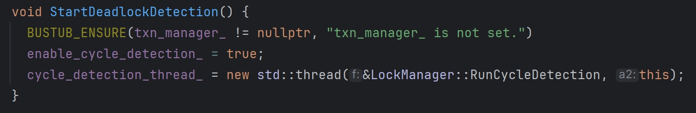

```cpp
void LockManager::RunCycleDetection() {
  while (enable_cycle_detection_) {
    std::this_thread::sleep_for(cycle_detection_interval);
    {
      waits_for_.clear();
      BuildGraph();//构建等待图
      // PrintGraph();
      while (true) {
        stk_.clear();
        in_stk_.clear();
        has_search_.clear();
        txn_id_t abort_tid;
        if (HasCycle(&abort_tid)) {//判断是否有环，如果有获取abort_id
          // LOG_DEBUG("abort_tid:%d", abort_tid);
          auto txn = txn_manager_->GetTransaction(abort_tid);
          txn->SetState(TransactionState::ABORTED);
          RemoveAllAboutAbortTxn(abort_tid);//删除有向图中该abort_tid的所有入边和出边
          WakeAbortedTxn(abort_tid);//该abort_tid的事务所占有的资源的cv_进行notify_all
          // LOG_DEBUG("dead_detect notify all");
        } else {
          break;
        }
      }
    }
  }
}

//HasCycle函数判断是否有环，并且返回环中最大的txn_id
auto LockManager::HasCycle(txn_id_t *txn_id) -> bool {
  return std::any_of(waits_for_.begin(), waits_for_.end(),
                     [this, txn_id](const std::pair<txn_id_t, std::set<txn_id_t>> &p) {
                       auto k = p.first;
                       if (!this->has_search_[k] && DFS(k)) {
                         auto iter = std::find(this->stk_.begin(), this->stk_.end() - 1, this->stk_.back());
                         *txn_id = -1;
                         while (iter != this->stk_.end()) {
                           if (*iter > *txn_id) {
                             *txn_id = *iter;
                           }
                           ++iter;
                         }
                         this->stk_.clear();
                         this->in_stk_.clear();
                         this->has_search_.clear();
                         return true;
                       }
                       this->stk_.clear();
                       this->in_stk_.clear();
                       return false;
                     });
}

//DFS函数判断是否有环,txn_id为遍历的起始点
//有环返回true 无环返回false
auto LockManager::DFS(txn_id_t txn_id) -> bool {
  has_search_[txn_id] = true;
  stk_.push_back(txn_id);
  in_stk_[txn_id] = true;
  for (auto id : waits_for_[txn_id]) {
    if (!has_search_[id]) {
      return DFS(id);
    }
    if (in_stk_[id]) {
      stk_.push_back(id);
      return true;
    }
  }
  stk_.pop_back();
  in_stk_[txn_id] = false;
  return false;
}

```

## Task #3 - Concurrent Query Execution
TransactionManager的Abort函数需要恢复Table和对应Index的原始状态
```cpp
void TransactionManager::Commit(Transaction *txn) {
  // Release all the locks.
  ReleaseLocks(txn);

  txn->SetState(TransactionState::COMMITTED);
  std::unique_lock<std::shared_mutex> guard(txn_map_mutex_);
  txn_map_.erase(txn->GetTransactionId());
}

void TransactionManager::Abort(Transaction *txn) {
  /* TODO: revert all the changes in write set */
  while (!txn->GetWriteSet()->empty()) {
    auto twr = txn->GetWriteSet()->back();
    if (twr.wtype_ == WType::INSERT) {
      auto tuple_meta = twr.table_heap_->GetTupleMeta(twr.rid_);
      tuple_meta.is_deleted_ = true;
      twr.table_heap_->UpdateTupleMeta(tuple_meta, twr.rid_);
    } else if (twr.wtype_ == WType::DELETE) {
      auto tuple_meta = twr.table_heap_->GetTupleMeta(twr.rid_);
      tuple_meta.is_deleted_ = false;
      twr.table_heap_->UpdateTupleMeta(tuple_meta, twr.rid_);
    }
    txn->GetWriteSet()->pop_back();
  }

  while (!txn->GetIndexWriteSet()->empty()) {
    auto iwr = txn->GetIndexWriteSet()->back();
    if (iwr.wtype_ == WType::INSERT) {
      iwr.catalog_->GetIndex(iwr.index_oid_)->index_->DeleteEntry(iwr.tuple_, iwr.rid_, txn);
    } else if (iwr.wtype_ == WType::DELETE) {
      iwr.catalog_->GetIndex(iwr.index_oid_)->index_->InsertEntry(iwr.tuple_, iwr.rid_, txn);
    }
    txn->GetIndexWriteSet()->pop_back();
  }

  ReleaseLocks(txn);

  txn->SetState(TransactionState::ABORTED);
  std::unique_lock<std::shared_mutex> guard(txn_map_mutex_);
  txn_map_.erase(txn->GetTransactionId());
}
```

SeqScanExecutor修改
```cpp
void SeqScanExecutor::Init() {
  auto catalog = exec_ctx_->GetCatalog();
  table_info_ = catalog->GetTable(plan_->table_oid_);
  auto txn = exec_ctx_->GetTransaction();
  auto iso_level = txn->GetIsolationLevel();
  try {
    if (exec_ctx_->IsDelete()) {//当前进行的sql操作是DELETE或者UPDATE
      auto res =
          exec_ctx_->GetLockManager()->LockTable(txn, LockManager::LockMode::INTENTION_EXCLUSIVE, plan_->table_oid_);
      if (!res) {
        throw ExecutionException("SeqScanExecutor LockTable Failed");
      }
    } else if (!txn->IsTableIntentionExclusiveLocked(plan_->table_oid_) &&  // 避免反向升级
               (iso_level == IsolationLevel::READ_COMMITTED || iso_level == IsolationLevel::REPEATABLE_READ)) {
      auto res =
          exec_ctx_->GetLockManager()->LockTable(txn, LockManager::LockMode::INTENTION_SHARED, plan_->table_oid_);
      if (!res) {
        throw ExecutionException("SeqScanExecutor LockTable Failed");
      }
    }
  } catch (TransactionAbortException &exception) {
    throw ExecutionException("SeqScanExecutor LockTable Failed");
  }
  iterator_ = std::make_unique<TableIterator>(table_info_->table_->MakeEagerIterator());
}

auto SeqScanExecutor::Next(Tuple *tuple, RID *rid) -> bool {
  std::pair<TupleMeta, Tuple> pair;
  auto txn = exec_ctx_->GetTransaction();
  auto iso_level = txn->GetIsolationLevel();
  while (!iterator_->IsEnd()) {
    pair = iterator_->GetTuple();
    try {
      if (exec_ctx_->IsDelete()) {
        auto res = exec_ctx_->GetLockManager()->LockRow(txn, LockManager::LockMode::EXCLUSIVE, plan_->table_oid_, pair.second.GetRid());
        if (!res) {
          throw ExecutionException("SeqScanExecutor LockRow Failed");
        }
      } else if (!txn->IsRowExclusiveLocked(plan_->table_oid_, pair.second.GetRid()) &&  // 避免反向升级
                 (iso_level == IsolationLevel::READ_COMMITTED || iso_level == IsolationLevel::REPEATABLE_READ)) {
        auto res = exec_ctx_->GetLockManager()->LockRow(txn, LockManager::LockMode::SHARED, plan_->table_oid_, pair.second.GetRid());
        if (!res) {
          throw ExecutionException("SeqScanExecutor LockRow Failed");
        }
      }
    } catch (TransactionAbortException &exception) {
      throw ExecutionException("SeqScanExecutor LockRow Failed");
    }

    if (iterator_->GetTuple().first.is_deleted_ ||
        (plan_->filter_predicate_ &&
         plan_->filter_predicate_->Evaluate(&pair.second, table_info_->schema_)
                 .CompareEquals(ValueFactory::GetBooleanValue(false)) == CmpBool::CmpTrue)) {
      if (exec_ctx_->IsDelete() ||
          (iso_level == IsolationLevel::READ_COMMITTED || iso_level == IsolationLevel::REPEATABLE_READ)) {
        try {
          auto res = exec_ctx_->GetLockManager()->UnlockRow(txn, plan_->table_oid_, pair.second.GetRid(), true);
          if (!res) {
            throw ExecutionException("SeqScanExecutor Force UnLockRow Failed");
          }
        } catch (TransactionAbortException &exception) {
          throw ExecutionException("SeqScanExecutor Force UnLockRow Failed");
        }
      }
      ++(*iterator_);
      continue;
    }

    if (!exec_ctx_->IsDelete() && iso_level == IsolationLevel::READ_COMMITTED) {
      try {
        auto res = exec_ctx_->GetLockManager()->UnlockRow(txn, plan_->table_oid_, pair.second.GetRid());
        if (!res) {
          throw ExecutionException("SeqScanExecutor UnLockRow Failed");
        }
      } catch (TransactionAbortException &exception) {
        throw ExecutionException("SeqScanExecutor UnLockRow Failed");
      }
    }
    ++(*iterator_);
    *tuple = std::move(pair.second);
    *rid = tuple->GetRid();
    return true;
  }
  if (!exec_ctx_->IsDelete() && iso_level == IsolationLevel::READ_COMMITTED) {
    try {
      auto res = exec_ctx_->GetLockManager()->UnlockTable(txn, plan_->table_oid_);
      if (!res) {
        throw ExecutionException("SeqScanExecutor UnLockTable Failed");
      }
    } catch (TransactionAbortException &exception) {
      throw ExecutionException("SeqScanExecutor UnLockTable Failed");
    }
  }
  return false;
}
```

InsertExecutor修改，给table加IE锁，并且table和index插入记录需要被保存下来
```cpp
void InsertExecutor::Init() {
  child_executor_->Init();
  auto cata_log = exec_ctx_->GetCatalog();
  table_info_ = cata_log->GetTable(plan_->table_oid_);
  index_infos_ = cata_log->GetTableIndexes(table_info_->name_);
  successful_ = false;
  auto txn = exec_ctx_->GetTransaction();
  try {
    auto res =
        exec_ctx_->GetLockManager()->LockTable(txn, LockManager::LockMode::INTENTION_EXCLUSIVE, plan_->table_oid_);
    if (!res) {
      throw ExecutionException("InsertExecutor LockTable Failed");
    }
  } catch (TransactionAbortException &exception) {
    throw ExecutionException("InsertExecutor LockTable Failed");
  }
}

auto InsertExecutor::Next(Tuple *tuple, RID *rid) -> bool {
  TupleMeta meta;
  if (successful_) {
    return false;
  }
  meta.insert_txn_id_ = INVALID_TXN_ID;
  meta.delete_txn_id_ = INVALID_TXN_ID;
  meta.is_deleted_ = false;
  auto count = 0;
  while (child_executor_->Next(tuple, rid)) {
    auto tuple_rid = table_info_->table_->InsertTuple(meta, *tuple, exec_ctx_->GetLockManager(), exec_ctx_->GetTransaction(), table_info_->oid_);
    if (tuple_rid == std::nullopt) {
      continue;
    }
    auto twr = TableWriteRecord(table_info_->oid_, tuple_rid.value(), table_info_->table_.get());
    twr.wtype_ = WType::INSERT;
    exec_ctx_->GetTransaction()->GetWriteSet()->push_back(twr);

    for (auto index_info : index_infos_) {
      auto key = tuple->KeyFromTuple(table_info_->schema_, index_info->key_schema_, index_info->index_->GetKeyAttrs());
      index_info->index_->InsertEntry(key, *tuple_rid, exec_ctx_->GetTransaction());
      auto iwr = IndexWriteRecord(tuple_rid.value(), table_info_->oid_, WType::INSERT, key, index_info->index_oid_,
                                  exec_ctx_->GetCatalog());
      exec_ctx_->GetTransaction()->GetIndexWriteSet()->push_back(iwr);
    }
    ++count;
  }
  std::vector<Value> values;
  values.emplace_back(TypeId::INTEGER, count);
  *tuple = Tuple(values, &GetOutputSchema());
  successful_ = true;
  return true;
}
```

DeleteExecutor修改，并且table和index删除记录需要被保存下来
```cpp
void DeleteExecutor::Init() {
  child_executor_->Init();
  successful_ = false;
  auto catalog = exec_ctx_->GetCatalog();
  table_info_ = catalog->GetTable(plan_->TableOid());
  index_infos_ = catalog->GetTableIndexes(table_info_->name_);
}

auto DeleteExecutor::Next(Tuple *tuple, RID *rid) -> bool {
  TupleMeta tuple_meta;
  if (successful_) {
    return false;
  }
  tuple_meta.delete_txn_id_ = INVALID_TXN_ID;
  tuple_meta.insert_txn_id_ = INVALID_TXN_ID;
  tuple_meta.is_deleted_ = true;
  auto count = 0;
  while (child_executor_->Next(tuple, rid)) {
    table_info_->table_->UpdateTupleMeta(tuple_meta, *rid);

    auto twr = TableWriteRecord(table_info_->oid_, *rid, table_info_->table_.get());
    twr.wtype_ = WType::DELETE;
    exec_ctx_->GetTransaction()->GetWriteSet()->push_back(twr);

    for (auto index_info : index_infos_) {
      auto key = tuple->KeyFromTuple(table_info_->schema_, index_info->key_schema_, index_info->index_->GetKeyAttrs());
      index_info->index_->DeleteEntry(key, *rid, exec_ctx_->GetTransaction());

      auto iwr = IndexWriteRecord(*rid, table_info_->oid_, WType::DELETE, key, index_info->index_oid_,
                                  exec_ctx_->GetCatalog());
      exec_ctx_->GetTransaction()->GetIndexWriteSet()->push_back(iwr);
    }
    count++;
  }
  std::vector<Value> values;
  values.emplace_back(TypeId::INTEGER, count);
  *tuple = Tuple(values, &GetOutputSchema());
  successful_ = true;
  return true;
}
```
五种细粒度锁IS IX S SIX X相容矩阵
| | IS | IX | S | SIX | X |
|:----:|:----:|:----:|:----:|:----:|:----:|
| IS | YES | YES | YES | YES | NO |
| IX | YES | YES | NO| NO | NO |
| S | YES | NO | YES | NO | NO |
| SIX | YES | NO | NO | NO | NO |
| X | NO | NO | NO | NO | NO |

本地测试通过：
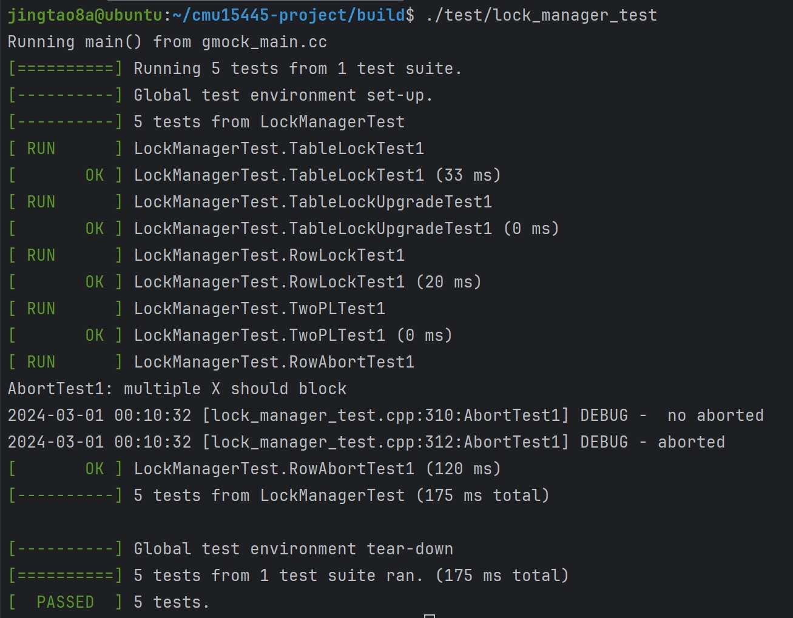
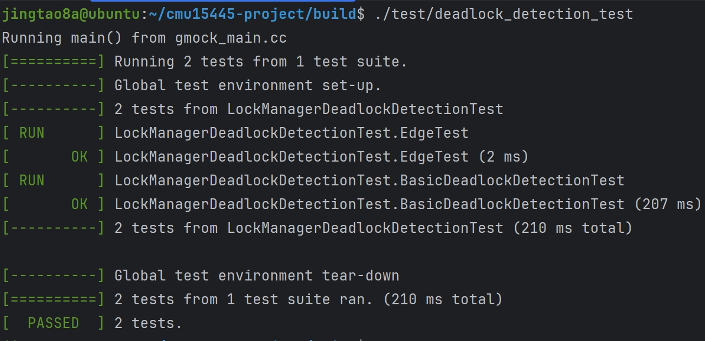
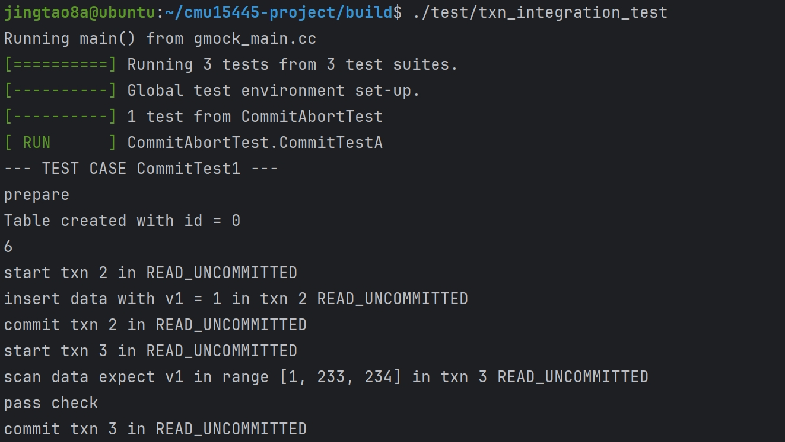
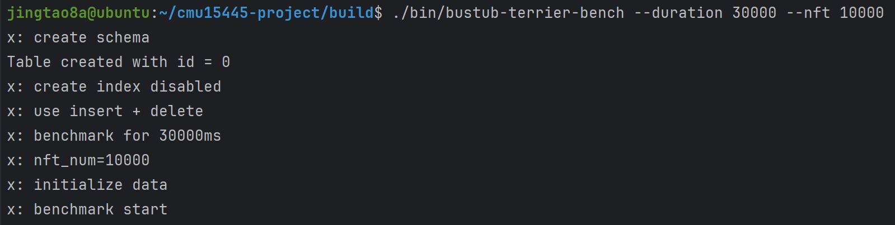
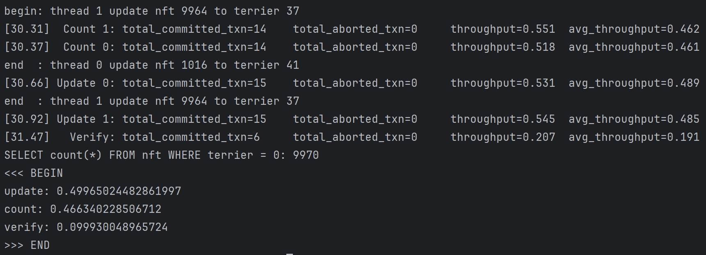

线上测试通过:
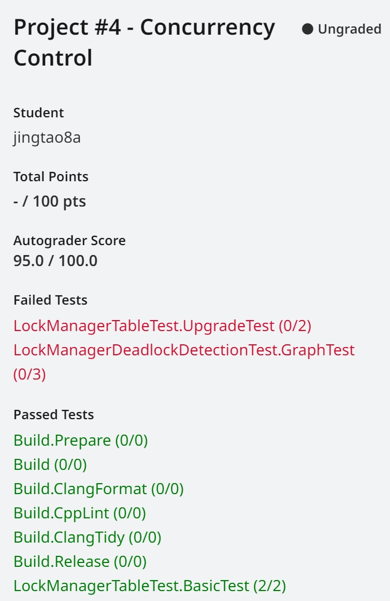
