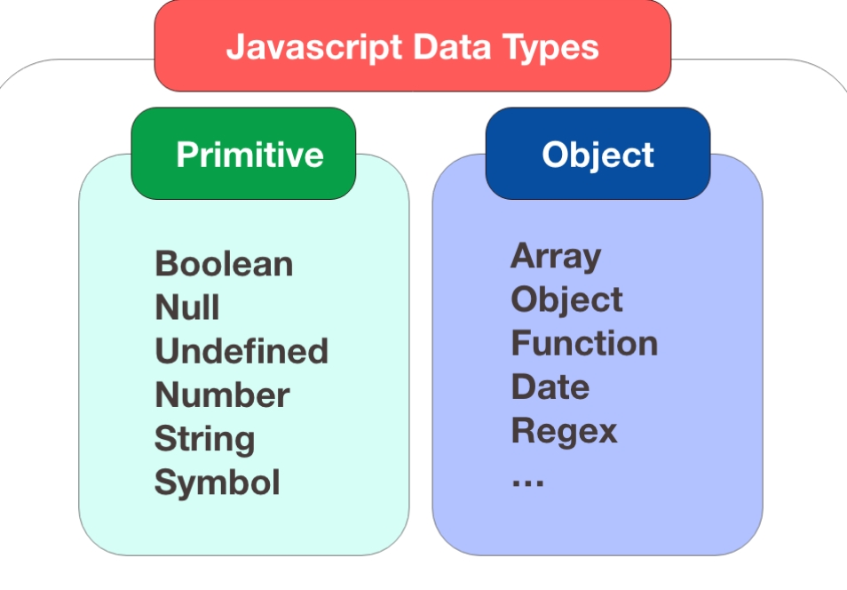
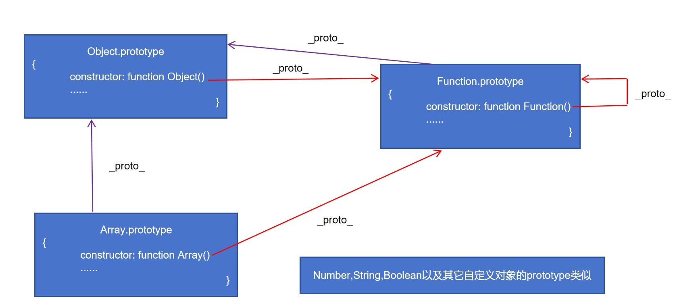

### 数据类型

**值类型(基本类型)**  ：字符串（String）、数字(Number)、布尔(Boolean)、空（null）、未定义（Undefined）、Symbol。
> 所有的值类型(基本类型), 除了null和undefined, 都可以被看做对象
```javascript
new String("abc")
new Number(123)
new Boolean(true)
```
> js中一切皆对象

**引用数据类型(对象类型)** ： 对象(Object)、数组(Array)、函数(Function)、正则（RegExp）和日期（Date）



> ps: 定义变量得使用 var 或者 let
> 可以用typeof 来查看变量的类型

### 函数
``` javascript
function myFunction(a, b) {
    return a * b;
}

```

### 原型链

class关键字是原型系统上的一个语法糖，创造了一种基于类的语言的错觉。

__proto__, prototype, constructor的关系


