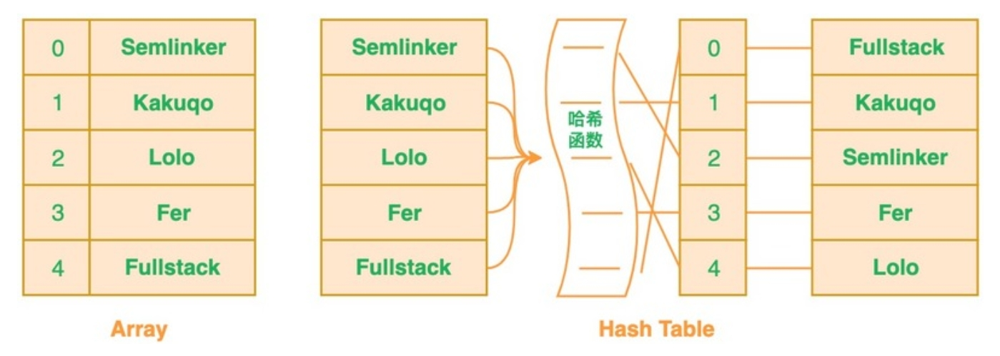
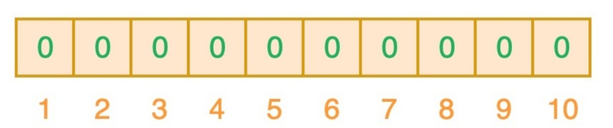
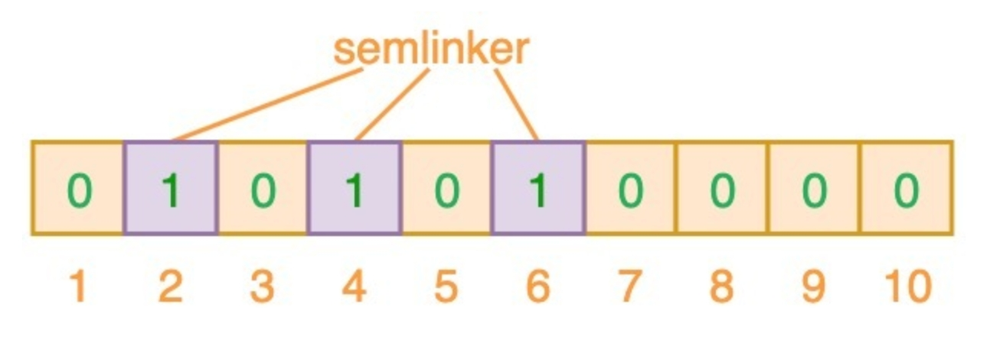
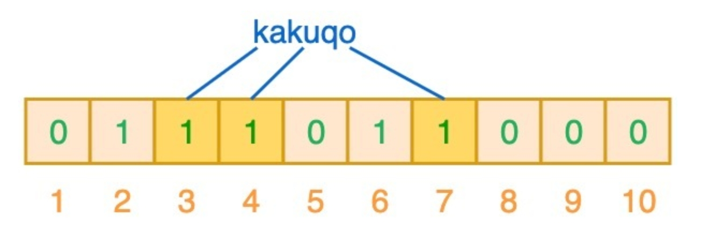
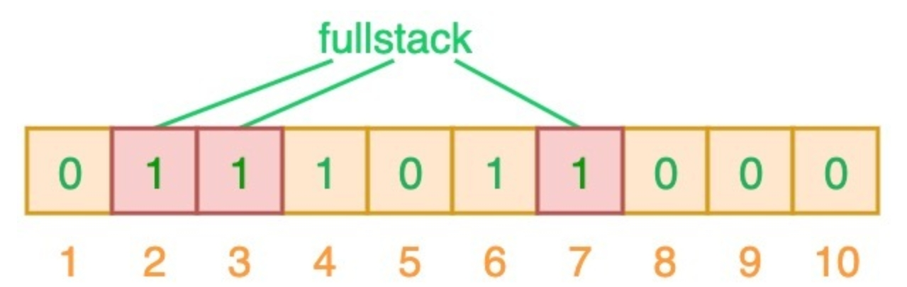
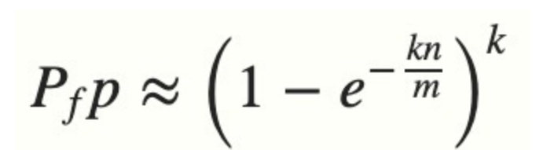
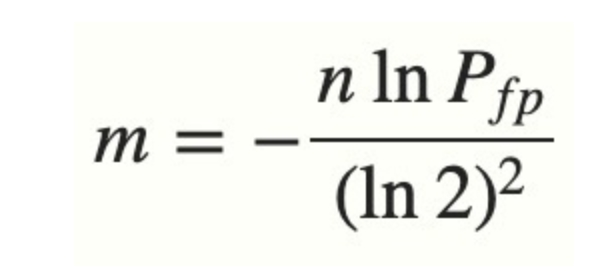

### 作用
查找时，过滤掉一定不存在的key，提高查找效率

### 简介
在数组或者列表中搜索相应值的时候，你必须遍历已有的集合。若集合中存在大量的数据，就会影响查找的效率

针对这个问题，可以考虑使用哈希表，利用哈希表来对"值"进行哈希处理来获得该值对应的索引值，然后将该"值"存放到列表中对应的索引位置。
这意味着判断列表中是否存在该值时，只需要对值进行哈希处理并在相应的索引位置进行搜索即可，这时的搜索速度是非常快的。

Bloom Filter本质上是由长度为m的位向量（仅包含0或者1）组成，最初所有值均设置为0，如下图所示：

为了将数据项添加到布隆过滤器中，使用k个不同的哈希函数对其进行哈希，并将结果位置上对应位置为1

### 简单的例子
输入"semlinker"，预设的3个哈希函数将输出2、4、6,我们把相应位置为1

再输入"kakuqo"，哈希函数输出3、4、7,把对应位置为1

再输入"fullstack",哈希函数输出2、3、7，这时发现相应的索引位都已经置为了1，这意味着我们可以说"fullstack"可能已经插入到集合中。这是一种误判情况

布隆过滤器有一个可预测的误判率(FPP):

- n是已经添加元素的数量
- k是哈希的次数
- m为布隆过滤器的长度(如比特数组的大小)

实际情况中，布隆过滤器的长度m可以根据误判率(FFP)的和期望添加的元素个数n的通过如下公式计算:

> 因此，我们得出一个结论，当我们搜索一个值的时候，若该值经过k个哈希函数运算后任何一个索引位为0，那么该值肯定不在集合中。但如果所有哈希索引值均为1，则只能说该搜索的值可能存在集合中

### 应用
在实际工作中，布隆过滤器常见的应用场景如下：
- 网页爬虫对 URL 去重，避免爬取相同的 URL 地址；
- 反垃圾邮件，从数十亿个垃圾邮件列表中判断某邮箱是否垃圾邮箱；
- Google Chrome 使用布隆过滤器识别恶意 URL；
- Medium 使用布隆过滤器避免推荐给用户已经读过的文章；
- Google BigTable，Apache HBbase 和 Apache Cassandra 使用布隆过滤器减少对不存在的行和列的查找

