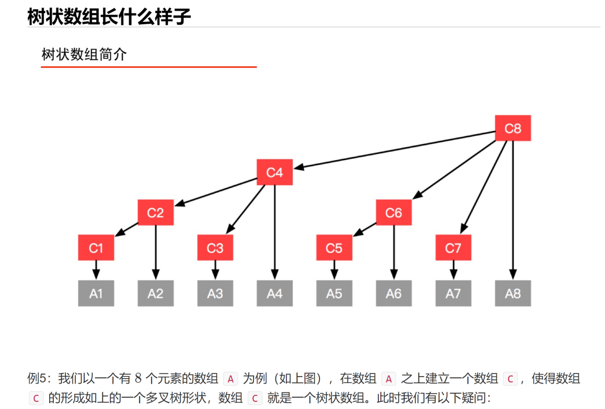

```cpp
/**
 * 单点更新
 *
 * @param i     原始数组索引 i
 * @param delta 变化值 = 更新以后的值 - 原始值
 */
public void update(int i, int delta) {
    // 从下到上更新，注意，预处理数组，比原始数组的 len 大 1，故 预处理索引的最大值为 len
    while (i <= len) {
        tree[i] += delta;
        i += lowbit(i);
    }
}

public static int lowbit(int x) {
    return x & (-x);
}
```

```cpp
/**
 * 查询前缀和
 *
 * @param i 前缀的最大索引，即查询区间 [0, i] 的所有元素之和
 */
public int query(int i) {
    // 从右到左查询
    int sum = 0;
    while (i > 0) {
        sum += tree[i];
        i -= lowbit(i);
    }
    return sum;
}
```

个人实现:
[https://github.com/jingtao8a/leetcode/blob/master/src/main/java/org/jingtao8a/code_random_notes/TreeArray.java](https://github.com/jingtao8a/leetcode/blob/master/src/main/java/org/jingtao8a/code_random_notes/TreeArray.java)