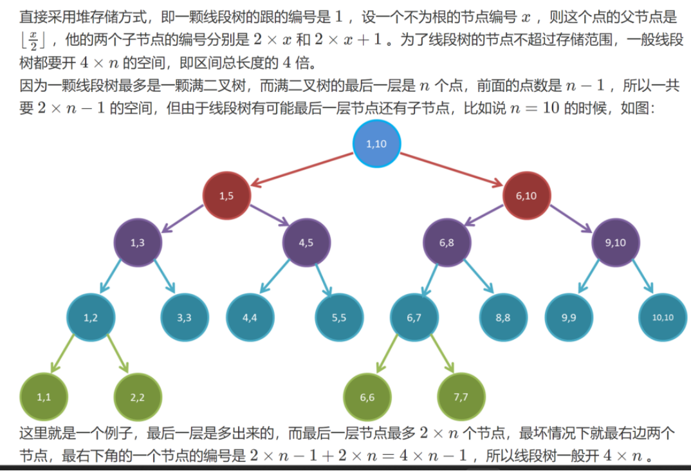

线段树是常用的维护区间信息的数据结构

## 线段树支持操作
（1）单点修改<br>
（2）区间修改<br>
（3）区间查询（区间求和，求区间max，求区间min，区间gcd等等）<br>

## 线段树特点：
（1）每个节点表示一个区间<br>
（2）root node表示区间为[1, n]<br>
（3）leaf Node表示区间为[x, x]<br>
（4）线段树中如果一个节点区间为[l, r]（l != r）那么这个节点的左子树的根表示区间为[l, mid]，这个节点的右子树的根表示区间就是[mid + 1, r], 其中mid = Floor((l + r) /2)<br>


## 线段树特点：
（1）每个节点表示一个区间
（2）root node表示区间为[1, n]
（3）leaf Node表示区间为[x, x]
（4）线段树中如果一个节点区间为[l, r]（l != r）那么这个节点的左子树的根表示区间为[l, mid]，这个节点的右子树的根表示区间就是[mid + 1, r], 其中mid = Floor((l + r) /2)

## 线段树的存储方式


## 建立线段树
时间复杂度为O（n）
```cpp
struct Segment_Tree {
    int l,r;
    info_type info;
    tag_type tag;
    //这里可以维护任何满足区间加法的信息
}tr[4 * N];   //要开四倍空间
//实现时可以写 info + info,info + tag,tag + tag 来简化代码
info_type operator + (info_type x,info_type y) {
    // 合并 info
}
info_type opreator + (info_type x,tag_type y) {
    // 合并 info 和 tag
}
tag_type operator + (tag_type x,tag_type y) {
    // 合并 tag
}
void opt (info_type &x,tag_type y) {
    x = x + y;
}
void push_up (int u) { 
//这里举个例子，比如区间和，区间和就是由一个点的左右子节点的和相加
tr[u].info = tr[u << 1].info + tr[u << 1 | 1].info;
}
void build (int u,int l,int r) {  //当前正在下标为u的点，这个点表示的区间是[l,r]
    if (l == r) {
        tr[u] = {l,r,info (a[l])};
        return ;
    }
    tr[u] = {l,r};  //记得存储当前点表示的区间，否则你会调上一整天
    int mid = l + r >> 1;
    build (u << 1,l,mid),build (u << 1 | 1,mid + 1,r); //u << 1就是u * 2，u << 1 | 1就是u * 2 + 1
    push_up (u);  //push_up函数的意思是把某一个节点的信息由它的子节点算出来
}
```

## 单点修改
时间复杂度均为O(logN)
```cpp
void modify (int u,int x,tag_type d) {  
    if (tr[u].l == tr[u].r) {
        tr[u].info += d; //如果当前区间只有一个数，那么这个数一定是要修改的
        // 修改不局限于覆盖，也可能是别的
        return ;
    }
    int mid = tr[u].l + tr[u].r >> 1;
    if (x <= mid) modify (u << 1,x,d);  //如果在左边就递归修改左半边区间
    else modify (u << 1 | 1,x,d);    //如果在右边就递归修改右半边区间
    push_up (u)   //记得更新信息
}
```

## 区间修改
思路1：
时间复杂度均为O(N)
```cpp
void modify (int u,int l,int r,tag_type d) {
    if (tr[u].l == tr[u].r) {   //叶子节点
        tr[u].info += d;
        return ;
    }
    int mid = tr[u].l + tr[u].r >> 1;  //注意是tr[u].l和tr[u].r
    if (l <= mid) modify (u << 1,l,r,d);  //左边有修改区间，就递归左半边
    if (r >= mid + 1) modify (u << 1 | 1,l,r,d);  //右边有修改区间，就递归右半边
    push_up (u);  //要记得要把这个点的信息更新一下
}
```
思路2：
```cpp
void push_down (int u) { //下传标记函数
    if (tr[u].tag) {  //有懒标记才下传
        tr[u << 1].info += tr[u].tag,tr[u << 1 | 1].info += tr[u].tag
        tr[u].tag = info ();  //懒标记记得清零
    }
}
void modify (int u,int l,int r,int d) { //当前遍历到的点下标是u，要修改区间[l,r]
    if (l <= tr[u].l && tr[u].r <= r) {
        opt (u,d);
        return ;
    }
    push_down (u);  //一定要分裂，只要记牢在递归左右区间之前，就要分裂
    int mid = tr[u].l + tr[u].r >> 1;  //注意时tr[u].l和tr[u].r
    if (l <= mid) modify (u << 1,l,r,d);  //左边有修改区间，就递归左半边
    if (r >= mid + 1) modify (u << 1 | 1,l,r,d);  //右边有修改区间，就递归右半边
    push_up (u);  //要记得要把这个点的信息更新一下
}
```

## 区间查询
```cpp
LL query_sum (int u,int l,int r) {
    if (l <= tr[u].l && tr[u].r <= r) return tr[u].sum;
    push_down (u);  //在递归之前一定要分裂
    int mid = tr[u].l + tr[u].r >> 1;
    LL sum = 0;
    if (l <= mid) sum += query_sum (u << 1,l,r);  //左半边有被查询到的数据，就递归左半边
    if (r >= mid + 1) sum += query_sum (u << 1 | 1,l,r);  //右半边有被查询到的数据，就递归右半边
    return sum;
}
```
参考:[线段树 acwing](https://www.acwing.com/file_system/file/content/whole/index/content/6505356/)

个人实现:
[https://github.com/jingtao8a/leetcode/blob/master/src/main/java/org/jingtao8a/code_random_notes/SegmentTree.java](https://github.com/jingtao8a/leetcode/blob/master/src/main/java/org/jingtao8a/code_random_notes/SegmentTree.java)
